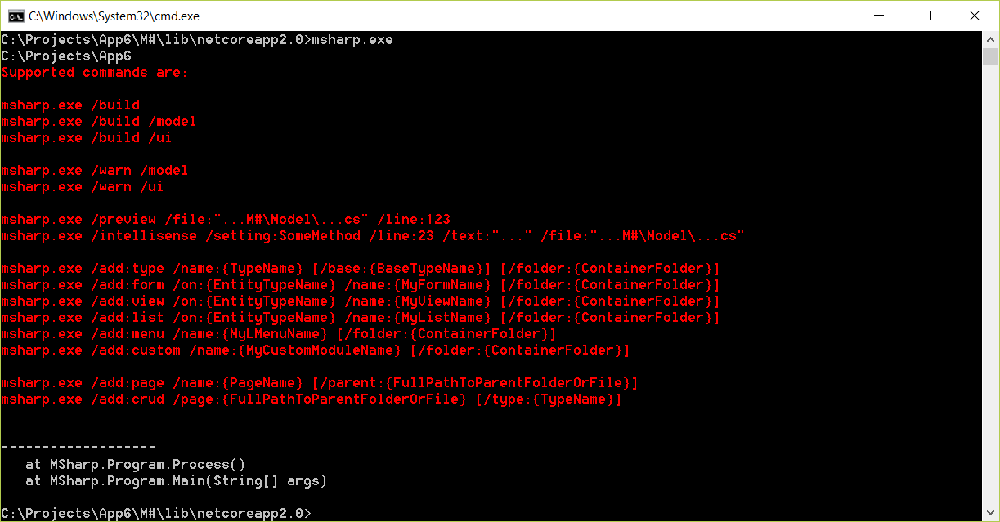
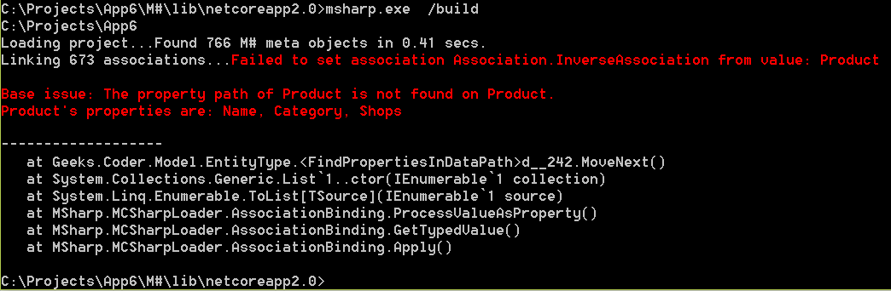

# M# Command Line Interface

**M# CLI** is a command line interface to scaffold and build M# apps. Not only it provides you scalable project structure, instead it handles all common tedious tasks for you out of the box.

## Getting Started
M# CLI ships with handful of commands to set up and build your project from scratch, after creating your project go to this path: **M#\lib\netcoreapp2.0**. This folder is located in your project root path, run below command to see if you have done everything good.

By running **msharp.exe** you will see all options and outputs and how to use them.

### msharp.exe /build *[/model]* *[/ul]*
By running **msharp.exe /build** m# framwrok will try to compile your current project and show you the result. If your project encounters any errors, you will see the result here.
For example, in following picture you can see that current project has an error an you will see the detail:

If you want to build just *#Model* or *#UI* project you can use this command:

- msharp.exe /build /model
- msharp.exe /build /ui

### msharp.exe /add:type /name:"TypeName" [/base:"BaseTypeName"] [/folder:"ContainerFolder"]
This command lets you generate entity in *#Model* project. For example, we have generated *Motor* entity with the following command:

- msharp.exe /add:type /name:"Motor"

If you want your generated entity placed in a specific folder or inherit from other entity, use these optional parameters:
- /base: use this for inheritance.
- /folder: use this for generating output in specific folder.

For example, in this sample we have generated *Motor.cs* class that inherits from *Vehicle* and generate output in *Domain* folder:
- msharp.exe /add:type /name:"Motor" /base:"Vehicle" /folder:"Model/Domain"

### msharp.exe /add:form /on:"EntityTypeName" /name:"MyFormName" [/folder:"ContainerFolder"]
Comming soon...