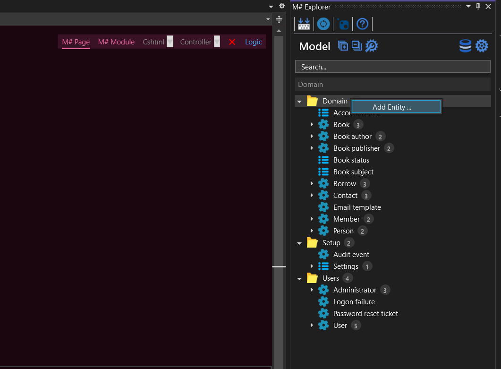
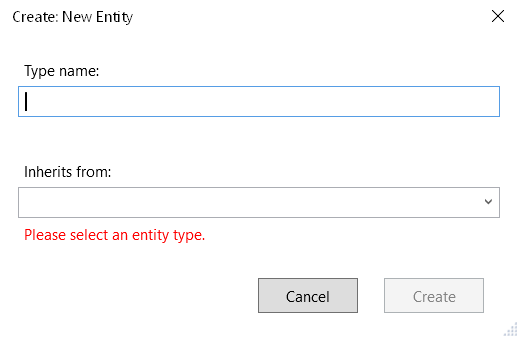
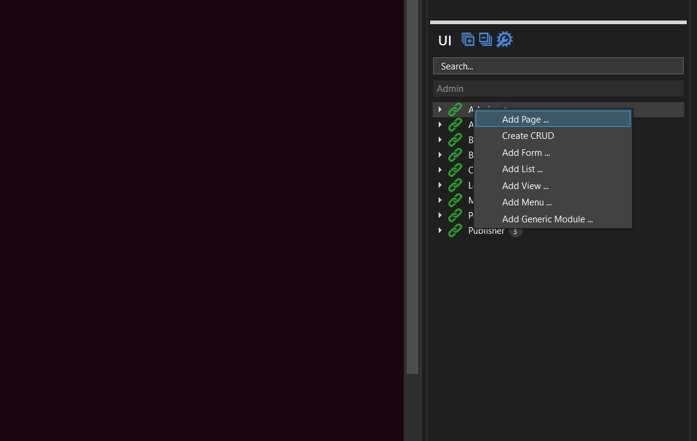
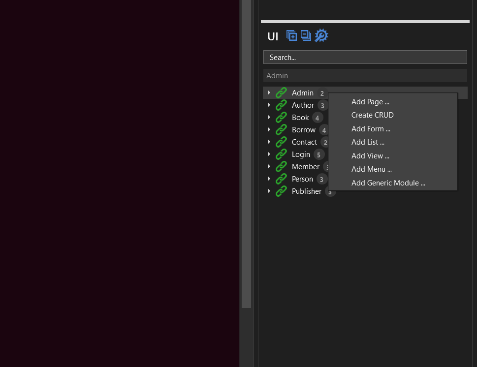

# M# Concepts

This lesson gives a bird’s eye view of the core components of M#. The web application structure in M# heavily depends on components described below, which are discussed in further detail within individual chapters. A developer must understand these components **(Entity, Page, Module)** in order to effectively develop and maintain quality web applications in M#.

## Entity

An entity represents a real world object, distinguishable from other entities, which exists in a business domain. In M# the same exact definition is undertaken. In M# the first thing a developer needs to do is to build a concrete business domain model, which consists of entities often referred to as business objects.

M# intelligently converts an Entity Domain Model, with all the associations and relationships, into database tables while maintaining entity relationships. This eliminates the need of developing Database and Business entities separately, significantly reducing the development time.

M# fully supports Object Oriented development and encourages developers to use all such features exposed at entity and property level.

### Adding New Entity

A new entity can be added by right click on your custom folder in **#Model** project and select **Add Entity** from M# context menu as shown bellow

### Name

#### The Name of the Entity

> **Note**: Always use singular naming convention when creating entities. M# intelligently uses plural naming convention where and when required.

For example: creating the entity shown in above image, M# creates a visual studio class with the name of "Member", also creating a database table using the plural "Members".

> **Note**: When adding entity names use normal English language style (i.e. with spaces and normal character case). M# automatically creates the class and database table according to standard naming conventions.

For example: creating an entity name as "Hello world entity" will be converted to "HelloWorldEntity" entity name and "HelloWorldEntities" database table name. Same applies to Properties.

#### Base Type

This property is used when a developer wants to inherit an existing entity type. M# creates a Member entity, which inherits from the "User" entity and also creates "dbo.Members" database table with one to one association on "dbo.Users" database table. This property is also available while editing the entity structure.

#### Database Mode

This is a very important property, because it defines the nature of the entity being created. This property has four options, as outlined below.

- **Managed**:

M# uses this option by default. Under this option, M# creates a database table for the entity and assumes that this entity will hold real data.

- **Transient**:

This option is used mostly to develop "Interfaces" for the Domain Model. M# doesn’t create any database table for the entity.

- **Custom**:

Select this option when an entity represents an external database table.

- **Existing**:

When you have an existing database, but want M# to generate an ADO.NET data accessor for it.

## Pages

Pages are fundamental for any web application and are required to display content on the website. M# provides this feature within #UI project. Pages created here are placed under "Pages" folder of the Visual Studio’s Web Application Project. M# generates a default "Login" page when a project is created.

### Creating New Pages

A new page is created by right click on "Pages" folder in #UI project and select "Add root page" . M# allows developers to create Root or Subpages as required in application structure.

**Page Name**:

This option allows the developer to specify the name of the page. This option works as the title and actual name of the page. Page names with white spaces are assembled using SEO standards e.g. A page name "Hello world" will have a URL "Hello-world"

## Modules

M# generates ASP.NET view called "Module", which is placed in the "Modules" folder within "Website" project. M# uses HTML div design pattern to layout modules. M# allows developers to create as many modules as necessary on Model Entities, or special type modules like menus or generic.

Modules encapsulate the actual operation of any page in M#. Module types include forms, lists, menus or simple data views. Each module is developed based on an Entity Type.

### Add a New Module

A new module is created by right click on "Modules" folder in #UI project and select related module.

