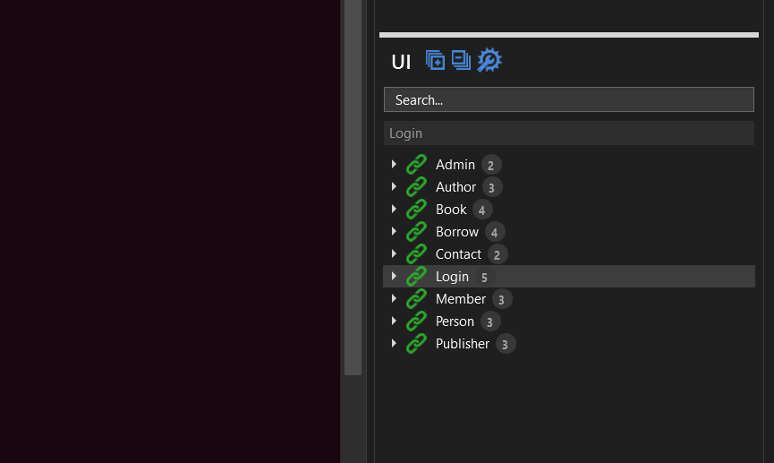
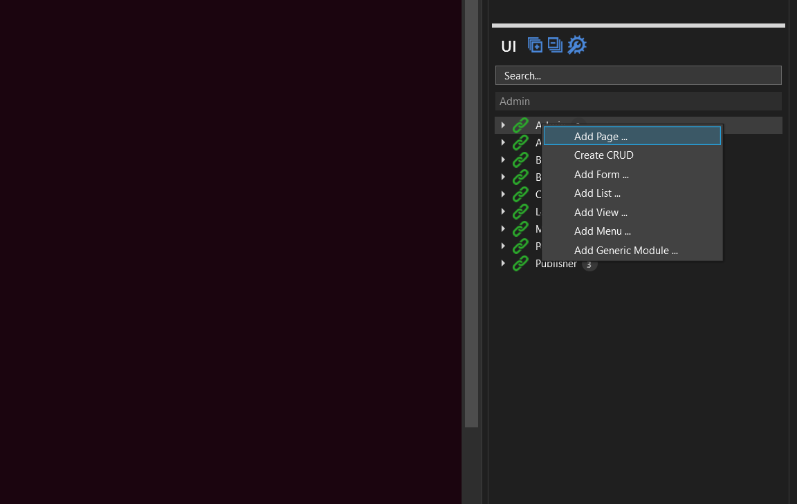
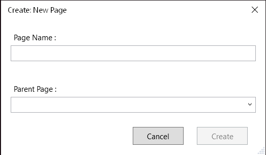

# What is an M# Page?

Pages are fundamental for any web application and are required to display content on the website.
M# provides this feature within #UI project. Pages created here are placed under `UI` project tree of the M# Web Application Project.

For example, M# generates a default "Login" page when a project is created.

### Creating New Pages

A new page is created by right click on "UI" project tree in M# Explorer and select "Add page" . M# allows developers to create Root page (a page without parent) or Sub-page (a page with parent) as required in application structure.

**Page Name**:

This option allows the developer to specify the name of the page. This option works as the title and actual name of the page.
Page names with white spaces are assembled using SEO standards e.g. A page name "Hello world" will have a URL "Hello-world".

**Page Name**:

This option allows the developer to create Root page (a page without parent) or Sub-page (a page with parent).