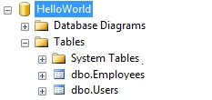
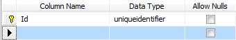
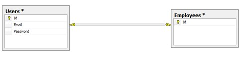

# Inheritance
Inheritance is one of the fundamental concepts of Object-Oriented Programming. In this lesson we will discuss how inheritance is maintained by M# in business logic and relationships between SQL database tables.

## Implementing Inheritance in M#
M# allows developers to select `Base Class` for the entity while creating or modifying the business entity. We will take the example of our **HelloWorld** project and will develop a new entity called `Employee` which will derive from the base entity `User`.

### Adding Entity
Add a new entity `Employee` using M#’s context menu, *right click > Add > M#*:


After creating the entity, you will notice that M# creates a new entity `Employee` which inherit from **SubType** generic class:

```C#
using MSharp;

namespace Domain
{
    public class Employee : SubType<User>
    {
        public Employee()
        {
            String("First Name");
        }
    }
}
```

After building **#Model** project M# generates the derived entity class by inheriting the `User` entity:

```C#
/// <summary>Represents an instance of Employee entity type.</summary>
[EscapeGCop("Auto generated code.")]
public partial class Employee : User
{
    /* -------------------------- Properties -------------------------*/
        
    /// <summary>Gets or sets the value of FirstName on this Employee instance.</summary>
    [System.ComponentModel.DisplayName("First Name")]
    public string FirstName { get; set; }
        
    /* -------------------------- Methods ----------------------------*/
        
    /// <summary>Returns a clone of this Employee.</summary>
    /// <returns>
    /// A new Employee object with the same ID of this instance and identical property values.<para/>
    ///  The difference is that this instance will be unlocked, and thus can be used for updating in database.<para/>
    /// </returns>
    public new Employee Clone() => (Employee)base.Clone();
        
    /// <summary>
    /// Validates the data for the properties of this Employee and throws a ValidationException if an error is detected.<para/>
    /// </summary>
    protected override async Task ValidateProperties()
    {
        var result = new List<string>();
            
        try
        {
            await base.ValidateProperties();
        }
        catch (ValidationException ex)
        {
            result.Add(ex.Message);
        }
            
        if (FirstName?.Length > 200)
            result.Add("The provided First Name is too long. A maximum of 200 characters is acceptable.");
            
        if (result.Any())
            throw new ValidationException(result.ToLinesString());
    }
}
```

For **Clone()** and **ValidateProperties()** method, please note that M# first call its parent method.

### SQL Database Structure
For any data driven application, it is very important to have a normalized database. This not only helps to increase performance but also makes it more manageable and saleable. M#’s intelligent database generation engine utilizes best practices to normalize databases and generate relationships among data tables.

Continuing aforementioned example, M# creates a new table called `Employees` in the database and creates a **One-to-One** relationship between `Users` and `Employees` tables. The `Employees` table only, contains a **foreign Key** to `Users` table, as shown in below pictures:

|    |    SQL Database Structure    |     |
|:--:|:----------------------------:| :--:|
| |   | |
|  |   |  |
| Users database table | Empoyees database table | Users and Employees One-To-One relationship |

