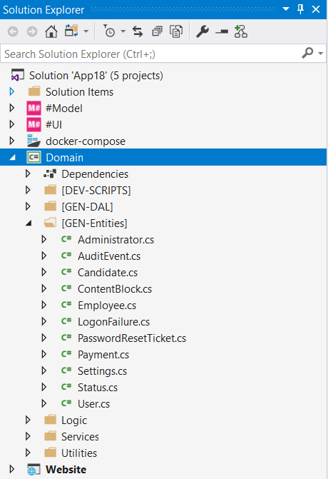
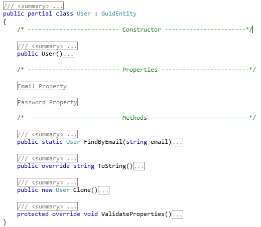
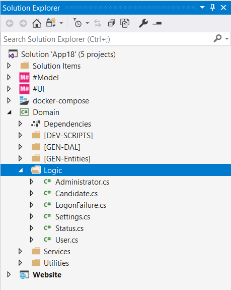

# Partial Classes & Business Logic
In C# you can split the implementation of a class over many files by using the **Partial** keyword. M# generated entity classes use this keyword, allowing you to separate the entity structure and business logic that are placed in seprate folders, making it easier to write and manage code.

## Entity Structure
M# creates a Partial Entity class when a developer creates an Entity in M#. This partial class contains all the properties, associations and default validation rules (Defined in M# during development e.g. Mandatory fields, number ranger etc.). M# places it under a separate folder called **[GEN-Entities]** within **Domain** project

 

This file is auto-generated by M#, so you should not change the code in this file or your changes will be overwritten by M# during the next complilation. Tutorial Generated Code explains the code shown above in more detail.

## Business Logic

#### File creation
This "Partial Class" is used to develop core business related functions including custom validation, persisting data, helper methods, and other custom business required behaviours. M# doesn't create this Class by default. You should navigate to the **Logic** folder under **Domain** project and create your partial class.



#### Implementation
Use Visual Studio to implement your business logic. As an example we will implement some business logic for the Employee class.

```C#
protected override async Task OnSaved(SaveEventArgs e)
{
    await base.OnSaved(e);

    if (e.Mode == SaveMode.Insert)
    {
        // Send welcome email
    }
}
```

#### Importance
Logic files are the central point of the application so have to be readable and all actions made by forms should call the appropriate method in the logic. No custom code should be written in your cshtml files or you won't be able to perform unit tests and will have difficulty maintaining your project.