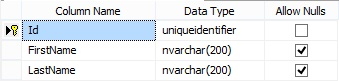
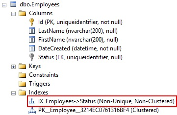

# Properties
Properties define the structure of an entity and usually hold values.

Persisted properties hold data, meaning, it is used to store data permanently. When developer creates a persisted property, M# creates a corresponding SQL Table Column. For example, the illustration below has two persisted properties `First name` and `Last name`. Both of the properties are used to retrieve and store data permanently and correspond to a SQL Table `Column Names`.

```C#
using MSharp;

namespace Domain
{
    public class Person : EntityType
    {
        public Person()
        {
            String("First name");

            String("Last name");
        }
    }
}
```

M# will also generate the C# class code corresponding to your properties:

```C#
/// <summary>Gets or sets the value of FirstName on this Person instance.</summary>
public string FirstName { get; set; }
        
/// <summary>Gets or sets the value of LastName on this Person instance.</summary>
public string LastName { get; set; }
```
The SQL table:



## General Methods

| Methods   | Sample   | Description     |
|:----------|:---------| :---------------|
| .Calculated(bool value = true)           | `String("Full name").Calculated() .Getter("FirstName + LastName");`                       | This method creates a read-only property in the generated C# file. The value is set by the Getter method. Calculated method will have no effect on the database column definition.
| .Default(string value)                   | `DateTime("Date created").Default("LocalTime.Now") .Mandatory();`                         | Default method will have no effect on the database column definition, but will change your class constructor in the generated C# file and initialize int with default value.
| .Unique(bool value = true)               | `String("Email").Unique();`                                                              | This property ensures data for this column are unique in the database.  
| .Attributes(string value)                | `String("Name").Attributes("[XmlIgnore]");`                                              | Attributes allows you to specify custom attributes to the property, Attributes will have no effect on the database column definition.
| .ColumnName(string value)                | `String("Last name").ColumnName("Surname");`                                             | Column name method will have no effect on the generated C# file. This will only change the column name in the database, this change is handled by the data access layer and does not change your entity file.
| .DatabaseIndex(bool? value = true)       | `Associate\<Employee\>("Status") .Default("Pending").DatabaseIndex();`                    | Database index has no effect on the generated C# file. This method will create an index in the database for this column.
| .DefaultFormatString(string value)       | `String("Name") .DefaultFormatString("Employee {0}");`                                    | Default format string method will have no effect on the database column definition or the generated C# class. It allows you to display a custom expression in Views. Example: The format `Employee {0}` will display `Employee Smith` if the value of the property is `Smith`.
| .Documentation(string value)             | `String("Email") .Documentation("Email address of the employee, also used as username");` | Documentation method will have no effect on the database column definition or the generated C# class. It adds a piece of information to your property XML documentation, for example the full name of the property, how to use it, how it works, ...
| .FormatValidationMessage(string value)   | `String("Email").Mandatory() .FormatValidationMessage("Invalid email address!");`         | Format validation message will have no effect on the database column definition or the generated C# class. It will generates a custom format validation message for the property. For example, you create an Email property with the `Email` text pattern and you set a custom message. If the end user tries to validate an instance and the provided email address does not match the email pattern, the client-side validation will show a pop-up to the user with your custom message.
| .Getter(string value)                    | `String("Full name").Calculated() .Getter("FirstName + LastName");`                       | Specifies a custom getter for the property.
| .HelpText(string value)                  | `Associate\<Employee\>("Status") .HelpText("The current status for this user");`          | Help text method will have no effect on the database column definition or the generated C# class. This method generates a help icon next to the control in CSHTML forms.
| .IsPrimaryKey(bool value = true)         | `String("Email").IsPrimaryKey();`                                                        | It is possible to specify the Primary Key Type at entity level. It supports String, Number as well as Guid (default). If you define a Number or String, then you can optionally declare the property as the Primary Key, which will create a new unique column in the database as the primary key of the table. If left to default, it will add a property called ID.
| .Name(string value)                      | `String("Last name").Name("Suranme");`                                                   | By setting a custom name, M# will change the name of your property and the name of your SQL column. This change will not have any impact on the UI because the Name method is independent of the Title method.
| .Notes(string value)                     | `String("Last name") .Notes("Last name of the employee");`                                | Notes will have no effect on the database column definition or the generated C# class. It is only used to display a note on a property to developers.
| .RequiredValidationMessage(string value) | `String("Email").Mandatory() .RequiredValidationMessage("Email missing!");`               | Required validation message will have no effect on the database column definition. It generates a custom validation message if the user does not provide a value for the property.
| .Setter(string value)                    |                                                                                        | Setter can be used with calculated properties only. By using this you can add a custom code to the setter before assigning the value.
| .Title(string value)                     | `String("First name").Title("Name");`                                                    | Title will have no effect on the database column definition or the generated C# class. It will just use this value to display labels in UI forms / lists / views.

#### Calculated properties
Calculated properties are created for read-only purposes and returns data based on business requirements. M# defines these types of properties in `Entity Class` of the `Model Project` and marks them with `Calculated` method. No SQL table Column is created for such properties. A calculated property is usually used to display some information on UI or in decision making. A good example of this could be to have a `Full Name` property on `Member` entity, as shown below.

```C#
using MSharp;

namespace Domain
{
    public class Person : EntityType
    {
        public Person()
        {
            String("First name");

            String("Last name");

            String("Full name").Calculated().Getter("FirstName + LastName");
        }
    }
}
```

```C#
/// <summary>Gets the FullName property.</summary>
[Calculated]
public string FullName
{
    get => FirstName + LastName;
}
```

Having such calculated properties allows developers to write more concrete code, eliminating the redundancy of code and making it easier to manage changes.

FOR EXAMPLE: In above scenario, if you do not use a calculated property and concatenate the First and Last Name of Member on different modules or pages instead, If at a later date you need to show `Middle Name` in `Full Name` of member , it will be much more difficult and time consuming to change it on each module rather simply updating the Calculated Property.

> **Note:** A calculated property must not contain complex calculations because this is not the intended purpose of entity behaviours. It is always recommended to implement Methods / Functions for such complex calculations.

#### Default
This method allows you to specify a default value for the property.

```C#
DateTime("Date created").Default("LocalTime.Now").Mandatory();
```

```C#
/// <summary>Initializes a new instance of the Person class.</summary>
public Person() => this.DateCreated = DateTime.Parse("LocalTime.Now");
        
/* -------------------------- Properties -------------------------*/
        
/// <summary>Gets or sets the value of DateCreated on this Person instance.</summary>
public DateTime DateCreated { get; set; }
```

#### Unique
This property ensures data for this column are unique in the database.
It has no effect on the database but will add a few things to the generated C# code.

Imagine the employee has a user account and can log into the system. If the username is the email address we have to make sure it is unique to distinguish users. If you set this method to "True", the validation method will make sure that the email address does not already exist in the system, if it exists a ValidationException will be thrown:

```C#
/// <summary>
        /// Validates the data for the properties of this Employee and throws a ValidationException if an error is detected.<para/>
        /// </summary>
        protected override async Task ValidateProperties()
        {
            var result = new List<string>();
            
            // Ensure uniqueness of Email.
            
            if (await Database.Any<Employee>(e => e.Email == Email && e != this))
                result.Add("Email must be unique. There is an existing Employee record with the provided Email.");
            
            if (result.Any())
                throw new ValidationException(result.ToLinesString());
        }
```

A cool feature generated by M# is the method FindByPropertyName, where PropertyName is the name of your unique property. Because an email is unique we can use this function to get the associated employee. If there is no employee `null` will be returned:

```C#
/* -------------------------- Methods ----------------------------*/
/// <summary>
/// Find and returns an instance of Employee from the database by its Email.<para/>
///                               If no matching Employee is found, it returns Null.<para/>
/// </summary>
/// <param name="email">The Email of the requested Employee.</param>
/// <returns>
/// The Employee instance with the specified Email or null if there is no Employee with that Email in the database.<para/>
/// </returns>
public static Task<Employee> FindByEmail(string email)
{
    return Database.FirstOrDefault<Employee>(e => e.Email == email);
}
```

#### Database index
Database index has no effect on the generated C# file. This method will create an index in the database for this column. M# will often suggest you to specify an index on foreign key columns to improve the performance of SQL queries.


