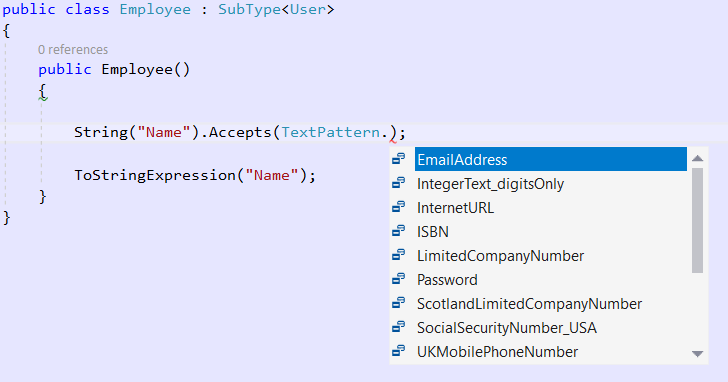

# String Property
M# String is a high level representation of a text. By adding a String property, M# will generate a standard C# string property with its XML documentation:

```C#
/// <summary>Gets or sets the value of Name on this Employee instance.</summary>
public string Name { get; set; }
```

The creation of this property will also create the SQL type **nvarchar(200)**. M# gives you flexibility by using some specific String methods allowing you to change the behaviour in your C# logic or the generated SQL code.

## Methods

### .Max()
Max is the number of characters allowed and will have an effect on the database column definition. The generated SQL data type will be **nvarchar([MaxNumber])**

### .Lines()
Lines will have no effect on the database column definition or the generated C# class. This property will tell M# what kind of text size we normally expect this property to have. For example, for a `Description` column that we expect a few lines, as opposed to a single word, we can set it to **5**, which will result in a TEXTAREA with 5 lines to be generated within UI elements.

### .HashPassword()
Hash password will have no effect on the database column definition or the generated C# class. All passwords must be hashed before being stored in the database. If the property represents a password, set this attribute to `True` to avoid security problems. If you need to compare a value with this password, for example for the authentication, use:

```C#
"Your value".CreateHash() == this.Password
```

### .DefaultFormatString()
Default format string will have no effect on the database column definition or the generated C# class. Allows you to display a custom expression in UI Views. Example: The format `Employee {0}` will displays **Employee Smith** if the value of the property is "Smith".

```C#
String("Name").DefaultFormatString("Employee {0}");
```

### .TrimValues()
Trim values will have an effect on the database column definition. If set to `True`, M# will remove extra spaces at the beginning and the end of the value. Example: " Smith " will be converted to "Smith".

```C#
String("Name").TrimValues();
```

### .Accepts()
Accepts method will add a validation rule to the generated C# class, but will have no effect on the database column definition. This method allows you to define a new validation rule based on some frequent patterns. Example: Email address, Internet URL, ISBN, Limited company number, Password, Social security number, Postcode, Phone number, ...

