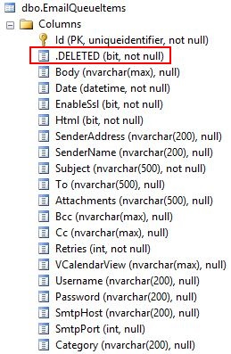

# Understanding Entity Types
The entity type is the fundamental building block for describing the structure of data within the Entity Data Model (EDM). In a conceptual model, an entity type represents the structure of top-level concepts, such as customers or orders. An entity type is a template for entity type instances. Each template contains the following information:

- A unique name.
- An entity key defined by one or more properties.
- Data in the form of properties.
- Navigation properties that allows navigation between associations.

In an application, an instance of an entity type represents a specific object (such as a specific customer or order). Each instance of an entity type must have a unique entity key within an entity set.

## Defining Entity Types
M# fully supports and automates most of the tasks required to create associations between entities and generates SQL Tables and related .Net classes.

### Methods

| Methods             | Parameters and overloads  | Sample                                 | Descriptions                                                                                                |
| ------------------- |:-------------------------:| --------------------------------------:| -----------------------------------------------------------------------------------------------------------:|    
| Name                | (string value)            | Name("Last Name");                          | This is the name of the entity.                                                                             |
| InstanceAccessors   | (bool value = true)       | InstanceAccessors();                        | M# will generates accessors for instances                                                                   |
| ClassName           | (string value)            | ClassName("Employee");                      | This is the name of the generated C# class                                                                  |
| DatabaseMode        | (DatabaseOption value)    | DatabaseMode(DatabaseOption.Managed);       | This allows you to specify a mode for the database                                                          |
| Documentation       | (string value)            | Documentation("Custom documentation");      | Add a custom documentation for the generated class                                                          |
| EagerLoadData       | (bool value = true)       | EagerLoadData();                            | Set this method if you don't want to defer the initialization of the object (lazy loading)                  |
| GenerateParseMethod | (bool value = true)       | GenerateParseMethod();                      | This method will create a static function that returns the instance of object                               |
| GenerateUnitTests   | (bool? value = true)      | GenerateUnitTests();                        | Set this to false if you don't want to unit test this entity                                                |
| Abstract            | (bool value = true)       | Abstract();                                 | Set this method if you want to generate the class as abstract                                               |
| Cachable            | (bool? value = true)      | Cachable();                                 | If you want to allow this type to be cached set the value to True                                           |
| IsHirarchy          | (bool value = true)       | IsHirarchy();                               | Set this object as hierarchical                                                                             |
| IsInterface         | (bool value = true)       | IsInterface();                              | Transforms your class to an Interface. Note: You have to set the database mode to "Transient"               |
| LogEvents           | (bool value = true)       | LogEvents(false);                           | By default M# stores all events for all the instances. This method allows you to disable this behaviour     |
| Notes               | (string value)            | Notes("Developer note");                    | This method has no impact on the generated C# or SQL code, it is only a note for developers                 |
| PluralName          | (string value)            | PluralName("Employees");                    | This is automatically generated by M#, this method allows you to define a custom value                      |
| PrimaryKeyType      | (string value)            | PrimaryKeyType("Guid");                     | This is the type of the primary key. By default the type is a Guid and your entity implements the interface |
| Schema              | (string value)            | Schema("dbo");                              | Schema of the database, "dbo" is the default value                                                          |
| SoftDelete          | (bool value = true)       | SoftDelete();                               | This is useful if you need to allow the user to delete data, but you want to retain a copy in the database  |
| SortDescending      | (bool value = true)       | SortDescending();                           | If you set this to true M# will sort your data by descending when you will use `Database.GetList()`       |
| ToStringExpression  | (string value)            | ToStringExpression("FirstName + LastName"); | Specify the value of ToString()                                                                             |
 
#### InstanceAccessors(bool value = true)
By setting this to true M# will generates accessors for instances.
For example if you create a "Status" entity and set this to true you will be able to use:
`myUser.Status = Status.Activated;`

#### GenerateParseMethod(bool value = true)
This method will create a static function that returns the instance of object that is textually represented by a specified string value, or null if no such object is found.

```C#
using MSharp;

namespace Domain
{
    public class Status : EntityType
    {
        public Status()
        {
            GenerateParseMethod();

            IsEnumReference();

            InstanceAccessors(new[] { "Pending", "Interviewed", "Rejected", "Offered" });

            String("Name");
        }
    }
}
```

```C#
/// <summary>
/// Returns the Status instance that is textually represented with a specified string value, or null if no such object is found.<para/>
/// </summary>
/// <param name="text">The text representing the Status to be retrieved from the database.</param>
/// <returns>The Status object whose string representation matches the specified text.</returns>
public static Task<Status> Parse(string text)
{
    if (text.IsEmpty())
        throw new ArgumentNullException(nameof(text));
            
    return Database.FirstOrDefault<Status>(s => s.Name == text);
}
```

#### SoftDelete(bool value = true)
This method is very useful if you need to allow the user to delete data, but you want to retain a copy in the database. If you use Soft delete M# will create a hidden column in the SQL table: `[.Deleted] bit NOT NULL`



If you call `Database.Delete()` M# will set this flag to "1" and you won't be able to get this instance by calling `Database.GetList()`