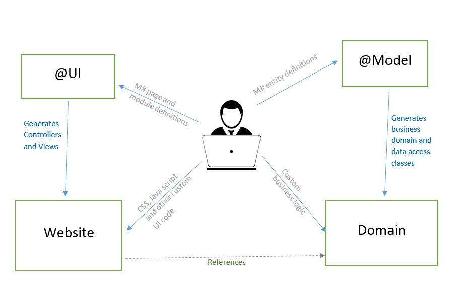

# Understanding the M# development model
TODO: Describe how the development philosophy is, what parts are written as M# concepts, what is written as direct C#, Html, etc.

# Structure of an MSharp solution

When you create a new M# ASP.NET Core MVC project you will see the following structure in Visual Studio.

The following diagram explains the relationship between these projects, and also how you, as the developer, will interact with these projects:

## #Model

This is where you define your application entities using the high level M# concept.
An entity represents a real world object which exists in a business domain. In M# development you always start here. Think of it as your database design stage, but at a more conceptual level. Here you declare your business data types and their associations, which will be the foundation of everything else.

>- This project does not reference any other project in your solution.
>- It references the core [M# nuget package](https://www.nuget.org/packages/MSharp/)
>- The compiled output of this project will not be deployed and will not be used at runtime by your application.
>- It's only used during development.

## Domain

This is the home for your business domain objects and business logic. By default you will have the following folders:

* **[DEV-SCRIPTS]**: Here you can write scripts and utilities which are not really a part of the final solution, but can help during development and testing time..
* **[GEN-Entities]**: For every entity definition in your *#Model* project, M# will generate a business class (partial) here.
* **Logic**: This is where you write any custom code *(as partial classes)* for the generated business entity classes.
* **Services**: This is where you write service classes for complex business logic scenarios.
* **Utilities**: This is where you can write extension methods (on system types) or any other handy utility function that doesn't belong anywhere else.

M# intelligently converts your high level entity definitions, with all the associations, inheritence, validation, data access, etc into the two generated folders explained above. It will also generate the database creation scripts (SQL). This eliminates the need of developing Database and Business entities manually.

M# fully supports Object Oriented development and encourages developers to use all such features exposed at entity and property level.

## #UI

This is where you define your application UI using the high level M# concept.

It consists of the following folders:

* **Pages**: Here you will define your application pages as a hierarchy. Each page has a URL, and can host modules.
* **Modules**: Here you define your application modules (forms, lists, menus, ...). Modules define the main visible elements of  your application.

NOTE:

>- This project references the Domain project.
>- It also references the core [M# nuget package](https://www.nuget.org/packages/MSharp/)
>- The compiled output of this project will not be deployed and will not be used at runtime by your application.
>- It's only used during development.

## Website

This is your ASP.NET Core MVC project. It consists of everything you'd expect any MVC application to have:

* Controller and ViewComponent classes (for all pages and modules)
* View files for layouts (cshtml), pages and modules
* SASS files (for styling)
* Typescript files (for UI effects)
* Images, fonts and generated CSS, Javascript and any other front-end asset
* GULP, Bower and other front-end build tools

**Note:**
> The following folders are managed by M# (generated) and you should not manually change anything, as they will be overwritten. All other files and folders in this project can be managed by yourself.
>- *Controllers\Pages*
>- *Controllers\Modules*
>- *Views\Pages*
>- *Views\Modules*

You will declare your pages and modules inside #UI project using the high level M# concept. After that, M# CLI (msharp.exe) will automatically generate the final controllers and views automatically.

>- Your definitions in the #UI project will be the true source. But they don't exist at run-time.
>- The generated code in Website folder is the final product which will be executed on a server.
>- Typically, every single line of M# code (in #UI) will result in 10 lines of generated code (controller actions, views, etc).
>- The M# code is also much simpler, more declarative and less error prone.

**Debugging**
During development, you will use the generated MVC code for debugging. You can temporarily change the code until you make things right. But you should always apply any changes on #UI files (M# definitions). Otherwise your changes will be lost as soon as M# generates the target code again.
