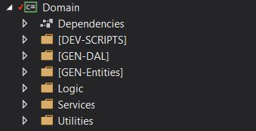

# Structure of an M# solution
When you create a new M# ASP.NET project you will see the following structure in Visual Studio.

## @Model
This is where you define your application entities using the high level M# concept.
An entity represents a real world object which exists in a business domain. In M# development you always start here. Think of it as your database design stage, but at a more conceptual level. Here you declare your business data types and their associations, which will be the foundation of everything else.

>- This project does not reference any other project in your solution.
>- It references the core [M# nuget package](https://www.nuget.org/packages/MSharp/)
>- The compiled output of this prject will not be deployed and will not be used at runtime by your application.
>- It's only used during development.

## Domain
This is the home for your business domain objects and business logic. By default you will have the following folders:

>- **«GEN»Entities**: For every entity definition in your *@Model* project, M# will generate a business class (partial) here.
>- **«GEN»DAL**: For every entity definition in your *@Model* project, M# will generate a data access class class here.
>- **Logic**: This is where you write any custom code *(as partial classes)* for the generated business entity classes.
>- **Services**: This is where you write service classes for complex business logic scenarios.
>- **Utilities**: This is where you can write extension methods (on system types) or any other handy utility function that doesn't belong anywhere else.
>- **«DEV»**: Here you can write scripts and utilities which are not really a part of the final solution, but can help during development and testing time..

M# intelligently converts your high level entity definitions, with all the associations, inheritence, validation, data access, etc into the two generated folders explained above. It will also generate the database creation scripts (SQL). This eliminates the need of developing Database and Business entities manually.

M# fully supports Object Oriented development and encourages developers to use all such features exposed at entity and property level.

## @UI
This is where you define your application UI using the high level M# concept.

It consists of the following folders:
>- **Pages**: Here you will define your application pages as a hierarchy. Each page has a URL, and can host modules.
>- **Modules**: Here you define your application modules (forms, lists, menus, ...). Modules define the main visible elements of  your application.

NOTE:

>- This project references the Domain project.
>- It also references the core [M# nuget package](https://www.nuget.org/packages/MSharp/)
>- The compiled output of this prject will not be deployed and will not be used at runtime by your application.
>- It's only used during development.
