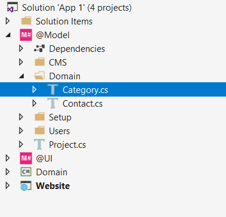

# App 1 - Tutorial
In this tutorial you will learn the following M# concepts.

- Entity Type Creation
- Association
- Page
- Navigation
- Button
- List Module
- Form Module
- Menu 


## Requirements:
We are going to implement Contact Management System that you can see all available contacts and simply do *CRUD* operation. Here are pictures of requirements:


By using **M# framework** you have the power of creating this application 4time faster than usual application development process, so lets see how we can achieve this.

#### Note:
> We suppose that you are familiar with M# framework, if you are totally unfamiliar with it please first look at [Understanding M#](http://msharp.co.uk/Learn/Understanding-MSharp.html)

## M# Structure:

As you can see, you as a developer should interact with these projects. If you are not familiar with this structure please look at [Structure of an M# solution](https://github.com/Geeksltd/MSharp.Docs/blob/master/Structure/README.md).
 Our development steps are:
1. Create required C# class in **@Model** project.
2. Build **@Model** project, this action generates domain class with all their dependencies for data access layer in **Domain** project.
3. Create and develop required pages in **@UI** project and build this project to get the final result in **WebSite** project.

## Knowing Entities and Implementation:
In our example, we have *Contact* and *Category* entity that have one to many relationship. Our first step is to create *Contact* and *Category* classes in **@Model** project.

### Adding Entities:
For adding a new entity, right click on **@Model** project and add required C# class. We are going to create two entities, *Category* and *Contact* .



In M# the first thing a developer needs to do is to build a concrete business domain model, which consists of entities often referred to as business objects.
```C#
public class Category : EntityType
    {
        public Category()
        {
            String("Name").Mandatory();
        }
    }
```

```C#
public class Contact : EntityType
    {
        public Contact()
        {
            Associate<Category>("Category").Mandatory();

            String("First name").Mandatory();

            String("Last name").Mandatory();

            String("Tel").Mandatory();

            String("Email").Mandatory().Accepts(TextPattern.EmailAddress);
        }
    }
```

Every entity in M# should inherit from **EntityType** base class, this special class instructs M# how to deal with an entity. As you can see we have created an association between *Category* and *Contact* entity and implement their properties. All properties are mandatory and for email property, we have specified special validation that check email address format.

#### Note:
> - M# framework has some built-in methods that all classes and properties generate according to them, For example, we have used **String("Name")** that generate a class with a property **Name**. You will learn more about these methods and properties by the time pass.
> - Always use singular naming convention when creating entities. M# intelligently uses plural naming convention where and when required.
> 
After creating all entities, we are going to build our model. Build your model by right click on **@Model** project and selecting **Build** from context menu. This step generates related C# class to **Domain** project that consist of all related code for generating and persisting data to the database. Now it's time to build this project too, right click on **Domain** project and select **Build**. Our final step starts from here, **@UI** project deal with user interface and generate all required stuff that user interact with it. In **@UI** project we have three main steps to do:
1. Add Pages
2. Config Menu
3. Add Modules To Pages

## Developing UI
In our example, we have a contact page that list our contacts and another one for adding and editing contact.

### Creating Contact Pages
Until now, we have done these steps:
1. Created our entities in **@Model** project and build the project in visual studio
2. Then build **Domain** project in visual studio.
Now it's time to create our first page. Here we have two pages, one that is responsible for showing a contacts list and the other for adding and editing contact, these two pages can have some property in common, so first we create a parent page and then inherit other required page according to our example.

```C#
public class ContactPage : RootPage
{
    public ContactPage()
    {
        Add<MainMenu>();

        OnStart(x => x.Go<ContactsPage>().RunServerSide());
    }
}
```
This  is our root class that inherits from **RootPage** class, **RootPage** is a special class that tell M# framework how to deal with page. In **ContactPage.cs** I have mentioned that by the running this page, it should navigate to **ContactsPage.cs** that list all of my Contacts. So our next step is to create **ContactsPage.cs**

#### Creating Contact List Page & Contact List Module

```C#
public class ContactsPage : SubPage<ContactPage>
    {
        public ContactsPage()
        {
            Layout(Layouts.FrontEnd);

            Add<ContactsList>();
        }
    }
```
This class inherits from *ContactPage* and include Layout and Modules. With *Layout(Layouts.FrontEnd)* method I have specified page layout and by calling *Add\<ContactList>()* I told M# that this page should show ContactList module. Implementation of **ContactList.cs** class is like this:
```C#
public class ContactsList : ListModule<Domain.Contact>
    {
        public ContactsList()
        {
            Column(x => x.Category);

            Column(x => x.FirstName);

            Column(x => x.LastName);

            Column(x => x.Tel).LabelText("Telephone");

            Column(x => x.Email);

            ButtonColumn("Edit").HeaderText("Actions").GridColumnCssClass("actions").Icon(FA.Edit)
                .OnClick(x => x.Go<EnterPage>()
                .Send("item", "item.ID").SendReturnUrl(false));

            ButtonColumn("Delete").HeaderText("Actions")
                .GridColumnCssClass("actions")
                .ConfirmQuestion("Are you sure you want to delete this Contact?")
                .CssClass("btn-danger")
                .Icon(FA.Remove)
                .OnClick(x =>
                {
                    x.DeleteItem();
                    x.RefreshPage();
                });

            Button("Add Contact")
                .Icon(FA.Plus)
                .OnClick(x => x.Go<EnterPage>().SendReturnUrl(false));
        }
    }
```
In this class we have included our needed column according to the picture and add *Edit, Delete* and *Add Contact* buttons with their navigation instruction. You should notice that we have inherited from **ListModule** class, this class is a special class that tells M# framework how to generate code for showing this class.

#### Creating Contact Form Page & Contact Form Module
After creating a contact list its time to create a contact form page that is responsible for adding and editing operation. We continue our work by creating a contact form page in **@UI** project
```C#
public class EnterPage : SubPage<ContactsPage>
    {
        public EnterPage()
        {
            Layout(Layouts.FrontEnd);

            Add<ContactForm>();
        }
    }
```
As you can see, this class inherits from Contacts page and by using **Add\<ContactForm\>** it instruct M# framework that this page is responsible for showing contact form module.
```C#
public class ContactForm : FormModule<Domain.Contact>
    {
        public ContactForm()
        {
            HeaderText("Contact Details");

            Field(x => x.Category).Control(ControlType.DropdownList);
            Field(x => x.FirstName).Control(ControlType.Textbox).Mandatory();
            Field(x => x.LastName).Control(ControlType.Textbox);
            Field(x => x.Email).Control(ControlType.Textbox);
            Field(x => x.Tel).Control(ControlType.Textbox).Label("Telephone");

            Button("Cancel").CausesValidation(false)
                .OnClick(x => x.ReturnToPreviousPage());

            Button("Save").IsDefault().Icon(FA.Check)
                .OnClick(x =>
                {
                    x.SaveInDatabase();
                    x.GentleMessage("Saved successfully.");
                    x.ReturnToPreviousPage();
                });
        }
    }
```
Another important module is form module that deals with add or edit entity. This class inherits from **FormModule** class that tell M# framework how to deal with this class. This special class tells M# that it should generate a form page.

### Adding Contact List Page to Menu
Our last step is to include a *contact list page* in the main menu, for doing this open **MainMenu.cs** class and add *ContactPage* class here as a menu item.
```C#
public class MainMenu : MenuModule
    {
        public MainMenu()
        {
            AjaxRedirect().IsViewComponent().UlCssClass("nav navbar-nav dropped-submenu");

            Item("Login").Icon(FA.UnlockAlt).VisibleIf(AppRole.Anonymous)
                .OnClick(x => x.Go<LoginPage>());

            Item("Settings").Icon(FA.Cog).VisibleIf(AppRole.Administrator)
                .OnClick(x => x.Go<SettingsPage>());

            Item("Contacts").Icon(FA.Cog)
                .OnClick(x => x.Go<ContactPage>());
        }
    }
```
By adding *ContactPage* class as menu item here, we tell M# framework that by clicking on Contacts link, it should navigate user to *ContactPage* that shows a list of all contacts in our database. 

#### Final Step
Now its time to build **@UI** project, this project generated related files in **WebSite** project, after building **@UI** project set the **WebSite** project as your default *StartUp* project and then set your *connection string* in **appsetting.json** file and hit F5 to see M# magic. Your project is ready to use in a short time.