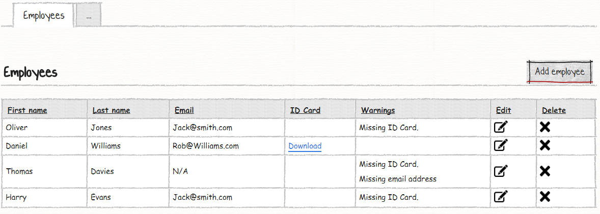
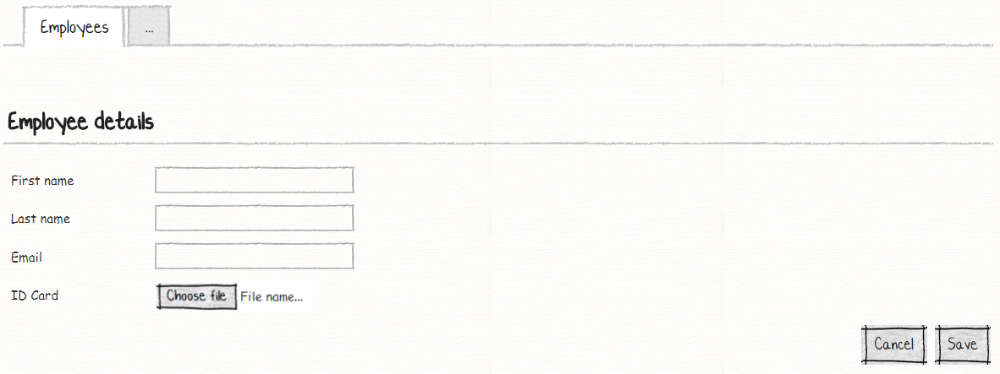
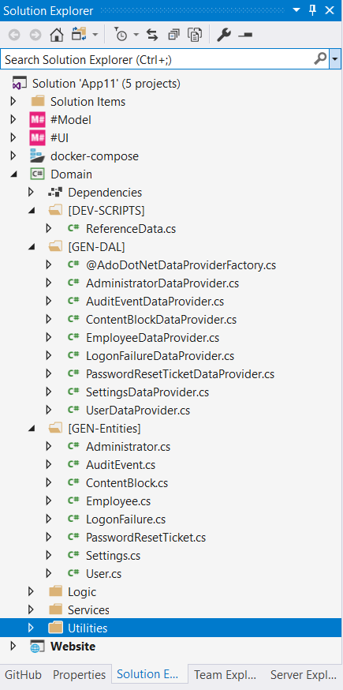

# Your Eleventh M# Application
In this tutorial you will learn:

- Html.Raw
- Empty markup
- Method logic 

## Requirements
In this tutorial we are going to develop a website that lists all employees. In employee page user can see all employees and do CRUD operations. User can download the employee's ID card and if there is no ID card or email user should see warning in warnings column and user left email column bank, he should see "N/A" instead of blank space.

### Agencies:




The employee page, just shows a list of all employees and lets users do CRUD operations. User should be able to download file and if he left an ID card or email address blank, he should see related warning in warnings column.

## Creating Entities
Let's begin with creating **Employee** classes in a *#Model* project under *Domain* folder:

```C#
using MSharp;

namespace Domain
{
    public class Employee : EntityType
    {
        public Employee()
        {
            String("First name");

            String("Last name");

            String("Email").Accepts(TextPattern.EmailAddress);

            SecureFile("ID Card");

            String("Warnings").Calculated().Getter("GetWarnings()");
        }
    }
}
```
The *Employee* class has got three string properties, "First name", "Last name" and "Email". Email address should force the user to enter a valid email and for this purpose, we have called `.Accepts(TextPattern.EmailAddress)` method. **ID Card** property is a file property and we have used `SecureFile("ID Card")` to define a file column. You should notice that just logged-in user can upload files and anonymous users does not allow to upload any files. **Warnings** property is a simple calculated string property that calls a method with the name of `GetWarnings()`. `GetWanings()` method is a custom method that is responsible to show related warning message based on custom circumstances, we are going to create this method soon.
In solution explorer, right click the *#Model* project and select *Build* and then build the *Domain* project to make sure everything regarding it is fine.

## Creating Business Logic
After building #Model project, M# framework will generate its related entities, Data Access Layer (DAL) and scripts in the **Domian** project as shown bellow:



In this scenario, we need a custom method with the name of `GetWarnings()` that return proper result according user input. Add a partial class with the name of **Employee** under **Logic** of **Domain** project then paste these blocks of code:

```C#
using System.Text;

namespace Domain
{
    public partial class Employee
    {
        public string GetWarnings()
        {
            var result = new StringBuilder();

            if (IDCard.IsEmpty())
            {
                result.Append("Missing ID Card.");
            }

            if (string.IsNullOrEmpty(Email))
            {
                result.Append("<br/>Missing email address");
            }

            return result.ToString();
        }

    }
}
```
This is simple C# partial class, this class has the same name as our main entity has. Employee class has a method with the name of `GetWarnings()`, in this method we have written our business logic, we have checked state of *IDCard* and *Email* property and if they are empty, we have added a related warning and return them to the user. Now build **Domain** project again to see every this is working correctly.

## Developing UI
According to the requirement, we have these pages to develop:

- Employees List
  - Add / Edit Employee

### Creating Employee Pages
Use the M# context menu to add *Employee* root page to the "Pages" folder of "#UI" project:
```C#
using MSharp;

public class EmployeePage : RootPage
{
    public EmployeePage()
    {
        Add<Modules.EmployeesList>();
    }
}
```
The "EmployeePage" holds employee list module (which will be implemented later).
Create a folder with the name of "Employees" under "Pages" folder and add *EnterPage* sub page class with codes bellow:
```C#
using MSharp;

namespace Employees
{
    class EnterPage : SubPage<EmployeePage>
    {
        public EnterPage()
        {
            Layout(Layouts.FrontEnd);

            Add<Modules.EmployeeForm>();
        }
    }
}
```
The "EnterPage" class holds employee form module and we have set its layout to "Layouts.FrontEnd" according to requirements.

#### Creating Employee List Module
Add a folder with the name of *Employee* under the *Modules* folder of the *#UI* project and add *EmployeesList* by using the M# context menu like below:

```C#
using MSharp;

namespace Modules
{
    public class EmployeesList : ListModule<Domain.Employee>
    {
        public EmployeesList()
        {
            HeaderText("Employees")
                .ShowHeaderRow();

            Column(x => x.FirstName);

            Column(x => x.LastName);

            Column(x => x.Email).EmptyMarkup("N/A");

            Column(x => x.IDCard);

            Column(x => x.Warnings).DisplayExpression("@Html.Raw(item.Warnings)");

            ButtonColumn("Edit").Icon(FA.Edit)
                .OnClick(x => x.Go<Employees.EnterPage>()
                .SendReturnUrl()
                .Send("item", "item.ID"));

            Button("New Employee").Icon(FA.Plus)
                .OnClick(x => x
                .Go<Employees.EnterPage>()
                .SendReturnUrl()
                );
        }
    }
}
```
The email column has a used new M# fluent method with the name of `.EmptyMarkup("N/A")`. This method accepts a string as an input parameter and if there is no data to show, "N/A" string will be shown to the user. Because the `GetWarnings()` method returns special character `<br/>`, ASP.NET MVC will prevent to show this data as a valid HTML tag to the user, so we need to explicitly tell ASP.NET MVC to render this part, we have used **@Html.Raw(item.Warnings)** and placed this string as an input parameter for `.DisplayExpression()` method.

#### Creating Employee Form Module
Add a form module with the name of *EmployeeForm* using the M# context menu like below:
```C#
using MSharp;

namespace Modules
{
    public class EmployeeForm : FormModule<Domain.Employee>
    {
        public EmployeeForm()
        {
            HeaderText("Employee details");

            Field(x => x.FirstName);

            Field(x => x.LastName);

            Field(x => x.Email);

            Field(x => x.IDCard);

            Button("Cancel").OnClick(x => x.ReturnToPreviousPage());

            Button("Save").IsDefault().Icon(FA.Check)
            .OnClick(x =>
            {
                x.SaveInDatabase();
                x.GentleMessage("Saved successfully.");
                x.ReturnToPreviousPage();
            });
        }
    }
}
```

#### Adding Pages to Menu
The last step is to add a root page to the main menu:
```C#
using MSharp;

namespace Modules
{
    public class MainMenu : MenuModule
    {
        public MainMenu()
        {
            AjaxRedirect().IsViewComponent().UlCssClass("nav navbar-nav dropped-submenu");

            Item("Login")
                .Icon(FA.UnlockAlt)
                .VisibleIf(AppRole.Anonymous)
                .OnClick(x => x.Go<LoginPage>());

            Item("Settings")
                .VisibleIf(AppRole.Admin)
                .Icon(FA.Cog)
                .OnClick(x => x.Go<Admin.SettingsPage>());

            Item("Employees")
                .VisibleIf(AppRole.Admin)
                .Icon(FA.Cog)
                .OnClick(x => x.Go<EmployeePage>());
        }
    }
}
```
### Final Step
Build **#UI** project, set the **WebSite** project as your default *StartUp* project and configure your *connection string* in **appsetting.json** file and hit F5. Your project is ready to use.
