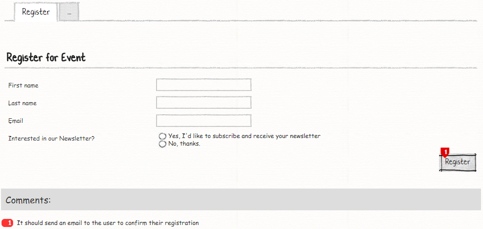
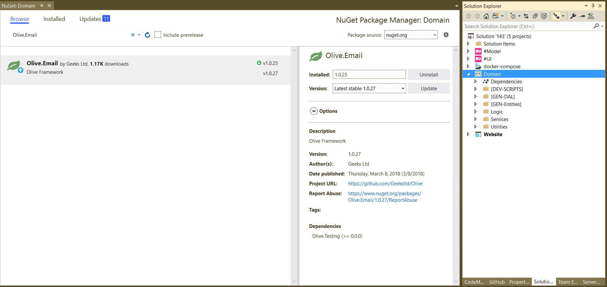

# M# Tutorial - Episode 14: Sending email

In this tutorial you will learn:

- Boolean form element (true, false text), 
- Custom workflow action
- Sending emails
- Email Templates

## Requirements

In this tutorial we are going to implement a registration form that get users information and send an email to the users after successful registration.

### Register Form:



In this form users enter their required information and after click on the register button, website will send an email to confirm their registration process.

## Implementation : Entities

As we can see in the requirements, *one* entity can be identified and it is **Registration**. This entity has just three *string* properties and one *boolean* property. The only business login is to send email after successful registration.
After analyzing the requirements and identifying related properties, it's time to create them. Now let's create the corresponding classes in the **#Model** project.

Create a **Domain** folder and add this class:

```C#
using MSharp;

namespace Domain
{
    public class Registration : EntityType
    {
        public Registration()
        {
            String("First name");

            String("Last name");

            String("Email");

            Bool("IsSubscribed").Mandatory();
        }
    }
}
```

After adding this class, build **#Model** and after that **Domain** project to make sure everything regarding it is fine.

### Implementation : Logic

According to the requirement system should send an email after user registration. For this purpose, we should add some extra business logic to our application and according to the M# architecture, we should add any business logic to the **Logic** folder of **Domain** project. But before adding any class, please add **Olive.Email** package to the **Domain** project like below:



After adding **Olive.Email** package, we should implement **IEmailMessage** and **IEmailTemplate**, these interfaces are used by the M# framework to customize and send an email. We continue our work by implementing these interfaces.

Create a class with the name of **EmailMessage** under *logic* folder like below:

```C#
public class EmailMessage : IEmailMessage
{
    public string Body { get; set; }
    public DateTime SendableDate { get; set; }
    public bool Html { get; set; }
    public string FromAddress { get; set; }
    public string FromName { get; set; }
    public string ReplyToAddress { get; set; }
    public string ReplyToName { get; set; }
    public string Subject { get; set; }
    public string To { get; set; }
    public string Attachments { get; set; }
    public string Bcc { get; set; }
    public string Cc { get; set; }
    public int Retries { get; set; }
    public string VCalendarView { get; set; }
    public bool? EnableSsl { get; set; }
    public string Username { get; set; }
    public string Password { get; set; }
    public string SmtpHost { get; set; }
    public int? SmtpPort { get; set; }
    public bool IsNew => true;
    public IEntity Clone() => this;
    public int CompareTo(object obj) => 0;
    public object GetId() => this;
    public void InvalidateCachedReferences()
    {
    }
    public Task Validate() => Task.CompletedTask;
}
```
**EmailMessage** class implements *IEmailMessage* and M# use this class to send email to the users, for now we don't have any logic for sending an email, but if we had, we could add our logic to *Validate* method.

Create another class with name of **EmailTemplate** under *logic* folder like below:

```C#
public class MailTemplate : IEmailTemplate
{
    public string Body { get; set; }
    public string Key { get; set; }
    public string MandatoryPlaceholders { get; set; }
    public string Subject { get; set; }
    public bool IsNew => true;
    public IEntity Clone() => this;
    public int CompareTo(object obj) => 0;
    public object GetId() => this;
    public void InvalidateCachedReferences()
    {
    }
    public Task Validate() => Task.CompletedTask;
}
```
**MailTemplate** hold our email template and M# use this class for formatting emails. This class is optional and you can hard-code email style in email message body, but in real project you would always have many styles for email and you have to implement this class.

Now it's time to add our business logic, create a partial class with the name of **Registration** under *Logic* folder like below:

```C#
public partial class Registration
{
    public void SendConfirmation()
    {
        var mailTempalte = new MailTemplate
        {
            Subject = "Welcome to our website",
            Body = "Dear [#FIRSTNAME#] <br/> <br/> <br/> Thanks for registering <br/> Regards."
        };

        var email = new EmailMessage
        {
            Subject = mailTempalte.MergeSubject(this),
            To = this.Email,
            Body = mailTempalte.MergeBody(this)
        };

        EmailService.Send(email);
    }
}
```

In **Registration** partial class we have added a new method with the name of **SendConfirmation**. First of all, we create a template for email, in  **Body** property, we have used special format for inserting the user first name, by using **[#FIRSTNAME#]** M# will change this special string with the **FirstName** property of **Registration** model. After creating email template, we create a new instance of **EmailMessage** class and used **.MergeSubject()** and **.MergeBody()** fluent method to replace any custom format with registration form entity properties, and in the end we used **EmailService.Send()** to send email. Please note that for sending email M# need to know your *SMTP* configuration, you can specify these configuration while you are creating a new instance of **EmailMessage** class and hard-code them or the best solution is to add SMTP configuration to the **appsettings.json** file under the **Website** project like below:

```JSON
"Email": {
    "From": {
      "Name": "Geeks",
      "Address": "hello@geeks.ltd.uk"
    },
    "ReplyTo": {
      "Name": "Geeks"
    },
    "EnableSsl": "false",
    "SmtpPort": "25",
    "SmtpHost": "127.0.0.1",
    "Username": "username",
    "Password": "password"
 }
```
M# will use this information to send emails and if there is any problem with sending emails, M# will enqueue emails and send them later.

Build the *Domain* project to make sure everything regarding is fine.

## Implementation : UI

As we can see in the requrements, we should develop one page:

- Register

### Register Page

Go to **Pages** folder of **#UI**, right *click > Add > M#*  then create **Registration** rootpage:

```C#
using MSharp;

public class RegistrationPage : RootPage
{
    public RegistrationPage()
    {
        Add<Modules.RegistrationForm>();
    }
}

```

#### Creating required module of Register Page

Navigate to **Modules** folder of **M#** project and create folder named **Registration**. Then add a *Form module* named **RegistrationForm** using M# context menu:

```C#
using MSharp;

namespace Modules
{
    public class RegistrationForm : FormModule<Domain.Registration>
    {
        public RegistrationForm()
        {
            HeaderText("Register for Event");

            Field(x => x.FirstName).Mandatory();

            Field(x => x.LastName).Mandatory();

            Field(x => x.Email).Mandatory();

            Field(x => x.IsSubscribed)
                .Label("Interested in our Newsletter?")
                .TrueText("Yes, I'd like to subscribe and receive your newsletter")
                .FalseText("No, thanks.");

            Button("Cancel").OnClick(x => x.ReturnToPreviousPage());

            Button("Save").IsDefault().Icon(FA.Check)
            .OnClick(x =>
            {
                x.RunInTransaction(false);
                x.SaveInDatabase();
                x.CSharp("info.Item.SendConfirmation();");
                x.Display("Saved successfully.")
                .DisplayOnModule();
            });
        }
    }
}
```
This is the only form that our web site has, now it's time to add this page to the menu.

#### Adding Pages to Menu

After you ended up with form page, you need to add it to the main menu:

```C#
using MSharp;

namespace Modules
{
    public class MainMenu : MenuModule
    {
        public MainMenu()
        {
            AjaxRedirect().IsViewComponent().UlCssClass("nav navbar-nav dropped-submenu");

            Item("Login")
                .Icon(FA.UnlockAlt)
                .VisibleIf(AppRole.Anonymous)
                .OnClick(x => x.Go<LoginPage>());

            Item("Settings")
                .VisibleIf(AppRole.Admin)
                .Icon(FA.Cog)
                .OnClick(x => x.Go<Admin.SettingsPage>());

            Item("Register")
                .Icon(FA.Cog)
                .OnClick(x => x.Go<RegistrationPage>());
        }
    }
}
```

### Final Step

Build **#UI** project, set the **WebSite** project as your default *StartUp* project and configure your *connection string* in **appsetting.json** file and hit F5. Your project is ready to use.


