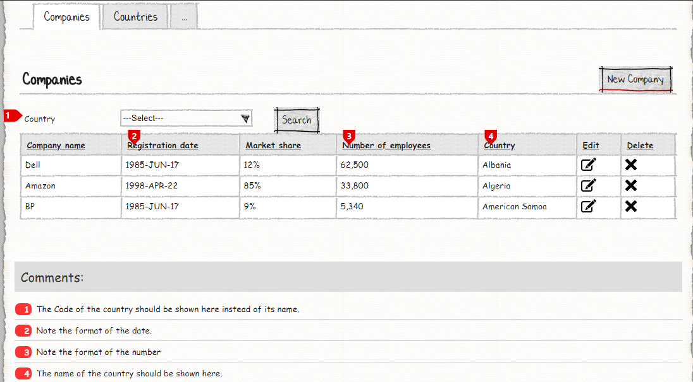
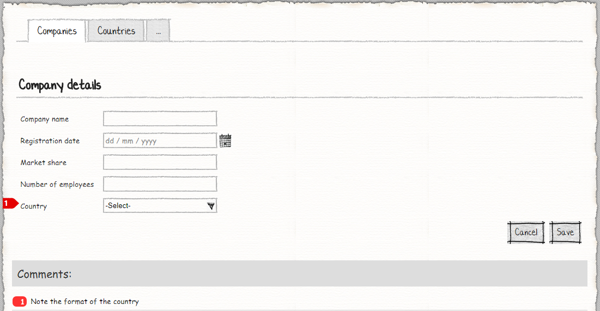
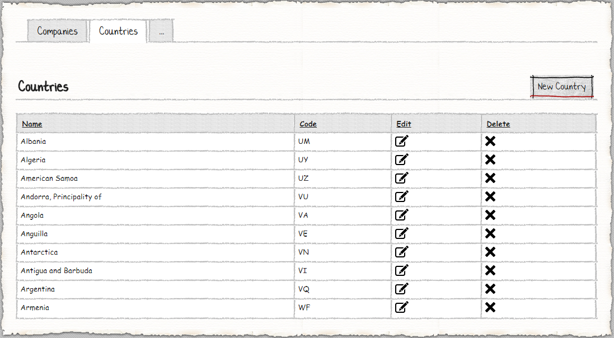
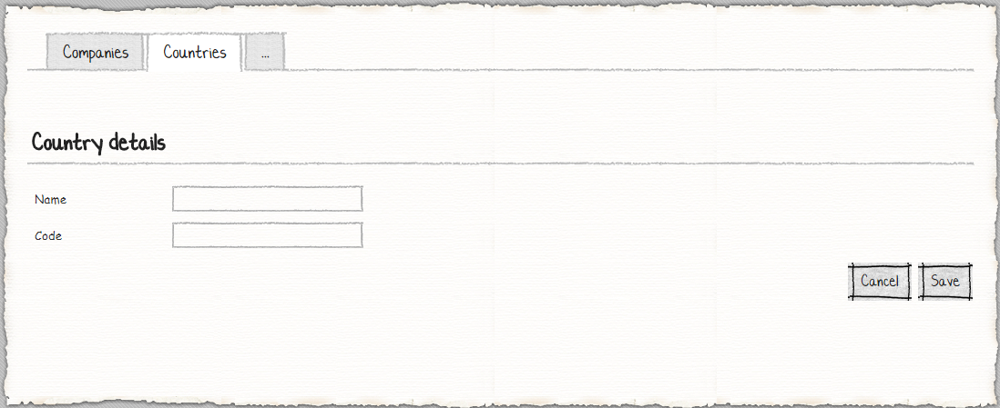

# M# Tutorial - Episode 15: Formatting property

In this tutorial you will learn:

- List column format (date and percentage, and number separator)
- Form element display expression
- Search element display expression 

## Requirements

In this tutorial, we are going to implement a website that manages countries and companies. On companies page some columns of grid table have specific formats and there is a search with a special string format for showing countries.

### Companies




 Every company has a *company name*, a registration date with a specific format, market share, which is percentage based, number of employees which is formatted with a thousand separator and a country. For searching we should consider the special string format and we should just show country code. In country detail form page country dropdown list should list all countries in this format *Code (Country Name)*

### Countries




In countries page users can sell all countries and they can do CRUD operations.

## Implementation: Entities

As we can see in the requirements, the two entities can be identified, **Country** and **Company**. The country has many companies and each company has one country. After analyzing the requirements and identifying related properties, it's time to create them. Now let's create the corresponding classes in the **#Model** project.

Create a **Domain** folder and add these classes:

```csharp
using MSharp;

namespace Domain
{
    public class Country : EntityType
    {
        public Country()
        {
            String("Name").Mandatory();

            String("Code").Mandatory();
        }
    }
}
```

Country class has just two mandatory string property as shown above.

```csharp
using MSharp;

namespace Domain
{
    public class Company : EntityType
    {
        public Company()
        {
            String("Name").Mandatory();

            Date("Registration date").Mandatory();

            Decimal("Market share").IsPercentage().Scale(2).Min(0).Max(100).Mandatory();

            Int("Number of employees").Mandatory();

            Associate<Country>("Country").Mandatory();
        }
    }
}
```

In company class, a new M# method has been used. It's `IsPercentage()`, as its name applies, this method is used for showing percentage mark and by calling `.Scale()` method we have limited to two decimal numbers and limit its max and min value by calling `.Min()` and `.Max()` M# fluent method.

After adding these classes, build **#Model** and after that **Domain** project to make sure everything regarding it is fine.

## Implementation: UI

As we can see in the requirements, we should develop these pages:

- Companies
  - Add / Edit Company
- Countries
  - Add / Edit Country

### Company Pages

Go to **Pages** folder of **#UI**, *right click > Add > M#*  then create **Company** rootpage:

```csharp
using MSharp;
public class CompanyPage : RootPage
{
    public CompanyPage()
    {
        Add<Modules.CompaniesList>();
        //will be implemented later
    }
}
```

Now create a folder named **Company** under the **Pages** folder. Then add an **EnterPage** class here:

```csharp
using MSharp;

namespace Company
{
    public class EnterPage : SubPage<CompanyPage>
    {
        public EnterPage()
        {
            Add<Modules.CompanyForm>();
            //will be implemented later
        }
    }
}
```

### Creating required module of Company Page

Navigate to **Modules** folder of **#UI** project and create folder named **Company**. Then add a *Form module* named **CompanyForm** using M# context menu:

```csharp
using MSharp;

namespace Modules
{
    public class CompanyForm : FormModule<Domain.Company>
    {
        public CompanyForm()
        {
            HeaderText("Company details");

            Field(x => x.Name);

            Field(x => x.RegistrationDate).Control(ControlType.DatePicker);

            Field(x => x.MarketShare);

            Field(x => x.NumberOfEmployees);

            Field(x => x.Country).DisplayExpression("item.Code + \" (\" + item.Name + \")\"");

            Button("Cancel").OnClick(x => x.ReturnToPreviousPage());

            Button("Save").IsDefault().Icon(FA.Check)
            .OnClick(x =>
            {
                x.SaveInDatabase();
                x.GentleMessage("Saved successfully.");
                x.ReturnToPreviousPage();
            });
        }
    }
}
```
According to the requirements, we should display the country name in special format, it should be something like *UK (United Kingdom)*. For this purpose we have used `DisplayExpression()` method to show the country name in special format.

Add a list module named **CompaniesList** using M# context menu:

```csharp
using MSharp;

namespace Modules
{
    public class CompaniesList : ListModule<Domain.Company>
    {
        public CompaniesList()
        {
            HeaderText("Companies");

            Search(c => c.Country).DisplayExpression("item.Code");

            SearchButton("Search").OnClick(x => x.Reload());

            Column(x => x.Name).LabelText("Company name");

            Column(x => x.RegistrationDate)
                .DisplayExpression("c#:string.Format(\"{0:yyyy-MMM-dd}\", item.RegistrationDate).ToUpper()");

            Column(x => x.MarketShare);

            Column(x => x.NumberOfEmployees).DisplayFormat("{0:n0}");

            Column(x => x.Country);

            ButtonColumn("Edit").Icon(FA.Edit)
                .OnClick(x => x.Go<Company.EnterPage>()
                    .Send("item", "item.ID")
                    .SendReturnUrl());

            Button("New Company").Icon(FA.Plus)
                .OnClick(x => x.Go<Company.EnterPage>().SendReturnUrl());
        }
    }
}
```
According to the requirements, in this page for search dropdown  and *RegistrationDate* column we have used `.DisplayExpression()` to display country code and date. For *NumberOfEmployees* column, we have used `.DisplayFormat()` method to show its value in special format as we want.

### Country Pages

Add a *root page* named **Country** under the **Pages** folder of **#UI** using M# context menu (or any other way that you are comfortable with):

```csharp
using MSharp;
public class CountryPage : RootPage
{
    public CountryPage()
    {
        Add<Modules.CountriesList>();
        //will be implemented later
    }
}
```

Now add a folder named **Country** under **Pages** folder, then add an **Enter** *sub page* class:

```csharp
using MSharp;

namespace Country
{
    public class EnterPage : SubPage<CountryPage>
    {
        public EnterPage()
        {
            Add<Modules.CountryForm>();
            //will be implemented later
        }
    }
}
```

### Creating required module of Country Page

Move on to the **Modules** folder of **#UI** and add a folder with the name of **Country** which will contain related modules of *country*.
Now use the M# context menu and add a *form module* named **CountryForm**:

```csharp
using MSharp;

namespace Modules
{
    public class CountryForm : FormModule<Domain.Country>
    {
        public CountryForm()
        {
            HeaderText("Country details");

            Field(x => x.Name);

            Field(x => x.Code);

            Button("Cancel").OnClick(x => x.ReturnToPreviousPage());

            Button("Save").IsDefault().Icon(FA.Check)
                .OnClick(x =>
                {
                    x.SaveInDatabase();
                    x.GentleMessage("Saved successfully.");
                    x.ReturnToPreviousPage();
                });
        }
    }
}
```

And also a *listmodule* named **CountriesList**:

```csharp
using MSharp;

namespace Modules
{
    public class CountriesList : ListModule<Domain.Country>
    {
        public CountriesList()
        {
            HeaderText("Countries");

            Column(x => x.Name);

            Column(x => x.Code);

            ButtonColumn("Edit").Icon(FA.Edit)
                .OnClick(x => x.Go<Country.EnterPage>()
                    .Send("item", "item.ID")
                    .SendReturnUrl());

            Button("New Country").Icon(FA.Plus)
                .OnClick(x => x.Go<Country.EnterPage>().SendReturnUrl());
        }
    }
}
```

Now we are done, county pages and modules are completed.

### Adding Pages to the Menu

After you ended up with form pages, you need to add it to the main menu:

```csharp
using MSharp;

namespace Modules
{
    public class MainMenu : MenuModule
    {
        public MainMenu()
        {
            AjaxRedirect().IsViewComponent().UlCssClass("nav navbar-nav dropped-submenu");

            Item("Login")
                .Icon(FA.UnlockAlt)
                .VisibleIf(AppRole.Anonymous)
                .OnClick(x => x.Go<LoginPage>());

            Item("Settings")
                .VisibleIf(AppRole.Admin)
                .Icon(FA.Cog)
                .OnClick(x => x.Go<Admin.SettingsPage>());

            Item("Companies")
                .Icon(FA.Cog)
                .OnClick(x => x.Go<CompanyPage>());

            Item("Countries")
                .Icon(FA.Cog)
                .OnClick(x => x.Go<CountryPage>());
        }
    }
}
```

### Final Step

Build **#UI** project, set the **WebSite** project as your default *StartUp* project and configure your *connection string* in **appsetting.json** file and hit F5. Your project is ready to use.


