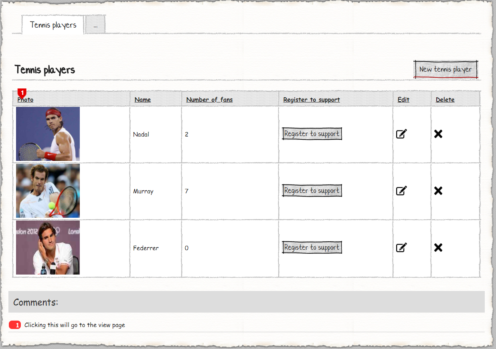
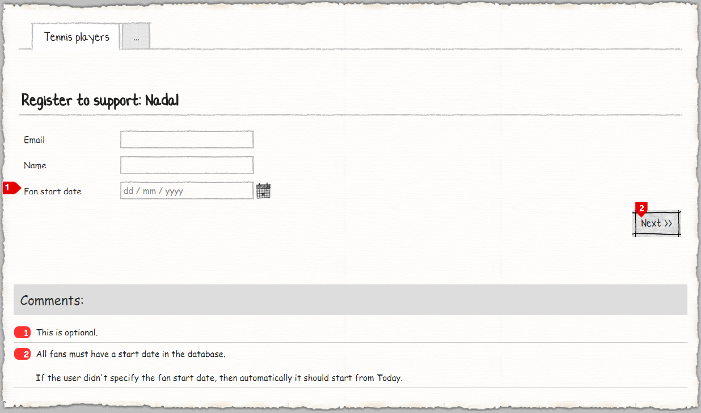
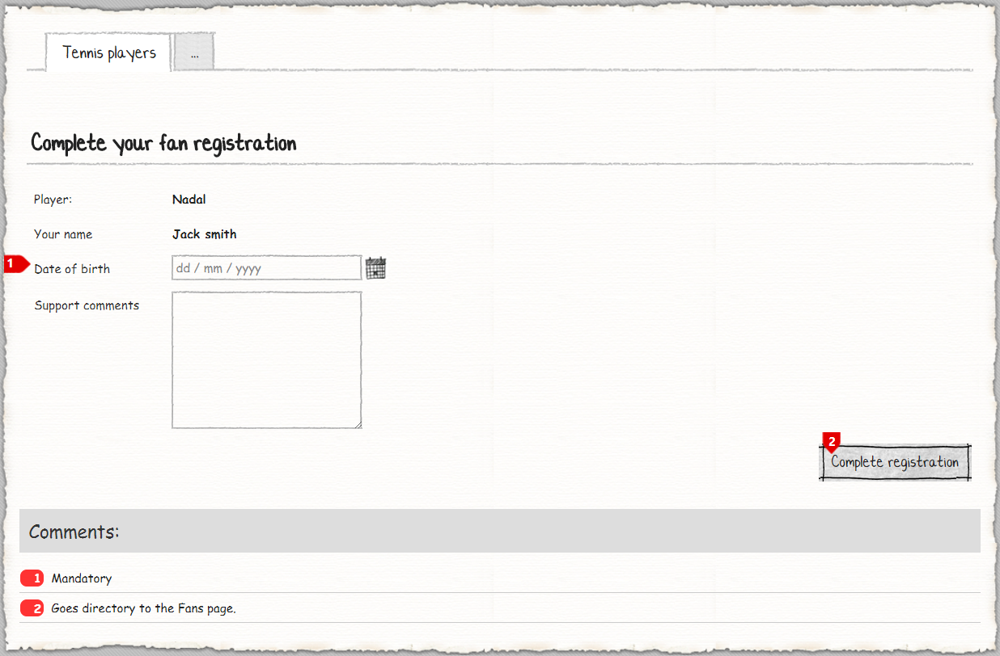
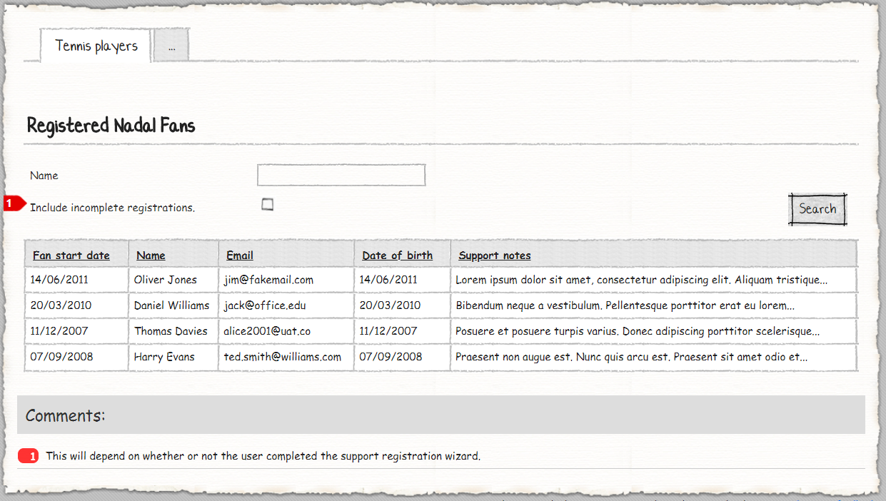

# M# Tutorial - Episode 16: Form wizard

In this tutorial you will learn:

- Mandatory property, but optional on a form
- Optional property, but mandatory on a form
- Setting a form value automatically only if the user didn't.
- Interactive image (using buttons)
- Custom search behaviour 


## Requirements

In this tutorial, we are going to implement a website that shows tennis players with their fans. Users can do CRUD operations on tennis players and fans of the selected tennis player. By clicking on each tennis player users can see a list of all fans and by clicking on *Register to support* button on the tennis player list page, users can add a fan in two steps.

### Tennis players




This page shows a list of all tennis players and lets users to do CRUD operations. When users add a new tennis player they should upload a new picture and after adding new tennis player, by clicking on the player's picture all related fans will be shown in the detail page. 

### Fan


When users click on the *Register to support* button, they will navigate to the **Register to support** page and on this page they will be asked to input their information. In this page user can left *Fan start date* property empty, but in this case this property will be filled by current date time.




In this page users will see their name and their favorite player name. *Date of birth* property is mandatory and when the users click on the *Complete registration* button, they will be navigated to the selected tennis player.



On this page all related fans that have been completed their registration will be shown, but there is ability to show all fans even incomplete ones. For this purpose there is a checkbox button that lets users to select between these two states.

## Implementation: Entities

As we can see in the requirements, the two entities can be identified; **Player** and **Fan**. Each tennis player has many fans and each fan has one tennis player. After analyzing the requirements and identifying related properties, it's time to create them. Now let's create the corresponding classes in the **#Model** project.

Create a **Domain** folder and add these classes:

```C#
using MSharp;

namespace Domain
{
    public class Player : EntityType
    {
        public Player()
        {
            String("Name").Mandatory();

            SecureImage("Photo").AutoOptimize()
                .Height(400)
                .Width(400);

            InverseAssociate<Fan>("Fans", "Player");
        }
    }
}
```

Player class has one string property that is mandatory and it has an image property with height and width of 400 pixels, it also has an inverse association with the *Fan* class that we are going to create it soon.

```C#
using MSharp;

namespace Domain
{
    public class Fan : EntityType
    {
        public Fan()
        {
            Associate<Player>("Player").Mandatory().DatabaseIndex();

            String("Name").Mandatory();

            String("Email").Accepts(TextPattern.EmailAddress).Mandatory();

            Date("Start date").Mandatory();

            Date("Date of birth").Mandatory();

            String("Support comments").Lines(5);

            Bool("Is registration completed").Mandatory();
        }
    }
}
```

Fan class has a reference to the *Player* class and it has required properties according to the requirements. There is a boolean property name *Is registration completed* that let us know registration status.

After adding these classes, build **#Model** and after that **Domain** project to make sure everything regarding it is fine.

## Implementation: Logic

According to the requirements there's one block of logic to implement:

- If the user didn't specify the fan start date, then automatically it should start from Today.

In **Domain** project under **Logic** folder create a partial class named **Fan** like below:

```C#
using Olive;
using System;
using System.Threading.Tasks;

namespace Domain
{
    public partial class Fan
    {
        protected override Task OnValidating(EventArgs e)
        {
            if (this.StartDate == default(DateTime))
            {
                this.StartDate = LocalTime.Now;
            }

            return base.OnValidating(e);
        }
    }
}
```

In this class we have overridden **OnValidating** method and add required business logic according to the requirements.

## Implementation: UI

As we can see in the requirements, we should develop these pages:

- Tennis Players
  - Add / Edit Tennis Player
  - Detail (Fans List)
- Register Fans

### Tennis Player Pages

Go to **Pages** folder of **#UI**, *right click > Add > M#*  then create **TennisPlayer** rootpage:

```C#
using MSharp;

public class TennisPlayerPage : RootPage
{
    public TennisPlayerPage()
    {
        //will be implemented soon
        Add<Modules.PlayersList>();
    }
}
```

Now create a folder named **Player** under the **Pages** folder. Then add an **Enter** and **View** class here:

```C#
using MSharp;

namespace Player
{
    public class EnterPage : SubPage<TennisPlayerPage>
    {
        public EnterPage()
        {
            //will be implemented soon
            Add<Modules.PlayerForm>();
        }
    }
}
```

```C#
using MSharp;

namespace Player
{
    public class ViewPage : SubPage<TennisPlayerPage>
    {
        public ViewPage()
        {
            //will be implemented soon
            Add<Modules.FansList>();
        }
    }
}
```

### Creating required module of Tennis Player Pages

Navigate to **Modules** folder of **#UI** project and create folder named **Player**. Then add a *List module* named **PlayersList** using M# context menu:

```C#
using MSharp;

namespace Modules
{
    public class PlayersList : ListModule<Domain.Player>
    {
        public PlayersList()
        {
            HeaderText("Tennis players")
                .ShowHeaderRow();

            ImageColumn("Photo").ImageUrl("@item.Photo").OnClick(x => x.Go<Player.ViewPage>()
            .Send("item", "item.ID"));

            Column(x => x.Name);

            CustomColumn().DisplayExpression("@await item.Fans.Count()").LabelText("Number of fans");

            //will be implemented soon
            ButtonColumn("Register to support")
                .OnClick(x => x.Go<Fan.FanFormPage>()
                .Send("player", "item.ID"));

            ButtonColumn("Edit").Icon(FA.Edit)
                .OnClick(x => x.Go<Player.EnterPage>()
                .Send("item", "item.ID")
                .SendReturnUrl());

            ButtonColumn("Delete").Icon(FA.Remove)
                .OnClick(x => x.DeleteItem());

            Button("New tennis player").Icon(FA.Plus)
                .OnClick(x => x.Go<Player.EnterPage>()
                .SendReturnUrl());
        }
    }
}
```

According to the requirements users should be able to see a list of all players here and they would be able to click on their image to see their fans. By calling **ImageColumn()** method we can show the image in the list module and by calling **.ImageUrl()** M# fluent method we have set its property and navigate users to the **ViewPage** by calling **.OnClick()** method and pass player Id by using **.Send()** method. For showing the number of fans we have used **CustomColumn()** method that let us add custom C# expression by calling **.DisplayExpression()** method.

Let's continue with adding *Form module* named **PlayerForm** like below:

```C#
using MSharp;

namespace Modules
{
    public class PlayerForm : FormModule<Domain.Player>
    {
        public PlayerForm()
        {
            HeaderText("Tennis player details");

            Field(x => x.Name);

            Field(x => x.Photo);

            Button("Cancel").OnClick(x => x.ReturnToPreviousPage());

            Button("Save").IsDefault().Icon(FA.Check)
            .OnClick(x =>
            {
                x.SaveInDatabase();
                x.GentleMessage("Saved successfully.");
                x.ReturnToPreviousPage();
            });
        }
    }
}
```

### Fan Pages

Create a folder named **Fan** under the **Pages** folder of **#UI** project. Then add an **FanForm** and **FanComplete** class here:

```C#
using MSharp;

namespace Fan
{
    public class FanFormPage : SubPage<TennisPlayerPage>
    {
        public FanFormPage()
        {
            //will be implemented soon
            Add<Modules.FanForm>();
        }
    }
}
```

```C#
using MSharp;

namespace Fan
{
    public class FanCompletePage : SubPage<TennisPlayerPage>
    {
        public FanCompletePage()
        {
            //will be implemented soon
            Add<Modules.FanCompleteForm>();
        }
    }
}
```

### Creating required module of Fan Pages

Navigate to **Modules** folder of **#UI** project and create folder named **Fan**. Then add a *List module* named **FansList** using M# context menu:

```C#
using MSharp;

namespace Modules
{
    public class FansList : ListModule<Domain.Fan>
    {
        public FansList()
        {
            HeaderText("Registered @info.Player.Name Fans");

            Search(x => x.IsRegistrationCompleted)
                .Label("Include incomplete registrations.")
                .Control(ControlType.CheckBox)
                .MemoryFilterCode("if(!info.IsRegistrationCompleted){ result = result.Where(x=>x.IsRegistrationCompleted == true);}");

            SearchButton("Search");

            Column(x => x.StartDate).LabelText("Fan start date");

            Column(x => x.Name);

            Column(x => x.Email);

            Column(x => x.DateOfBirth);

            Column(x => x.SupportComments).LabelText("Support notes");

            ViewModelProperty("Player", "Player").FromRequestParam("item");

            DataSource("await info.Player.Fans.GetList()");
        }
    }
}
```

In this page users should be able to see a list of all player's fans and they should be able to see completed or uncompleted registered fans. For this purpose, after **.Search()** method we have used **.MemoryFilterCode()** fluent method and we have put C# expression to include incomplete fans if this checkbox has been checked.

According to the requirements we should get fans' information on two steps, we will do this by adding two form modules. Let's continue with adding our first *Form module* named **FanForm** like below:

```C#
using MSharp;

namespace Modules
{
    public class FanForm : FormModule<Domain.Fan>
    {
        public FanForm()
        {
            HeaderText("Register to support: @info.Player.Name");

            Field(x => x.Email);

            Field(x => x.Name);

            Field(x => x.StartDate).Mandatory(false);

            AutoSet(x => x.Player);

            Button("Next").IsDefault().Icon(FA.Check)
            .OnClick(x =>
            {
                x.SaveInDatabase();
                x.Go<Fan.FanCompletePage>().Send("item", "info.Item.ID");
            });
        }
    }
}
```

On this page we will get **Player** from query string, so we have used **AutoSet()** method to do this. By writing C# expression `@info.Player.Name` in **HeaderText()** method player name will be shown in header text and after saving fans' information we navigate users to the next form module and send current fans Id.

Let's continue our work by Adding second *Form Module* named **FanCompleteForm** form like below:

```C#
using MSharp;

namespace Modules
{
    public class FanCompleteForm : FormModule<Domain.Fan>
    {
        public FanCompleteForm()
        {
            HeaderText("Complete your fan registeration");

            Field(x => x.Player).Readonly();

            Field(x => x.Name).Readonly().Label("Your name");

            Field(x => x.DateOfBirth).Mandatory();

            Field(x => x.SupportComments);

            OnBeforeSave("Befor saving form").Code("item.IsRegistrationCompleted = true;");

            Button("Complete registration").IsDefault().Icon(FA.Check)
            .OnClick(x =>
            {
                x.SaveInDatabase();
                x.GentleMessage("Saved successfully.");
                x.Go<Player.ViewPage>().Send("item", "info.Item.PlayerId");
            });
        }
    }
}
```

In this page we should put a business logic. The reason that we have put business logic here is that we have this logic just for this page and if we have general business logic, it would better put it in a separate file in the **Logic** folder of **Domain** project. By calling **OnBeforeSave()** method we have set the *IsRegistrationCompleted* property to *true* and then save fans' information. After saving fan's information users will be navigated to the **ViewPage** that will be listing all fans of the selected player.

Now it's time to add these modules to their related root and sub pages. Add them if you let them empty in previous steps.

### Adding Pages to the Menu

After you ended up with form pages, you need to add it to the main menu:

```C#
using MSharp;
using Domain;

namespace Modules
{
    public class MainMenu : MenuModule
    {
        public MainMenu()
        {
            AjaxRedirect().IsViewComponent().UlCssClass("nav navbar-nav dropped-submenu");

            Item("Login")
                .Icon(FA.UnlockAlt)
                .VisibleIf(AppRole.Anonymous)
                .OnClick(x => x.Go<LoginPage>());

            Item("Settings")
                .VisibleIf(AppRole.Admin)
                .Icon(FA.Cog)
                .OnClick(x => x.Go<Admin.SettingsPage>());

            Item("Tennis players")
                .Icon(FA.Cog)
                .OnClick(x => x.Go<TennisPlayerPage>());
        }
    }
}
```

build **#UI** prject to make sure everything regarding it is fine.

### Final Step

Build **#UI** project, set the **WebSite** project as your default *StartUp* project and configure your *connection string* in **appsetting.json** file and hit F5. Your project is ready to use.
