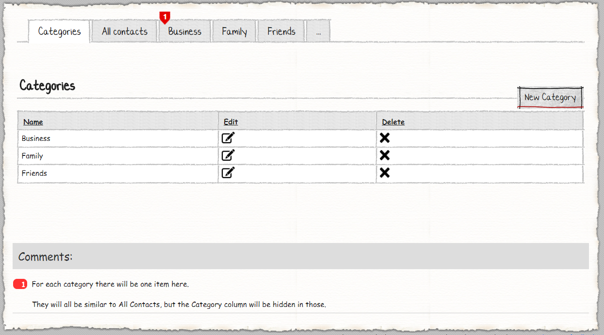
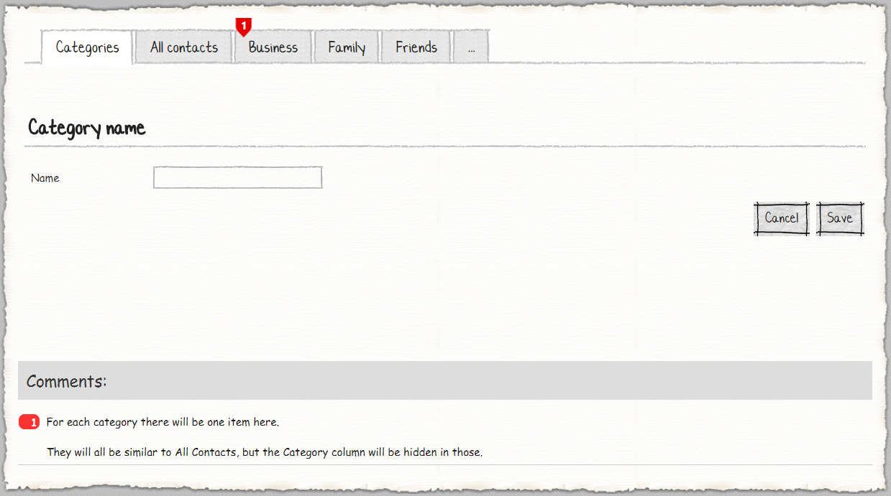
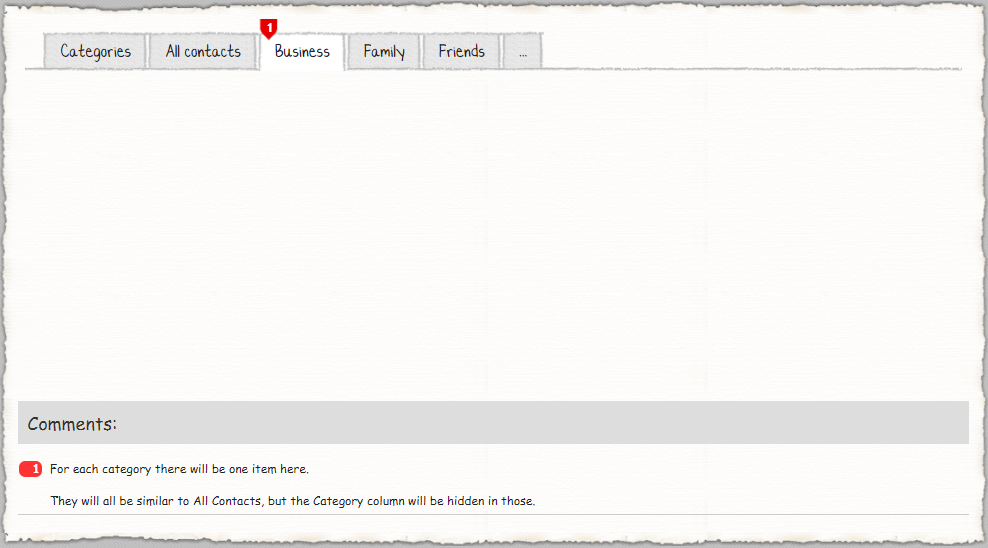
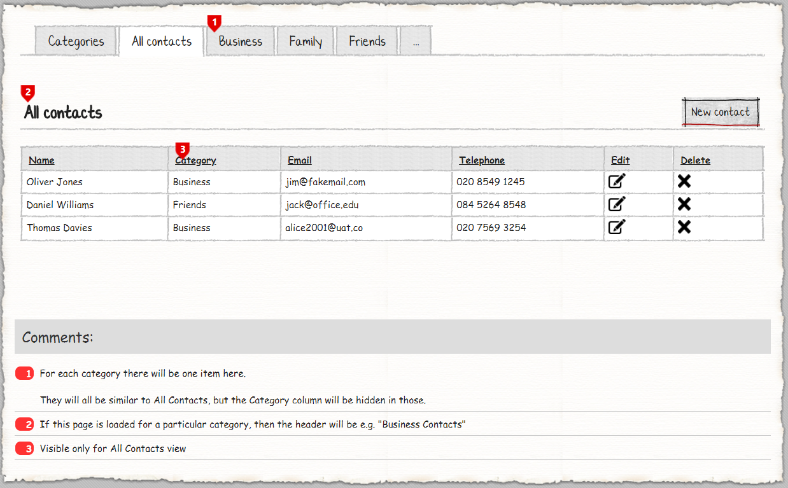
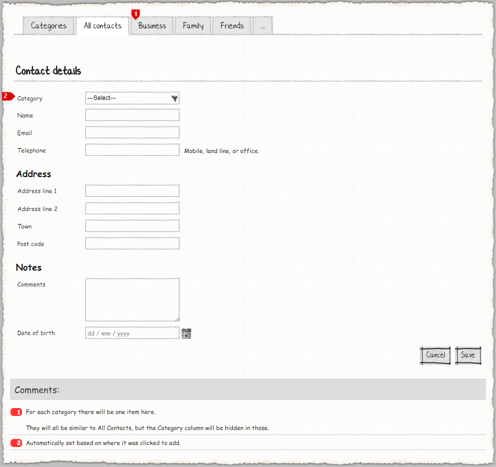

# M# Tutorial - Episode 17: Dynamic menu

In this tutorial you will learn:

- Dynamic menu item
- Custom Active menu item
- Visibility
- Module box
- After control, Before control settings

## Requirements

In this tutorial, we are going to implement a website that lets users to create categories and assign contacts to each category, by adding a new category that category must be dynamically added to the main menu and when users click on the category menu item they should see only related contacts.

### Categories





This page shows a list of all categories and lets users do CRUD operations. When a user adds a new category, that category should be added to the menu and when user clicks on each category menu item, he should see just related contacts.

### Contacts




On this page, users should select a related category for contact and there is two separate parts named **Address** and **Notes** which hold related properties. When a user navigates to this page from selected categories on the menu, the category dropdown list should be selected by default.

## Implementation: Entities

As we can see in the requirements, the two entities can be identified; **Category** and **Contact**. The category entity has *many* contacts and each contact has *one* category. After analyzing the requirements and identifying related properties, it's time to create them. Now let's create the corresponding classes in the **#Model** project.

Create a **Domain** folder and add these classes:

```csharp
using MSharp;

namespace Domain
{
    public class Category : EntityType
    {
        public Category()
        {
            String("Name").Mandatory();

            InverseAssociate<Contact>("Contacts", "Category");
        }
    }
}
```

Category class has one mandatory string property and an inverse association with **Contact** entity.

```csharp
using MSharp;

namespace Domain
{
    public class Contact : EntityType
    {
        public Contact()
        {
            Associate<Category>("Category").Mandatory();

            String("Name");

            String("Email");

            String("Telephone");

            String("Address line 1");

            String("Address line 2");

            String("Town");

            String("Postcode");

            String("Comments").Lines(5);

            Date("Date of birth");
        }
    }
}
```

Contact class has association with **Category** entity and other related properties are written based on requirements.

After adding these classes, build **#Model** and after that **Domain** project to make sure everything regarding it is fine.

## Implementation: UI

As we can see in the requirements, we should develop these pages:

- Categories
  - Add / Edit Category
- Contacts
  - Add / Edit Contact

### Category Pages

Go to **Pages** folder of **#UI**, *right click > Add > M#*  then create **Category** rootpage:

```csharp
using MSharp;

public class CategoryPage : RootPage
{
    public CategoryPage()
    {
        Add<Modules.CategoriesList>();
        //will be implemented soon.
    }
}
```

Now create a folder named **Category** under the **Pages** folder. Then add an **Enter** class here:

```csharp
using MSharp;

namespace Category
{
    public class EnterPage : SubPage<CategoryPage>
    {
        public EnterPage()
        {
            Add<Modules.CategoryForm>();
            //will be implemented soon.
        }
    }
}
```

### Creating required module of Category Pages

Navigate to **Modules** folder of **#UI** project and create folder named **Category**. Then add a *List module* named **CategoriesList** using M# context menu:

```csharp
using MSharp;

namespace Modules
{
    public class CategoriesList : ListModule<Domain.Category>
    {
        public CategoriesList()
        {
            HeaderText("Categories");

            Column(x => x.Name);

            ButtonColumn("Edit").Icon(FA.Edit)
				.HeaderText("Edit").GridColumnCssClass("actions")
                .OnClick(x => x.Go<Category.EnterPage>().Send("item", "item.ID")
                .SendReturnUrl());

			ButtonColumn("Delete").Icon(FA.Remove)
                .HeaderText("Delete").GridColumnCssClass("actions")
                .ConfirmQuestion("Are you sure you want to delete this Category?")
                .CssClass("btn-danger")
                .OnClick(x =>
                {
                    x.DeleteItem();
                    x.RefreshPage();
                });
            Button("New Category").Icon(FA.Plus)
                .OnClick(x => x.Go<Category.EnterPage>()
                .SendReturnUrl());
        }
    }
}
```

Let's continue with adding *Form module* named **CategoryForm** like below:

```csharp
using MSharp;

namespace Modules
{
    public class CategoryForm : FormModule<Domain.Category>
    {
        public CategoryForm()
        {
            HeaderText("Category details");

            Field(x => x.Name);

            Button("Cancel").OnClick(x => x.ReturnToPreviousPage());

            Button("Save").IsDefault().Icon(FA.Check)
            .OnClick(x =>
            {
                x.SaveInDatabase();
                x.GentleMessage("Saved successfully.");
                x.ReturnToPreviousPage();
            });
        }
    }
}
```

Now its time to add these modules to their related root and sub pages. Add them if you let them empty in previous steps.

### Contact Pages

Go to **Pages** folder of **#UI**, *right click > Add > M#*  then create **Contact** rootpage:

```csharp
using MSharp;
public class ContactPage : RootPage
{
    public ContactPage()
    {
        Add<Modules.ContactsList>();
        //will be implemented soon.
    }
}
```

Now add a folder named **Contact** under **Pages** folder, then add an **Enter** *sub page* class:

```csharp
using MSharp;

namespace Contact
{
    public class EnterPage : SubPage<ContactPage>
    {
        public EnterPage()
        {
            Add<Modules.ContactForm>();
        }
    }
}
```

### Creating required module of Contact Pages

Move to the **Modules** folder of **#UI** and add a folder with the name of **Contact** which will contain related modules of *Contact*.
Now use the M# context menu and add a *List module* named **ContactsList**:

```csharp
using MSharp;

namespace Modules
{
    public class ContactsList : ListModule<Domain.Contact>
    {
        public ContactsList()
        {
            HeaderText("Contacts");

            Column(x => x.Name);

            Column(x => x.Category).VisibleIf("info.Category == null");

            Column(x => x.Email);

            Column(x => x.Telephone);

            ViewModelProperty("Category", "Category").FromRequestParam("category");

            DataSource("info.Category == null ? await  Database.GetList<Contact>() : await info.Category.Contacts.GetList()");

            ButtonColumn("Edit").Icon(FA.Edit)
				.HeaderText("Edit").GridColumnCssClass("actions")
                .OnClick(x => x.Go<Contact.EnterPage>().Send("item", "item.ID"));

			ButtonColumn("Delete").Icon(FA.Remove)
                .HeaderText("Delete").GridColumnCssClass("actions")
                .ConfirmQuestion("Are you sure you want to delete this Contact?")
                .CssClass("btn-danger")
                .OnClick(x =>
                {
                    x.DeleteItem();
                    x.RefreshPage();
                });

            Button("New Contact").Icon(FA.Plus)
                .OnClick(x => x.Go<Contact.EnterPage>().Send("category", "info.Category?.ID"));
        }
    }
}
```

In this class, if users navigated here by clicking on *All contacts*, they should see all contacts and **Category** should be visible but when users click on a specific category from menu item they should see only related contacts and **Category** should be hidden. We pass **Category Id** in menu item and if users click on *All contacts* menu item there is no available category , so related category property is null, we have used this feature and set visible state of *Category* property by calling `.VisibleIf()` method. We have also set `DataSource()` method by checking property state.

Now add *Form module* named **ContactForm** like below:

```csharp
using MSharp;

namespace Modules
{
    public class ContactForm : FormModule<Domain.Contact>
    {
        public ContactForm()
        {
            HeaderText("Contact details");

            Field(x => x.Category);

            Field(x => x.Name);

            Field(x => x.Email);

            Field(x => x.Telephone).AfterControl("Mobile, land line, or office");

            var addressBox = Box("Address", BoxTemplate.HeaderBox);

            Field(x => x.AddressLine1).Box(addressBox);

            Field(x => x.AddressLine2).Box(addressBox);

            Field(x => x.Town).Box(addressBox);

            Field(x => x.Postcode).Box(addressBox);

            var notesBox = Box("Notes", BoxTemplate.HeaderBox);

            Field(x => x.Comments).Box(notesBox);

            Field(x => x.DateOfBirth).Box(notesBox);

            AutoSet(x => x.Category);

            Button("Cancel").OnClick(x => x.ReturnToPreviousPage());

            Button("Save").IsDefault().Icon(FA.Check)
            .OnClick(x =>
            {
                x.SaveInDatabase();
                x.GentleMessage("Saved successfully.");
                x.ReturnToPreviousPage();
            });
        }
    }
}
```

On this page there is a new M# method named `Box()`. Where you need to group your form elements, you should call `.Box()` method and add related elements to that box. According to the requirements, if category id is available category should be selected by default and for this purpose, we have called `AutoSet()` method for category property.

### Adding Pages to the Menu

After you ended up with form pages, you need to add it to the main menu:

```csharp
using MSharp;

namespace Modules
{
    public class MainMenu : MenuModule
    {
        public MainMenu()
        {
            AjaxRedirect().IsViewComponent().UlCssClass("nav navbar-nav dropped-submenu");

            Item("Login")
                .Icon(FA.UnlockAlt)
                .VisibleIf(AppRole.Anonymous)
                .OnClick(x => x.Go<LoginPage>());

            Item("Settings")
                .VisibleIf(AppRole.Admin)
                .Icon(FA.Cog)
                .OnClick(x => x.Go<Admin.SettingsPage>());

            Item("Categories")
               .Icon(FA.Cog)
               .OnClick(x => x.Go<CategoryPage>());

            Item("All Contacts")
               .Icon(FA.Cog)
               .OnClick(x => x.Go<ContactPage>());

            Item<ContactPage>()
               .DataSourceType<Domain.Category>()
               .Name("Category")
			   .Text("C#:item.Name")
               .Key("C#:item.ID")
               .Icon(FA.Cog)
               .OnClick(x => x.Go<ContactPage>().Send("category", "item.ID"));
        }
    }
}
```

In this class, menu items should be added dynamically according to the categories. For this purpose, we should call `.DataSourceType<Domain.Category>()` with its related name and key method as shown above.

### Final Step

Build **#UI** project, set the **WebSite** project as your default *StartUp* project and configure your *connection string* in **appsetting.json** file and hit F5. Your project is ready to use.
