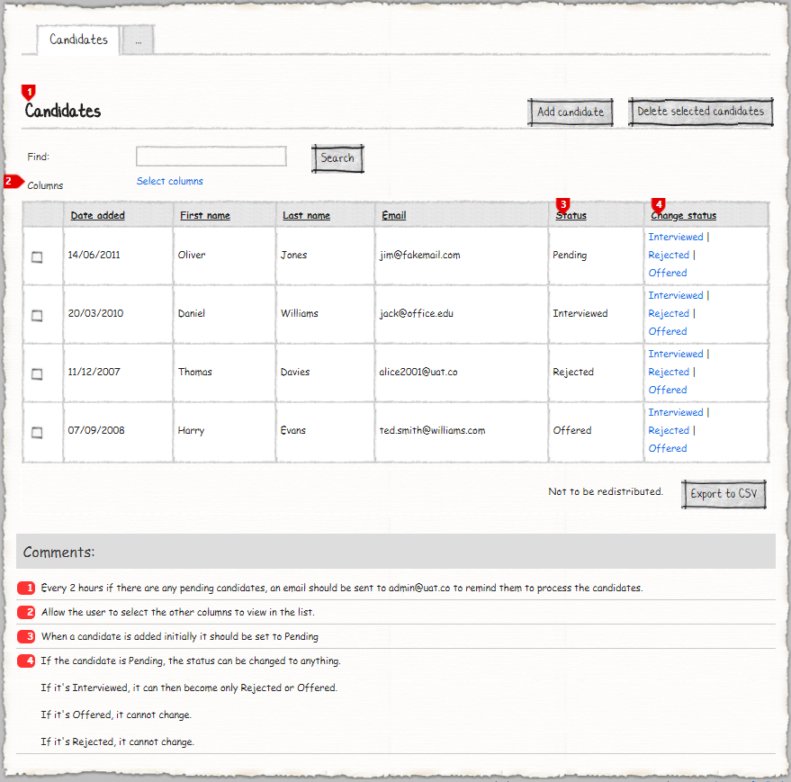
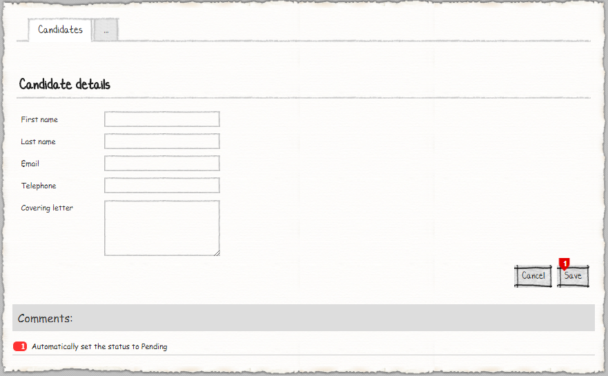

# M# Tutorial - Episode 18: Automated tasks

In this tutorial you will learn:

- Repeated buttons
- Button markup template
- Checkbox column for list modules
- Display option for columns
- Instance accessor for entity types
- Automated tasks

## Requirements

In this tutorial, we are going to implement a website that manages candidates. Users can do CRUD operations on candidates and change their status. There are some criteria listed below:

- Application should send a reminder email to *admin@uat.co* if there's any new pending candidates to proceed.
- Allow the user to select the other columns to view in the list.
- When a candidate is added initially it should be set to *Pending*
- The candidate status can change during the application lifetime with these conditions:
  - If the candidate is *Pending*, the status can turn into either *Interviewed*, *Offered* or *Rejected*.
  - If it's *Interviewed*, it can then become only *Rejected* or *Offered*.
  - If it's *Offered*, it cannot change.
  - If it's *Rejected*, it cannot change.

### Candidates




Candidate page shows a list of all candidates and lets users to do CRUD operations. When a user adds a new candidate, initially its status should be *Pending* and after adding a candidate, the user is able to change candidate status to any other status. In list page, users are able to export the candidates list to *CSV*, search, delete selected candidates and select specific columns to show.

## Implementation: Entities

As we can see in the requirements, one entity can be identified; **Candidate**. The candidate has a status that we consider is as a class. After analyzing the requirements and identifying related properties, it's time to create them. Now let's create the corresponding classes in the **#Model** project.

Navigate to the **#Model** project and create a **Domain** folder, *right click > Add > M#* and then add these classes:

```csharp
using MSharp;

namespace Domain
{
    public class Candidate : EntityType
    {
        public Candidate()
        {
            String("First name").Mandatory();

            String("Last name").Mandatory();

            String("Email").Accepts(TextPattern.EmailAddress);

            String("Telephone").Accepts(TextPattern.UKMobilePhoneNumber);

            String("Convering letter").Lines(5);

            Date("Date Added").Mandatory().Default("C#:LocalTime.Now");

            Associate<Status>("Status").Default("Pending");
        }
    }
}
```

Candidate class has four string properties with thier related M# fluent methods and a date property and a association with *status* class. Accoding to the requiremtns *status* property should be initially selected and for this purpose we have used `.Default()` method with *Pending* string value.

```csharp
using MSharp;

namespace Domain
{
    public class Status : EntityType
    {
        public Status()
        {
            GenerateParseMethod();

            IsEnumReference();

            InstanceAccessors(new[] { "Pending", "Interviewed", "Rejected", "Offered" });

            String("Name");
        }
    }
}
```

Status class is acting like a Enum, for this purpose we have used `IsEnumReference()` method and initial it by calling `InstanceAccessors()`. In *Candidate* class we initialized *Status* property with a *Pending* string value, for this purpose, we should use `GenerateParseMethod()` method.

After adding these classes, build **#Model** and after that **Domain** project to make sure everything regarding it is fine.

## Implementation: Logic

According to the requirements there's three blocks of logic to implement:

- A method to check candidates status every 2 hours and send reminder email to *admin@uat.co* if necessary.
- A method to change candidate status.
- A method to show available status.

In **Domain** project under **Logic** folder create a partial class named **Candidate** like below:

```csharp
using Olive;
using Olive.Email;
using System.Threading.Tasks;

namespace Domain
{
    public partial class Candidate
    {
        public void UpdateStatus(Status status)
        {
            Database.Update(this, x => x.Status = status);
        }

        public static async Task RemindAdminForPendingCandidates()
        {
            var pendingCandidates = await Database.GetList<Candidate>(x => x.Status == Status.Pending);

            if (pendingCandidates.None())
            {
                return;
            }

            await EmailService.Send(new EmailMessage() { Subject = "Candidate pending reminder", Body = "...", To = "admin@uat.co" });
        }
    }
}
```

We will use these methods in **#UI** project soon, but for now you should know that `UpdateStatus()` method will change selected candidate status to specified value and `RemindAdminForPendingCandidates()` method will gather all pending candidates and send a reminder email to the admin (for more information about sending email in M# please go to [tutorial 14](https://github.com/Geeksltd/MSharp.Docs/blob/master/Tutorials/14/README.md)).

Create another partial class named **Status** like below:

```csharp
using System.Collections.Generic;
using System.Linq;

namespace Domain
{
    public partial class Status
    {
        public IEnumerable<Status> GetPossibleChanges()
        {
            if (this == Pending)
            {
                return new[] { Interviewed, Offered, Rejected };
            }

            if (this == Interviewed)
            {
                return new[] { Offered, Rejected };
            }

            return Enumerable.Empty<Status>();
        }
    }
}
```

AS you can see, `GetPossibleChanges()` method returns the available status according to the current state of the entity.

According to the requirements, **Status** class has four predefined values that should be initially saved to the database when application start for the first time. Under **[DEV-SCRIPTS]** folder of **Domain** project open *ReferenceData.cs* and add this method like below:

```csharp
using System;
[...]

namespace Domain
{
    public class ReferenceData : IReferenceData
    {
        [...]
        public async Task Create()
        {
            [...]
            await InitEnums();
        }

        [...]
        async Task InitEnums()
        {
            await Create(new Status { Name = "Pending" });
            await Create(new Status { Name = "Interviewed" });
            await Create(new Status { Name = "Rejected" });
            await Create(new Status { Name = "Offered" });
        }
    }
}
```

By calling `InitEnums()` method on `ReferenceData` class constructor, M# will seed database with initial value just once.

### Automated Task

According to the requirements we should check candidate status every 2 hours and send an email to the administrator to process candidates.
Navigate to **#Model** project , open **Project.cs** file and add `RemindAdminForPendingCandidate()` method like below:

```csharp
        public Project()
        {
			[...]

            AutoTask("Clean old temp uploads").Every(10, TimeUnit.Minute)
                .Run("await Olive.Mvc.FileUploadService.DeleteTempFiles(olderThan: 1.Hours());");
			
			//Every 2 hours if there are any pending candidates, an email should be sent to admin@uat.co to remind them to process the candidates.
            AutoTask("Remind admin for pending candidate").Every(2, TimeUnit.Hour)
                .Run("await Candidate.RemindAdminForPendingCandidates();");

        }
```

Also make sure that inside **appsetting.json** in **WebSite** project, the setting related to *Automated Tasks* is marked as *true*.

```json
"Automated.Tasks": {
        "Enabled": true
    }
```

## Implementation: UI

As we can see in the requirements, we should develop these pages:

- Candidates
  - Add / Edit Candidate

### Creating Candidate Pages

Go to **Pages** folder of **#UI**, *right click > Add > M#*  then create **Candidate** rootpage:

```csharp
using MSharp;
public class CandidatePage : RootPage
{
    public CandidatePage()
    {
        Add<Modules.CandidatesList>();
    }
}
```

Now create a folder named **Candidate** under the **Pages** folder. Then add an **Enter** class here:

```csharp
using MSharp;
using MSharp;

namespace Candidate
{
    public class EnterPage : SubPage<CandidatePage>
    {
        public EnterPage()
        {
            Add<Modules.CandidateForm>();
        }
    }
}
```

### Creating required module of Canidate Pages

Navigate to **Modules** folder of **#UI** project and create folder named **Candidate**. Then add a *List module* named **CandidatesList** using M# context menu:

```csharp
using MSharp;

namespace Modules
{
    public class CandidatesList : ListModule<Domain.Candidate>
    {
        public CandidatesList()
        {
            HeaderText("[#BUTTONS(NewCandidate)#][#BUTTONS(DeleteSelectedCandidates)#]Candidates")
                .ShowHeaderRow()
                .ShowFooterRow()
                .SelectCheckbox();

            Search(GeneralSearch.AllFields).Label("Find:");

            SearchButton("Search").OnClick(x => x.Reload());

            Column(x => x.DateAdded);

            Column(x => x.FirstName);

            Column(x => x.LastName);

            Column(x => x.Email);

            Column(x => x.Telephone).DisplayMode(DisplayMode.Selectable);

            Column(x => x.ConveringLetter).DisplayMode(DisplayMode.Selectable);

            Column(x => x.Status);

            ButtonColumn("Option Name").RepeatDataSource("item.Status.GetPossibleChanges()")
                .RepeatDataSourceType("Status")
                .SeperatorTemplate("|")
                .Text("@option.Name")
                .OnClick(x =>
                {
                    x.CSharp("item.UpdateStatus(option);");
                    x.Reload();
                })
                .Style(ButtonStyle.Link);

            ButtonColumn("Edit").Icon(FA.Edit)
                .OnClick(x => x.Go<Candidate.EnterPage>()
                .Send("item", "item.ID")
                .SendReturnUrl());

			ButtonColumn("Delete").Icon(FA.Remove)
					.HeaderText("Delete").GridColumnCssClass("actions")
					.ConfirmQuestion("Are you sure you want to delete this Candidate?")
					.CssClass("btn-danger")
					.OnClick(x =>
					{
						x.DeleteItem();
						x.Reload();
					});

            Button("New Candidate").Icon(FA.Plus)
                .CssClass("pull-right")
                .OnClick(x => x.Go<Candidate.EnterPage>()
                .SendReturnUrl());

            Button("Delete selected candidates")
                .CssClass("pull-right")
                .OnClick(x =>
                {
                    x.CSharp("await Database.Delete<Candidate>(await info.SelectedItems);");
                    x.Reload();
                });

            Button("Export to CSV")
                .MarkupTemplate("Not to be redistributed. [#Button#]")
                .OnClick(x => x.Export(ExportFormat.Csv));
        }
    }
}
```

According to the requirements users should be able to select custom columns; So we have used `.DisplayMode(DisplayMode.Selectable)` M# fluent method with **DisplayMode.Selectable** parameter to let users make these columns visible or hidden. We should also put *Add candidate* and *Delete selected candidates* to the top right side of the page, so we have put their name with special format in `HeaderText()` method. For showing available status based on current candidate status, we have used `ButtonColumn()` method with other special M# fluent methods. `.RepeatDataSource()` and `.RepeatDataSourceType()` methods configure M# to use our custom method to feed its data. By calling `.SeperatorTemplate()` method we have used "|" as a separator for each value and by calling `.OnClick()` method we have called our custom method for changing selected candidate status.

Let's continue with adding *Form module* named **CandidateForm** like below:

```csharp
using MSharp;

namespace Modules
{
    public class CandidateForm : FormModule<Domain.Candidate>
    {
        public CandidateForm()
        {
            HeaderText("Candidate details");

            Field(x => x.FirstName);

            Field(x => x.LastName);

            Field(x => x.Email);

            Field(x => x.Telephone);

            Field(x => x.ConveringLetter);

            Button("Cancel").OnClick(x => x.ReturnToPreviousPage());

            Button("Save").IsDefault().Icon(FA.Check)
            .OnClick(x =>
            {
                x.SaveInDatabase();
                x.GentleMessage("Saved successfully.");
                x.ReturnToPreviousPage();
            });
        }
    }
}
```

Now its time to add these modules to their related root and sub pages. Add them if you let them empty in previous steps.

### Adding Pages to the Menu

After you ended up with the pages, you need to add them to the main menu:

```csharp
using MSharp;
using Domain;

namespace Modules
{
    public class MainMenu : MenuModule
    {
        public MainMenu()
        {
            AjaxRedirect().IsViewComponent().UlCssClass("nav navbar-nav dropped-submenu");

            Item("Login")
                .Icon(FA.UnlockAlt)
                .VisibleIf(AppRole.Anonymous)
                .OnClick(x => x.Go<LoginPage>());

            Item("Settings")
                .VisibleIf(AppRole.Admin)
                .Icon(FA.Cog)
                .OnClick(x => x.Go<Admin.SettingsPage>());

            Item("Candidates")
                .Icon(FA.Cog)
                .OnClick(x => x.Go<CandidatePage>());
        }
    }
}
```

build **#UI** prject to make sure everything regarding it is fine.

### Final Step

Build **#UI** project, set the **WebSite** project as your default *StartUp* project and configure your *connection string* in **appsetting.json** file and hit F5. Your project is ready to use.
