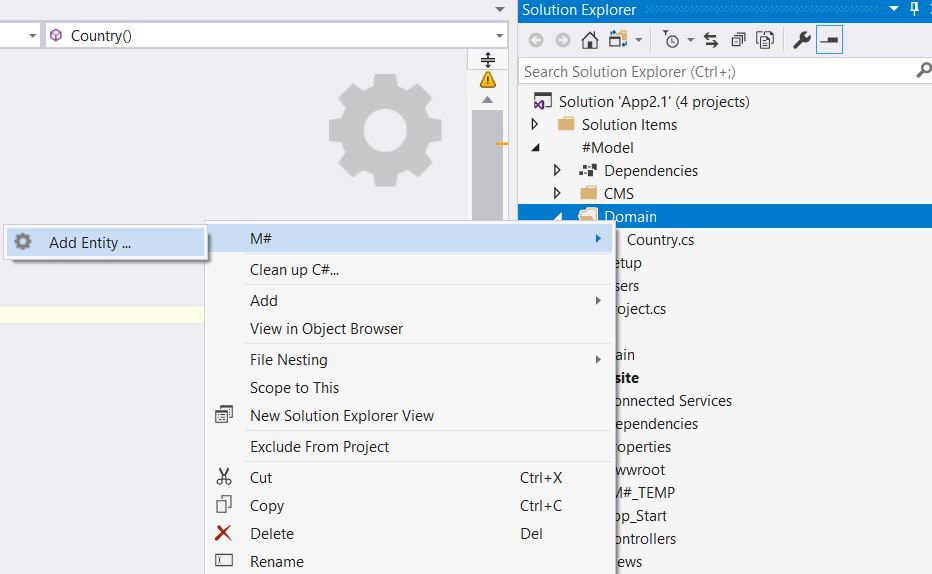
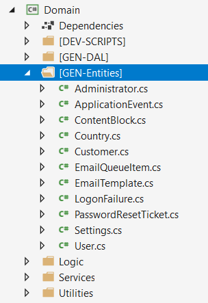
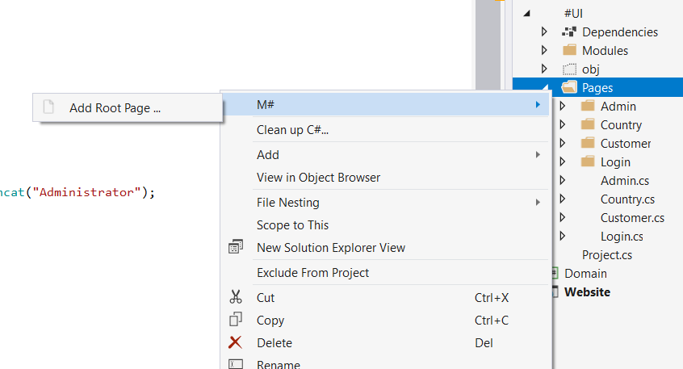
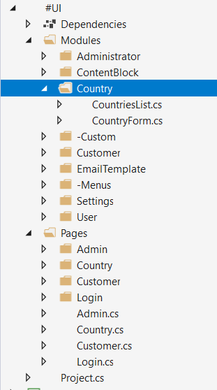
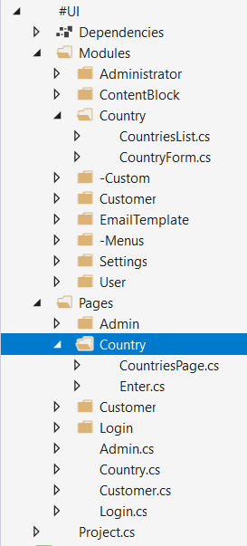

# M# Tutorial - Episode 2: Modal pages

In the previous tutorial we have learned about this topics:

- Entity types
- Association between entity types
- Pages and navigation
- Action buttons
- A list module
- A form module
- A menu

In this tutorial we continue our learning process with enriching previous topics and learn new topics like:

- Pop-up (modal) pages
- Image and file properties

## Requirements

In this tutorial, we are going to implement a management system that let users manage their customers and related countries.
Here are the sketches for list and model.


## Implementation: Entities

As we can see in the requirements, we can identify two entities, "Country" and "Customer" that these entities has One-to-Many relationships since any country have many customers and each customer has one country.
After understanding requirements and identifying its related entities and their relationships, it's time to create them. Now let's create the corresponding classes in the *#Model* project.

Navigate to the **#Model** project and create a **Domain** folder, *right click > Add > M#* and then add these classes:



By default M# will create a concrete class that inherits from *EntityType* class, let change our class and add required properties:

```C#
using MSharp;
namespace Domain
{
    public class Country : EntityType
    {
        public Country()
        {
            String("Name").Mandatory();
        }
    }
}
```

In M# we use the default constructor to add properties to entity types.
The only property of the *Country* class is of type *string* and is called *Name*. This property is mandatory so we need to call .Mandatory() method using M# fluent API.

In a similar way add another entity type called *Customer* but this time with a set of properties shown in the snippet below:

```C#
using MSharp;
namespace Domain
{
    public class Customer : EntityType
    {
        public Customer()
        {
            Associate<Country>("Country");

            String("Company name").Mandatory(value: false);

            Date("Contract start date").Mandatory(value: false);

            OpenImage("Logo").Width(200).Height(80).Mandatory(value: false);

            OpenFile("Contract").Mandatory(value: false);
        }
    }
}
```

As you can see we have used M# fluent API to add *Customer* class properties, we have added One-to-Many relationship with **Associate\<Country>("Country")** property and continue our work to add *Company name* and other properties.
Here you should consider these methods:

- String() : Used for simple string property
- Date() : Used for date and time property
- OpenImage() : Used for image property
- OpenFile() : Used for any document file.

As you can see, M# framework gives use excellent power to use it's fluent API continuance to add other methods like *.Width()* , *.Height()* etc.

**Note:** Always use singular names for entity types. M# is smart enough to automatically use their plural forms when necessary.

Now it's time to feed our two entity types to the M# code generator. You invoke it by building the *#Model* project.
In solution explorer, right click the *#Model* project and select *Build*.
After the build process, you can find the resulting files in the *Domain* project under the *[GEN-Entities]* branch as shown below:



You should notice that every class in *GEN-Entities* , *GEN-DAL* , *DEV-SCRIPTS* are generated by M# framework and you shouldn't do any manual change. If you need some business logic you should add a partial class in *Logic* and write your own business.
Before moving on to developing the UI, let's build the *Domain* project to make sure everything regarding it is fine.

## Implementation: UI

In **#UI** project we have three main steps to do:

1. Add Pages
2. Config Menu
3. Add Modules To Pages

According to the requirement, we have a country and a customer page that in these pages we should add a modal page for adding or editing each entity.
Our first step is to create a root page for country and customer page.

### Creating Country Pages

Go to **Pages** folder of **#UI**, *right click > Add > M#*  then create **Country** rootpage:



```C#
using MSharp;
public class CountryPage : RootPage
{
    public CountryPage()
    {
        Add<Modules.MainMenu>();

        OnStart(x => x.Go<Country.CountriesPage>().RunServerSide());
    }
}
```

M# framework will create this file for you and you should change it's constructor as shown above.
In this class we have added *Add\<Modules.MainMenu>();*, by adding this code we tell M# that it should add our main menu class that hold our site menu.
After that we tell M# framework that it should run *CountriesPage* class immediately after running this page.

Under **Pages** folder create a folder named **Country** and then add the following class:

```C#
using MSharp;
namespace Country
{
    public class CountriesPage : SubPage<CountryPage>
    {
        public CountriesPage()
        {
            //will be implemented soon
            Add<Modules.CountriesList>();
        }
    }
}
```

This class inherits from *SubPage\<CountryPage>* class. We have added a *CountriesList* class that its responsibility is to list all countries in a grid like the first requirement picture. We continue our work by adding *CountriesList* class that inherits from *ListModule*

### Creating required module of Country Pages

Navigate to **Modules** folder of **#UI** project and create folder named **Country**. Then add a *List module* named **CountriesList** using M# context menu:



```C#
using MSharp;
namespace Modules
{
    public class CountriesList : ListModule<Domain.Country>
    {
        public CountriesList()
        {
            Column(x => x.Name);

            ButtonColumn("Edit").Icon(FA.Edit)
                .OnClick(x => x.PopUp<Country.EnterPage>()
                    .Send("item", "item.ID"));

            ButtonColumn("Delete").Icon(FA.Remove)
                .OnClick(x =>
                {
                    x.DeleteItem();
                    x.RefreshPage();
                });

            Button("New Country").Icon(FA.Plus)
                .OnClick(x => x.PopUp<Country.EnterPage>());
        }
    }
}
```

In this class we have included our needed column according to the requirement and add *Edit, Delete* and *Add Contact* buttons with their navigation instruction. You should notice that we have inherited from **ListModule** class, this class is a special class that tells M# framework how to generate code for showing this class.

### Creating Country Form Page

After creating a Country list its time to create a country form page that is responsible for adding and editing operation. We continue our work by creating a **Enter** class in a **Country** folder under the *Page* folder in **#UI** project:



Add a class named *EnterPage* like below:

```C#
using MSharp;
namespace Country
{
    public class EnterPage : SubPage<CountriesPage>
    {
        public EnterPage()
        {
            Layout(Layouts.FrontEndModal);

            Add<Modules.CountryForm>();
        }
    }
}
```

This class inherits from *CountriesPage* class, we have set its layout to be modal and by using **Add\<Modules.CountryForm\>** we instruct the M# framework that this page is responsible for showing country form module. Now it's time to create **CountryForm** class, Add this class under the **Countery** folder in **Modules** folder like below:

```C#
using MSharp;
namespace Modules
{
    public class CountryForm : FormModule<Domain.Country>
    {
        public CountryForm()
        {
            Field(x => x.Name);

            Button("Cancel").CausesValidation(false).Icon(FA.Stop)
                .OnClick(x => x.CloseModal());

            Button("Save").IsDefault().Icon(FA.Save).OnClick(x =>
            {
                x.SaveInDatabase();
                x.GentleMessage("Saved successfully.");
                x.CloseModal();
            });
        }
    }
}
```

This class inherits from **FormModule** class that tell the M# framework to deal with this class as a form module. This special class tells M# that it should generate a form page and a user can add or edit entity. In this class we have just one filed as requirement told us, so we just use *Field()* method to tell M# how to generate code for this property.

### Creating Customer List Pages

We continue our work by repeating former steps. First add customer root page:


```C#
using MSharp;
public class CustomerPage : RootPage
{
    public CustomerPage()
    {
        Add<Modules.MainMenu>();

        OnStart(x => x.Go<Customer.CustomersPage>().RunServerSide());
    }
}
```

Add a folder named **Customer** under the **Pages** folder of **#UI** project and then add **CustomersPage** class:

```C#
using MSharp;
namespace Customer
{
    public class CustomersPage : SubPage<CustomerPage>
    {
        public CustomersPage()
        {
            Add<Modules.CustomersList>();
        }
    }
}
```

### Creating required module of Customer Pages

Add a folder named **Customer** under the **Modules** folder of **#UI** project and then add **CustomersList** class:

```C#
using MSharp;
namespace Modules
{
    public class CustomersList : ListModule<Domain.Customer>
    {
        public CustomersList()
        {
            Column(x => x.Country);

            Column(x => x.CompanyName);

            Column(x => x.ContractStartDate);

            Column(x => x.Logo);

            Column(x => x.Contract);

            ButtonColumn("Edit").Icon(FA.Edit)
                .OnClick(x => x.PopUp<Customer.EnterPage>()
                    .Send("item", "item.ID"));

            ButtonColumn("Delete").Icon(FA.Remove)
                .OnClick(x =>
                {
                    x.DeleteItem();
                    x.RefreshPage();
                });

            Button("New Customer").Icon(FA.Plus)
                .OnClick(x => x.PopUp<Customer.EnterPage>());
        }
    }
}
```

According to the requirements, this class should include more columns to be shown for users. We have added all required columns as shown above.
Now we need to create a form page that let users to add or edit entities.

### Creating Customer Form Page

We continue our work by creating a **EnterPage** class in a **Customer** folder under the **Page** folder in **#UI** project. Add a class named *EnterPage* like below:

```C#
using MSharp;
namespace Customer
{
    public class EnterPage : SubPage<CustomerPage>
    {
        public EnterPage()
        {
            Layout(Layouts.FrontEndModal);

            Add<Modules.CustomerForm>();
        }
    }
}
```

Our next step is to create **CustomerForm** class, Add this class under the **Customer** folder in **Modules** folder like below:

```C#
using MSharp;
namespace Modules
{
    public class CustomerForm : FormModule<Domain.Customer>
    {
        public CustomerForm()
        {
            Field(x => x.Country).Control(ControlType.DropdownList);

            Field(x => x.CompanyName);

            Field(x => x.Logo).Control(ControlType.FileUpload).Mandatory(value: false);

            Field(x => x.Contract).Control(ControlType.FileUpload).Mandatory(value: false);

            Field(x => x.ContractStartDate).Control(ControlType.DateAndTimePicker);

            Button("Cancel").CausesValidation(false).Icon(FA.Backward)
                .OnClick(x => x.CloseModal());

            Button("Save").IsDefault().Icon(FA.Save).OnClick(x =>
            {
                x.SaveInDatabase();
                x.GentleMessage("Saved successfully.");
                x.CloseModal();
            });
        }
    }
}
```

This class generates a form with the required columns according to requirements.

#### Adding Pages to the Menu

After you ended up with the pages, you need to add them to the main menu, for doing this open **MainMenu.cs** class:

```C#
using MSharp;
namespace Modules
{
    public class MainMenu : MenuModule
    {
        public MainMenu()
        {
            AjaxRedirect().IsViewComponent().UlCssClass("nav navbar-nav dropped-submenu");

            Item("Login").Icon(FA.UnlockAlt).VisibleIf(AppRole.Anonymous)
                .OnClick(x => x.Go<LoginPage>());

            Item("Settings").Icon(FA.Cog).VisibleIf(AppRole.Administrator)
                .OnClick(x => x.Go<Admin.SettingsPage>());

            Item("Countries").Icon(FA.Cog).OnClick(x => x.Go<Country.CountriesPage>());

            Item("Customers").Icon(FA.Cog).OnClick(x => x.Go<Customer.CustomersPage>());
        }
    }
}
```

### Final Step

Now its time to build **#UI** project, this project generated related files in **WebSite** project, after building **#UI** project set the **WebSite** project as your default *StartUp* project and then set your *connection string* in **appsetting.json** file and hit F5 to see M# magic. Your project is ready to use.
