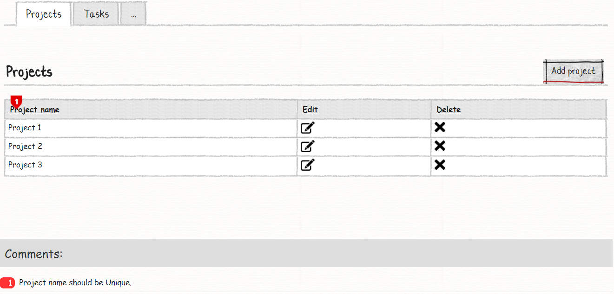
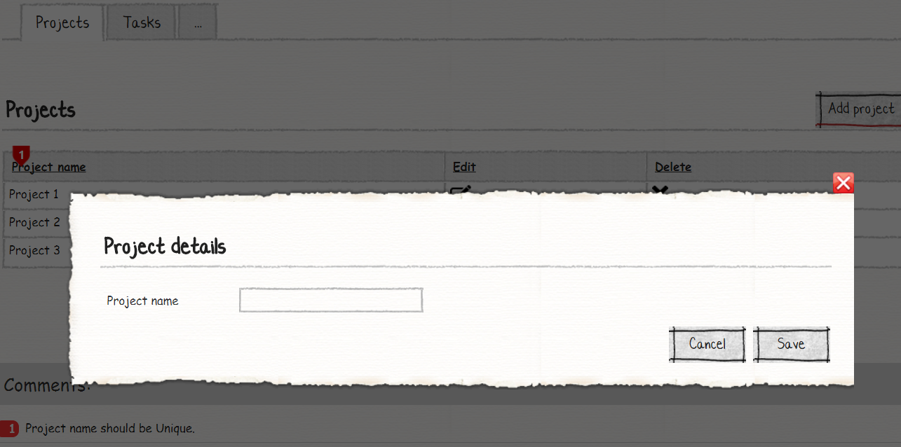
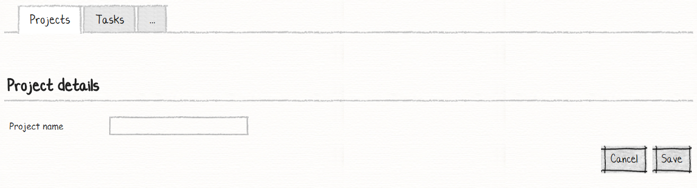
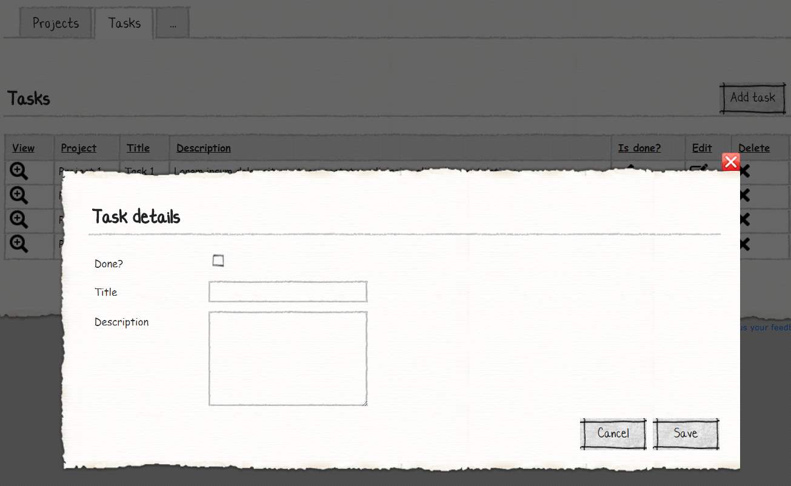
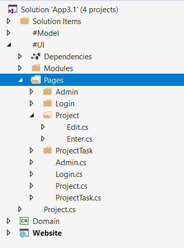
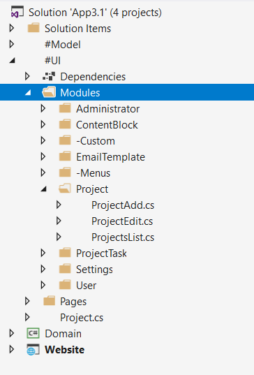
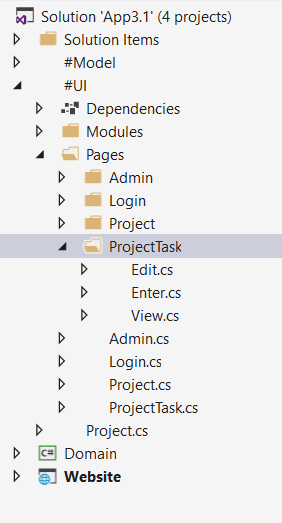

# M# Tutorial - Episode 3: Uniqueness rules

In this tutorial you will learn:

- Uniqueness rules

## Requirements

In this tutorial, we are going to implement a project management system that lets user manage their projects and related tasks.
Here are the sketches for list and model.

### Projects







### Tasks




As you can see, Edit and Add page of project and task module differ and for the task we have a view page.

## Implementation: Entities

As we can see in the requirements, we can identify two entities, "Project" and "Task". These entities have One-to-Many relationships since any project can have many tasks and each task has one project. We should also notice that each project name and each project task name should be unique. After understanding requirements and identifying related entities and their relationships, it's time to create them. Now let's create the corresponding classes in the **#Model** project.

Navigate to the **#Model** project and create a **Domain** folder, *right click > Add > M#* and then add these classes:

```csharp
using MSharp;

namespace Domain
{
    public class Project : EntityType
    {
        public Project()
        {
            DatabaseMode(DatabaseOption.Managed);

            Name("Project");

            String("Name");

            UniqueCombination(new[] { "Name" });
        }
    }
}
```

As you can see, We have used some new M# fluent API here, **DatabaseMode** method tells the M# framework how to treat this entity. We have three options here:

- **DatabaseOption.Managed**: By default, this option is selected and it saves data to created table based on M# default conventions.
- **DatabaseOption.Existing**: It doesn't create table by M# conventions and let you choose the table to be used.
- **DatabaseOption.Transient**: Nothing will be saved to the database and every saved entities life depend on the current application running process.
- **DatabaseOption.Custom**: You should define for the M# framework how to save entity.

**Name** method has been used to change the name of the object to our custom name. In this case, we have set its name to *Project*. As our requirements told us, we should make sure that the project name is unique. To achieve this goal, M# has a method named **UniqueCombinarion**. In this method you should write your custom property name here.
In a similar way add another entity named **Task**, but this time with a set of properties shown in the snippet below:

```csharp
using MSharp;

namespace Domain
{
    public class ProjectTask : EntityType
    {
        public ProjectTask()
        {
            DatabaseMode(DatabaseOption.Managed);

            Name("Project Task");

            Associate<Project>("Project");

            String("Title");

            String("Description", 500);

            Bool("Done").Mandatory().Default("false");

            UniqueCombination(new[] { "Project", "Title" });
        }
    }
}
```

As you can see we have used M# fluent API to add *Task* class properties, we have added One-to-Many relationship with `Associate<Project>("Project")` property.
Here you should consider these methods:

- DatabaseMode(): Used to tell M# framework how to store the data
- Name(): Used for changing the name of the entity
- String(): Used for string property
- Bool(): Used for boolean property and in this case, we've set its default value to **false**
- UniqueCombination(): Used for making one or combination of properties unique

As you can see, M# framework gives use excellent power to use it's fluent API continuance to add other methods like *.Default()*.
Now it's time to feed these two entity types to the M# code generator. You invoke it by building the *#Model* project.
In solution explorer, right click the *#Model* project and select *Build*.
Before moving on to developing the UI, let's build the *Domain* project to make sure everything is fine.

## Implementation: UI

According to the requirement, we have these pages:

- Projects list
  - Add project
  - Edit project
- Tasks list
  - Add task
  - Edit task
  - View task

So, we have two root pages that hold our list modules and 5 sub pages that are related to add or edit operation.

### Creating Project Pages

Go to **Pages** folder of **#UI**, *right click > Add > M#*  then create **ProjectPage** rootpage:

```csharp
using MSharp;

public class ProjectPage : RootPage
{
    public ProjectPage()
    {
        //will be implemented soon
        Add<Modules.ProjectsList>();
    }
}
```

As you can see, we have added `Add<Modules.ProjectsList>();`, by calling this method we tell M# that it should render *ProjectsList* module to show list of projects.
This page is our main page that is acting like parent for other pages. Now we need to add two more pages, *Add* and *Edit* pages. Add a new folder named **Project** under *Pages* folder in #UI project and then add two sub-pages named **Enter** and **Edit**:



```csharp
using Modules;
using MSharp;

namespace Project
{
    public class EnterPage : SubPage<ProjectPage>
    {
        public EnterPage()
        {
            Layout(Layouts.FrontEndModal);

            Add<ProjectAdd>();
        }
    }
}
```

```csharp
using Modules;
using MSharp;

namespace Project
{
    public class EditPage : SubPage<ProjectPage>
    {
        public EditPage()
        {
            Layout(Layouts.FrontEnd);

            Add<ProjectEdit>();
        }
    }
}
```

According to requirements, Adding new project should be opened in modal and editing should be opened in a new page, so we have set **Layout()** methods in each class according to its requirement and then add related module.

### Creating required module of Project Pages

Navigate to **Modules** folder of **#UI** project and create folder named **Project**. Then add a *List module* named **ProjectsList** using M# context menu:



```csharp
using MSharp;
using Project;

namespace Modules
{
    public class ProjectsList : ListModule<Domain.Project>
    {
        public ProjectsList()
        {
            HeaderText("Projects");

            Column(x => x.Name);

            ButtonColumn("Edit").Icon(FA.Edit)
                .OnClick(x => x.Go<EditPage>()
                .Send("item", "item.ID")
                .SendReturnUrl());

            ButtonColumn("Delete")
                .ConfirmQuestion("Are you sure you want to delete this Project?")
                .CssClass("btn-danger")
                .Icon(FA.Remove)
                .OnClick(x =>
                {
                    x.DeleteItem();
                    x.Reload();
                });

            Button("New project").Icon(FA.Plus)
                .OnClick(x => x.PopUp<EnterPage>().SendReturnUrl(false));
        }
    }
}
```

This class properties are ordered as requirements and we have inherited from **ListModule** generic class that is a M# framework class and by adding *Domain. Project*  class we tell M# framework, it's a list module class and its responsibility is to list projects.

Now it is time to add a form module that is responsible for adding and editing operations.Create a folder named **Project** under the *Modules* folder in *#UI* project, create two *form modules* named **ProjectAdd.cs** and *ProjectEdit.cs* in it, and edit them with the following code snippets:

```csharp
using MSharp;

namespace Modules
{
    public class ProjectAdd : FormModule<Domain.Project>
    {
        public ProjectAdd()
        {
            HeaderText("Project Details");

            Field(x => x.Name);

            Button("Cancel").OnClick(x => x.CloseModal());

            Button("Save").IsDefault().Icon(FA.Check)
                .OnClick(x =>
                {
                    x.SaveInDatabase();
                    x.GentleMessage("Saved successfully.");
                    x.CloseModal(Refresh.Full);
                });
        }
    }
}
```

```csharp
using MSharp;

namespace Modules
{
    public class ProjectEdit : FormModule<Domain.Project>
    {
        public ProjectEdit()
        {
            HeaderText("Project Details");

            Field(x => x.Name);

            Button("Cancel").OnClick(x => x.ReturnToPreviousPage());

            Button("Save").IsDefault().Icon(FA.Check)
                .OnClick(x =>
                {
                    x.SaveInDatabase();
                    x.GentleMessage("Saved successfully.");
                    x.ReturnToPreviousPage();
                });
        }
    }
}
```

These classes inherit from **FormModule** class. This special class tells M# to deal with these classes as form modules, and generate a form page, so the user can add or edit entities.
According to our requirement, we should have two separate classes for adding and editing modules. One of them is modal and the other one is a web page. The main difference between them is about **Cancel** and **Save** buttons. As you can see, in *Add* module we close modal and refresh the page, but in *Edit* module we return to previous page.

### Creating Task Page

For task page, like *Project* pages we have these pages :

- Task root page: This page holds **TaskList** module.
- Task add page: This page holds **TaskAdd** module.
- Task edit page: This page holds **TaskEdit** module.
- Task view page: This page holds **TaskView** module.

Right click on *Pages* folder in #UI project, create **ProjectTask** root page using M# context menu, and add the following code:

```csharp
using MSharp;

public class ProjectTaskPage : RootPage
{
    public ProjectTaskPage()
    {
        Add<Modules.ProjectTaskList>();
    }
}
```

Add a folder named *ProjectTask* under *Pages* folder, add three sub-pages named **Edit**, **Enter** and **View**, and edit them using the following code snippets:



```csharp
using MSharp;

namespace ProjectTask
{
    public class EnterPage : SubPage<ProjectTaskPage>
    {
        public EnterPage()
        {
            Layout(Layouts.FrontEnd);

            Add<Modules.ProjectTaskAdd>();
        }
    }
}
```

```csharp
using MSharp;

namespace ProjectTask
{
    public class EditPage : SubPage<ProjectTaskPage>
    {
        public EditPage()
        {
            Layout(Layouts.FrontEndModal);

            Add<Modules.ProjectTaskEdit>();
        }
    }
}
```

```csharp
using MSharp;

namespace ProjectTask
{
    public class ViewPage : SubPage<ProjectTaskPage>
    {
        public ViewPage()
        {
            Layout(Layouts.FrontEnd);

            Add<Modules.ProjectTaskView>();
        }
    }
}
```

As you can see, we have added three pages. *EnterPage* has the responsibility to add a new task and it will be open in a new page, *EditPage* has the responsibility to edit tasks and it will be open in a modal, and *ViewPage* is responsible for showing task details.

### Creating required module of Task Pages

Add a folder named *ProjectTask* under the *Modules* folder of *#UI* project, then add a *Form* module named **ProjectTaskAdd** using M# context menu:

```csharp
using MSharp;

namespace Modules
{
    public class ProjectTaskAdd : FormModule<Domain.ProjectTask>
    {
        public ProjectTaskAdd()
        {
            HeaderText("Task Details");

            Field(x => x.Project).Control(ControlType.DropdownList);

            Field(x => x.Title).Mandatory();

            Field(x => x.Description).Control(ControlType.Textbox).NumberOfLines(5);

            Button("Cancel").OnClick(x => x.ReturnToPreviousPage());

            Button("Save").IsDefault().Icon(FA.Check)
                .OnClick(x =>
                {
                    x.SaveInDatabase();
                    x.GentleMessage("Saved successfully.");
                    x.ReturnToPreviousPage();
                });
        }
    }
}
```

**ProjectTaskAdd** class inherits from *FormModule* class, according to requirement, we have added *HeaderText("Task Details")* method and changed the control type of project *DropdownList*. We have also set the number of lines of *Description* property and returned back to the previous page.

Add another *Form* module named **ProjectTaskEdit** in the same folder and edit it with the following code:

```csharp
using MSharp;

namespace Modules
{
    public class ProjectTaskEdit : FormModule<Domain.ProjectTask>
    {
        public ProjectTaskEdit()
        {
            HeaderText("Task Details");

            Field(x => x.Done).Control(ControlType.CheckBox).Label("Done?");

            Field(x => x.Title).Mandatory();

            Field(x => x.Description).Control(ControlType.Textbox).NumberOfLines(5);

            Button("Cancel").OnClick(x => x.CloseModal());

            Button("Save").IsDefault().Icon(FA.Check)
                .OnClick(x =>
                {
                    x.SaveInDatabase();
                    x.GentleMessage("Saved successfully.");
                    x.CloseModal(Refresh.Ajax);
                });
        }
    }
}
```

**ProjectTaskEdit** is like *ProjectTaskAdd* class, but it's different in property, cancel and save actions. in this class we didn't change the project property and just added *Done* property and changed its control type to *CheckBox*.

Create a *List* module named **ProjectTaskList** in the same folder using M# context menu, and add the following code:

```csharp
using MSharp;
using ProjectTask;

namespace Modules
{
    public class ProjectTaskList : ListModule<Domain.ProjectTask>
    {
        public ProjectTaskList()
        {
            ShowFooterRow()
                .ShowHeaderRow()
                .UseDatabasePaging(false)
                .HeaderText("Tasks")
                .PageSize(10);

            LinkColumn("View").HeaderText("View")
                .OnClick(x => x.Go<ViewPage>()
                .Send("item", "item.ID")
                .SendReturnUrl());

            Column(x => x.Project);

            Column(x => x.Title);

            Column(x => x.Description);

            Column(x => x.Done).LabelText("Is done?");

            ButtonColumn("Edit").Icon(FA.Edit)
                .HeaderText("Edit")
                .OnClick(x => x.PopUp<EditPage>()
                .Send("item", "item.ID")
                .SendReturnUrl(false));

            ButtonColumn("Delete")
                .HeaderText("Delete")
                .ConfirmQuestion("Are you sure you want to delete this Task?")
                .CssClass("btn-danger")
                .Icon(FA.Remove)
                .OnClick(x =>
                {
                    x.DeleteItem();
                    x.Reload();
                });

            Button("Add task").Icon(FA.Plus)
                .OnClick(x => x.Go<EnterPage>().SendReturnUrl());
        }
    }
}
```

**ProjectTaskList** class shows a list of tasks and let users to add or edit tasks, it also lets users to see task details by clicking on the *View* link button.

>**Note:** You should consider using *.SendReturnUrl()* when you want to go to another page and let user to come back, and don't use it for modal.
>**Note:** You should consider using `.Go<>()` when you want to go to another page and use `.PopUp<>()` when you want an open modal.

Finally, create a *View* module named **ProjectTaskView** in the same folder using M# context menu, and add the following code:

```csharp
using MSharp;

namespace Modules
{
    public class ProjectTaskView : ViewModule<Domain.ProjectTask>
    {
        public ProjectTaskView()
        {
            HeaderText("Tasks");

            Field(x => x.Project);

            Field(x => x.Title);

            Field(x => x.Description);

            Field(x => x.Done).LabelText("Is done?");
			
			Button("Back").Icon(FA.ChevronLeft)
				.OnClick(x => x.ReturnToPreviousPage());

        }
    }
}
```

**ProjectTaskView** class inherits from *ViewModule* generic class. It's a M# class that tells M# this is a view page and lets M# know how to generate related codes for it.
We have set its properties according to requirements and for *done* property, we have used *LabelText()* method to add our custom text.

### Adding Pages to the Menu

After you finished creating the pages, you need to add them to the main menu:

```csharp
using MSharp;

namespace Modules
{
    public class MainMenu : MenuModule
    {
        public MainMenu()
        {
            AjaxRedirect().IsViewComponent().UlCssClass("nav navbar-nav dropped-submenu");

            Item("Login").Icon(FA.UnlockAlt).VisibleIf(AppRole.Anonymous)
                .OnClick(x => x.Go<LoginPage>());

            Item("Settings").Icon(FA.Cog).VisibleIf(AppRole.Administrator)
                .OnClick(x => x.Go<Admin.SettingsPage>());

            Item("Projects").Icon(FA.Cog)
                .OnClick(x => x.Go<ProjectPage>());

            Item("ProjectTasks").Icon(FA.Cog)
                .OnClick(x => x.Go<ProjectTaskPage>());
        }
    }
}
```

### Final Step

Build **#UI** project, set the **WebSite** project as your default *StartUp* project and configure your *connection string* in **appsetting.json** file and hit F5. Your project is ready to use.

# Practice
Now it's your turn to implement an application that corresponds to the following [wireframes](https://design.visualspec.co.uk/?p=MSharp.Practice.3&user=1&S1_2=3).
