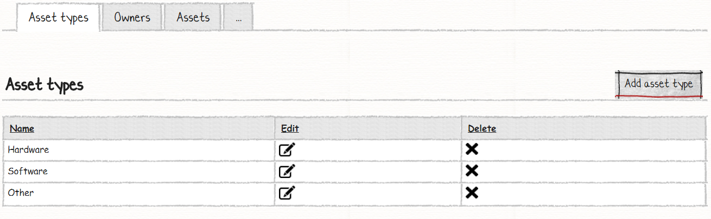
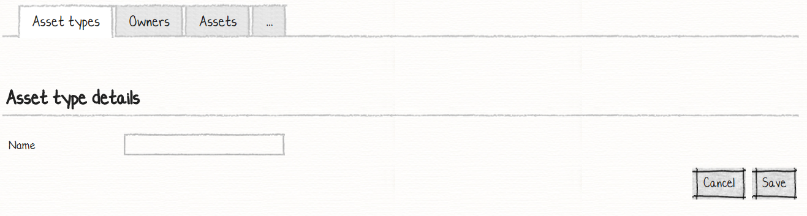
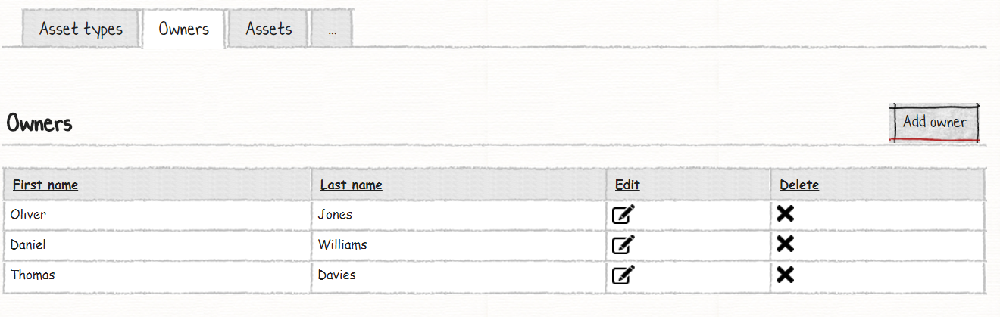
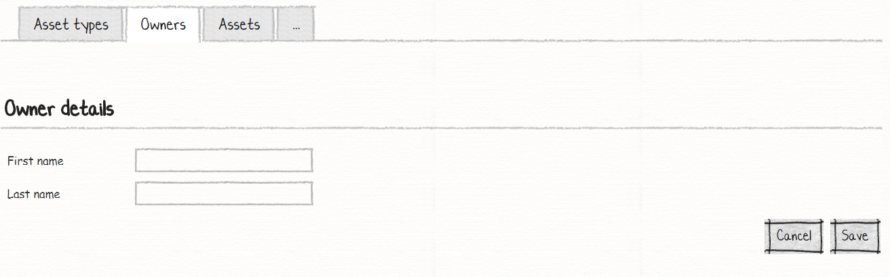
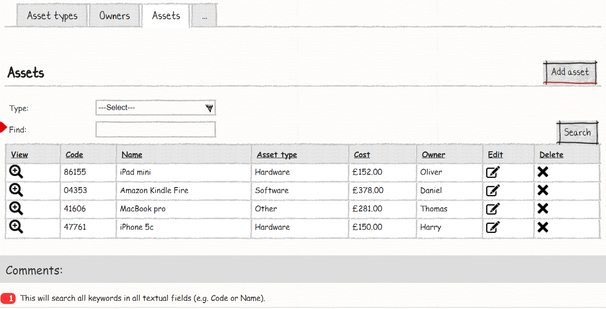
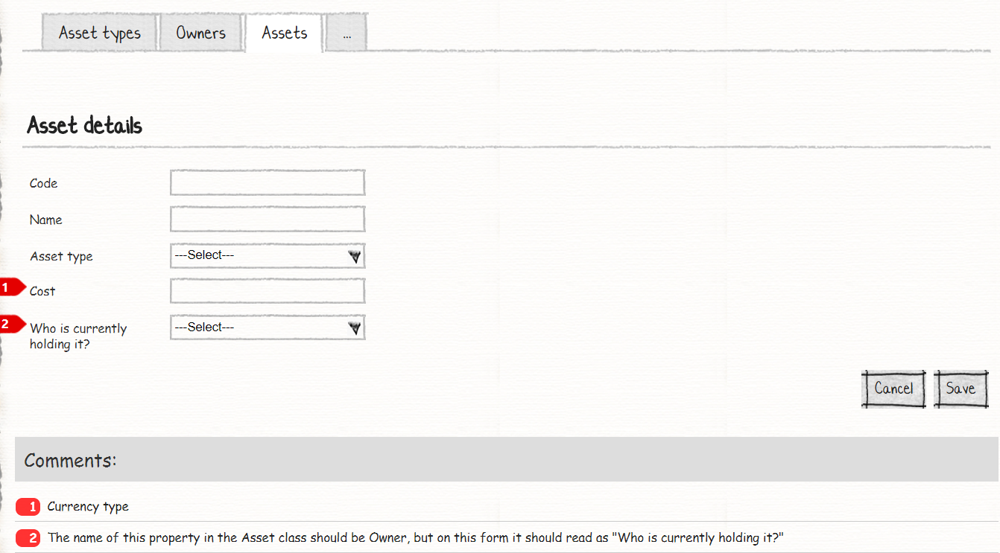

# Your Forth M# Application
In this tutorial you will learn:

 - Property search element
 - All fields search element
 - Custom Label for form / search elements

## Requirements
In this tutorial we are going to implement an asset management system that lets users to do CRUD operation on assets and owners and let them to search and find assets and related owners easily.
Here are the sketches for list and model.

### Asset Types:




For asset types, we just have simple CRUD operation.

### Owner:




For owners, we just have simple CRUD operation, too.

### Assets:




As you can see, In the assets list we have filter and search  columns, and in editing mode, we should change the default label to custom one.

## Implementation
From requirements, we can identify three entities, "Asset Type", "Owner" and "Assets". In asset entity, we have two One-to-Many relationships one with the owner and the other one with asset type.  
After understanding requirements and identifying its related properties and their relationships, it's time to create them. Now let's create the corresponding classes in the *#Model* project.

## Creating M# Entity Types
We start our work by creating related classes in a *#Model* project under *Domain* folder:

```C#
using MSharp;

namespace Domain
{
    public class AssetType : EntityType
    {
        public AssetType()
        {
            Name("Asset Type");

            String("Name");
        }
    }
}
```

```C#
using MSharp;

namespace Domain
{
    public class Owner : EntityType
    {
        public Owner()
        {
            Name("Owner");

            String("First name");

            String("Last name");

            ToStringExpression("FirstName + ' ' + LastName");
        }
    }
}
```
In owner class, we have used new M# method. It's **ToStringExpression()**, as its name applies, we use this method to change default M# *.ToString()* behavior and here we tell M# framework that it should render *First Name + Last Name* for showing entity.

```C#
using MSharp;

namespace Domain
{
    public class Asset : EntityType
    {
        public Asset()
        {
            Name("Asset");

            String("Code");

            String("Name");

            Associate<AssetType>("Type");

            Money("Cost");

            Associate<Owner>("Owner");
        }
    }
}
```
As you can see, We have two relations, one with *AssetType* and the other one with *Owner* class. For *Cost* property, we have used *Money()* methods that tell M# framework how to behave and render this property.
Now it's time to feed our two entity types to the M# code generator. In solution explorer, right click the *#Model* project and select *Build* and then build the *Domain* project to make sure everything regarding it is fine.

## Developing UI
According to the requirement, we have these pages:

- Asset Types List
  - Add / Edit Asset Types
- Owners List
  - Add / Edit Owner
- Assets List (with search and filter)
  - Add / Edit Asset

So, we have three root pages that hold our list modules and 6 sub pages that are related to add or edit operation.

### Creating Asset Type Pages
Use M# context menu to add *Asset Type* root page:

```C#
using MSharp;

public class AssetTypePage : RootPage
{
    public AssetTypePage()
    {
        Add<Modules.AssetTypesList>();
    }
}
```
As you can see, we have added **Add\<Modules.ProjectsList>();**, we are going to create this class soon and for now just skip it and we continue our work by creating a *Enter* class like bellow:

```C#
using MSharp;

namespace AssetTypes
{
    class Enter : SubPage<AssetTypePage>
    {
        public Enter()
        {
            Layout(Layouts.FrontEnd);

            Add<Modules.AssetTypeForm>();
        }
    }
}
```
Create a new folder with the name of *AssetTypes* and then add the above class as a sub-page for *AssetTypePage*, this class holds asset type form module.

#### Creating Asset Types List Module
Add a folder with the name of *AssetType* under the *Modules* folder of the *#UI* project and add *AssetTypesList* by using the M# context menu like bellow:


```C#
using MSharp;

namespace Modules
{
    public class AssetTypesList : ListModule<Domain.AssetType>
    {
        public AssetTypesList()
        {
            HeaderText("Asset Typeses");

            Column(x => x.Name);

            ButtonColumn("Edit").Icon(FA.Edit)
                .OnClick(x => x.Go<AssetTypes.Enter>()
                .Send("item", "item.ID")
                .SendReturnUrl());

            ButtonColumn("Delete").Icon(FA.Remove)
                .OnClick(x =>
                {
                    x.DeleteItem();
                    x.Reload();
                });

            Button("New Asset Types").Icon(FA.Plus)
                .OnClick(x => x.Go<AssetTypes.Enter>()
                .SendReturnUrl());
        }
    }
}
```
In this class we show a list of asset types according to the requirements and add a route for adding, editing and removing items.

#### Creating Asset Type Form Module
Add *AssetTypeForm* class by using the M# context menu under the *Modules* folder of the *#UI* project in *AssetType* like bellow:

```C#
using MSharp;

namespace Modules
{
    public class AssetTypeForm : FormModule<Domain.AssetType>
    {
        public AssetTypeForm()
        {
            HeaderText("Asset Types details");

            Field(x => x.Name);

            Button("Cancel").OnClick(x => x.ReturnToPreviousPage());

            Button("Save").IsDefault().Icon(FA.Check)
            .OnClick(x =>
            {
                x.SaveInDatabase();
                x.GentleMessage("Saved successfully.");
                x.ReturnToPreviousPage();
            });
        }
    }
}
```
This class has responsibility for generating related forms for adding and editing entity. After creating these modules, please add them to *AssetType.cs* class that is our root page and *Enter.cs* class under *AssetTypes* folder if you have let them empty in previous sections.

#### Creating Owner Pages
Use M# context menu to add a *Owner* root page:

```C#
using MSharp;

public class OwnerPage : RootPage
{
    public OwnerPage()
    {
        Add<Modules.OwnersList>();
    }
}
```
In this class we add *OwnerList* module that is responsible for showing all owners, we continue our work by creating a *Enter* class that is responsible for adding and editing owner, create new folder with the name of *Owners* under the *Pages* folder in *#UI* project and add a *Enter* class like bellow:

```C#
using MSharp;

namespace Owners
{
    class Enter : SubPage<OwnerPage>
    {
        public Enter()
        {
            Layout(Layouts.FrontEnd);

            Add<Modules.OwnerForm>();
        }
    }
}
```
In this class we add our *OwnerForm* module that this module tell M# framework how to generate related code for this class.

#### Creating Owner Modules
Now it's time to create related *Modules*, we need  two modules for owner entity, they are **ListModule** and **FormModule**. Create a new folder with the name of *Owner* under the *Modules* folder of *#UI* project and then add these classes using M# context menu:

```C#
using MSharp;

namespace Modules
{
    public class OwnerForm : FormModule<Domain.Owner>
    {
        public OwnerForm()
        {
            HeaderText("Owner details");

            Field(x => x.FirstName);
            Field(x => x.LastName);

            Button("Cancel").OnClick(x => x.ReturnToPreviousPage());

            Button("Save").IsDefault().Icon(FA.Check)
            .OnClick(x =>
            {
                x.SaveInDatabase();
                x.GentleMessage("Saved successfully.");
                x.ReturnToPreviousPage();
            });
        }
    }
}
```

```C#
using MSharp;

namespace Modules
{
    public class OwnersList : ListModule<Domain.Owner>
    {
        public OwnersList()
        {
            HeaderText("Owners");

            Column(x => x.FirstName);
            Column(x => x.LastName);

            ButtonColumn("Edit").Icon(FA.Edit)
                .OnClick(x => x.Go<Owners.Enter>()
                .Send("item", "item.ID")
                .SendReturnUrl());

            ButtonColumn("Delete").Icon(FA.Remove)
                .OnClick(x =>
                {
                    x.DeleteItem();
                    x.Reload();
                });

            Button("New Owner").Icon(FA.Plus)
                .OnClick(x => x.Go<Owners.Enter>()
                .SendReturnUrl());
        }
    }
}
```
These two classes has responsibility for CRUD (Create, Read, Update, Delete) operation.

#### Creating Asset Pages
Our last step is to create related pages for *Asset* entity. Use M# context menu to add a *Asset* root page:

```C#
using MSharp;

public class AssetPage : RootPage
{
    public AssetPage()
    {
        Add<Modules.AssetsList>();
    }
}
```
In this class we add *AssetsList* module that is responsible for showing all assets, we continue our work by creating a *Enter* class that is responsible for adding and editing asset, create new folder with the name of *Assets* under the *Pages* folder of *#UI* project and add a *Enter* class like bellow:

```C#
using MSharp;

namespace Assets
{
    class Enter : SubPage<AssetPage>
    {
        public Enter()
        {
            Layout(Layouts.FrontEnd);

            Add<Modules.AssetForm>();
        }
    }
}
```
In this class we have added *AssetForm* module that tells M# framework how to generate related form code for this class.

```C#
using MSharp;

namespace Assets
{
    class View : SubPage<AssetPage>
    {
        public View()
        {
            Layout(Layouts.FrontEnd);

            Add<Modules.AssetView>();
        }
    }
}
```
This class is responsible for the view only purpose and we have added *AssetView* module.

#### Creating Asset Modules
We continue our work by creating related *Modules*, we need three modules for asset entity, they are **ListModule**, **FormModule** and **ViewModule**. Create a new folder with the name of *Asset* under the *Modules* folder of *#UI* project and then add these classes using M# context menu:

```C#
using MSharp;

namespace Modules
{
    public class AssetForm : FormModule<Domain.Asset>
    {
        public AssetForm()
        {
            HeaderText("Asset details");

            Field(x => x.Code);
            Field(x => x.Name);
            Field(x => x.Type).Label("Asset type");
            Field(x => x.Cost);
            Field(x => x.Owner).Label("Who is currently holding it?");

            Button("Cancel").OnClick(x => x.ReturnToPreviousPage());

            Button("Save").IsDefault().Icon(FA.Check)
            .OnClick(x =>
            {
                x.SaveInDatabase();
                x.GentleMessage("Saved successfully.");
                x.ReturnToPreviousPage();
            });
        }
    }
}
```
In this class, we have used **.Label()** method, this method helps you to write your custom label for the property and we have added custom text according to requirement.

```C#
using MSharp;

namespace Modules
{
    public class AssetsList : ListModule<Domain.Asset>
    {
        public AssetsList()
        {
            HeaderText("Assets");

            Search(x => x.Type).Label("Type:");

            Search(GeneralSearch.AllFields).Label("Find:");

            SearchButton("Search");

            ButtonColumn("View").HeaderText("View").Icon(FA.SearchPlus)
                .OnClick(x => x.Go<Assets.View>().SendReturnUrl());

            Column(x => x.Code);
            Column(x => x.Name);
            Column(x => x.Type).LabelText("Asset type");
            Column(x => x.Cost);
            Column(x => x.Owner);

            ButtonColumn("Edit").Icon(FA.Edit)
                .OnClick(x => x.Go<Assets.Enter>()
                .Send("item", "item.ID")
                .SendReturnUrl());

            ButtonColumn("Delete").Icon(FA.Remove)
                .OnClick(x =>
                {
                    x.DeleteItem();
                    x.Reload();
                });

            Button("New Asset").Icon(FA.Plus)
                .OnClick(x => x.Go<Assets.Enter>()
                .SendReturnUrl());
        }
    }
}
```
In this class we have used some new M# methods, **Search()** method let us to add new search and filter capacity. By using **Search(x => x.Type).Label("Type:");** we tell M# that we need a filter over *Type*  property with custom text "Type:". By using **Search(GeneralSearch.AllFields).Label("Find:");** we add search for all columns to our list module and we have added a search button with "Search" label that let users search through entities.

```C#
using MSharp;

namespace Modules
{
    public class AssetView : ViewModule<Domain.Asset>
    {
        public AssetView()
        {
            HeaderText("Asset details");

            Field(x => x.Code);
            Field(x => x.Name);
            Field(x => x.Type).LabelText("Asset type");
            Field(x => x.Cost);
            Field(x => x.Owner).LabelText("Held by");

            Button("Back").Icon(FA.ChevronLeft).OnClick(x => x.ReturnToPreviousPage());
        }
    }
}
```
This class just shows asset detail and let the users go back to the previous page by click on "Back" button.

#### Adding Pages to Menu
Our last step is to add a root page to the main menu:

```C#
using MSharp;

namespace Modules
{
    public class MainMenu : MenuModule
    {
        public MainMenu()
        {
            AjaxRedirect().IsViewComponent().UlCssClass("nav navbar-nav dropped-submenu");

            Item("Login").Icon(FA.UnlockAlt).VisibleIf(AppRole.Anonymous)
                .OnClick(x => x.Go<LoginPage>());

            Item("Settings").Icon(FA.Cog).VisibleIf(AppRole.Administrator)
                .OnClick(x => x.Go<Admin.SettingsPage>());

            Item("Asset Types").Icon(FA.Navicon)
               .OnClick(x => x.Go<AssetTypePage>());

            Item("Owners").Icon(FA.Navicon)
               .OnClick(x => x.Go<OwnerPage>());

            Item("Assets List").Icon(FA.Navicon)
               .OnClick(x => x.Go<AssetPage>());
        }
    }
}
```

### Final Step
Build **#UI** project, set the **WebSite** project as your default *StartUp* project and configure your *connection string* in **appsetting.json** file and hit F5. Your project is ready to use.
