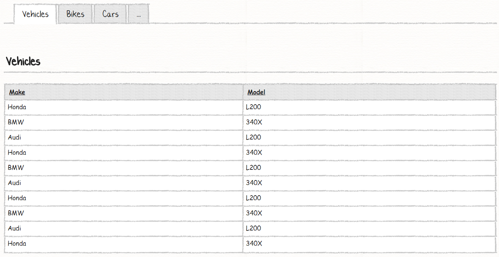
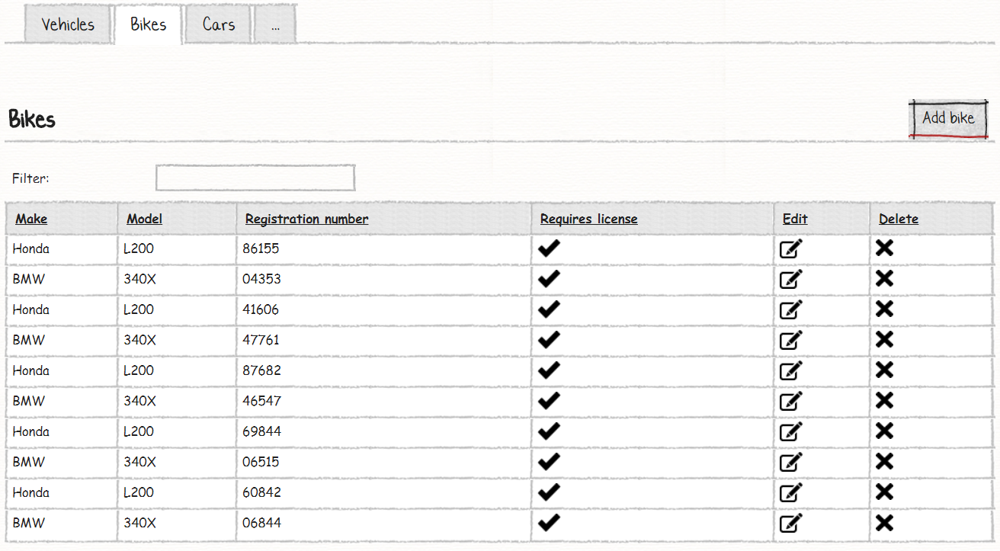
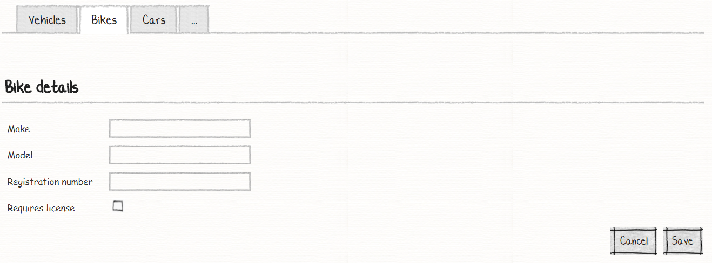
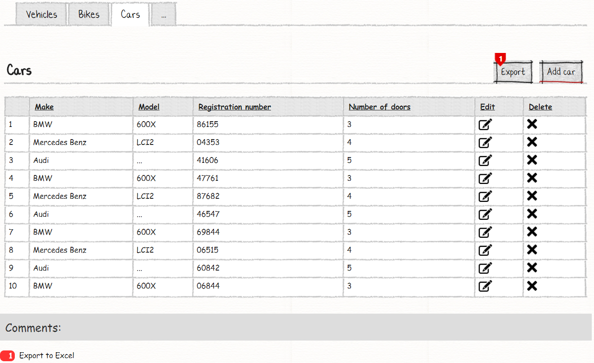
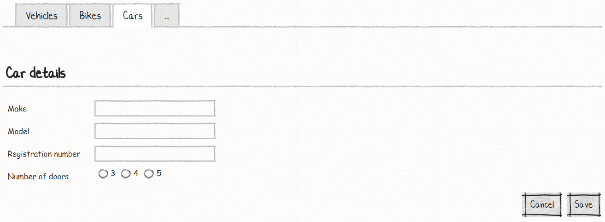

# Your Fifth M# Application
In this tutorial you will learn:

- Inheritence
- Export to excel
- Client-side filter
- Index column

## Requirements
In this tutorial we are going to implement a system that lets users add a car or a bike and see them in related tab, we also let user to see all vehicles that are parent of all cars or bikes in a vehicle tab.
Here are the sketches for list and model.

### Vehicle:


In vehicle entity, we just have a list of them and they are read only.

### Bike:




In bike entity, we have CRUD (Create, Read, Update, Delete) operation and client side filter. This class inherits from the vehicle.

### Car:




In the car list we have an export to Excel button, and in add or editing mode, for *Number of doors* property we have custom view and limited to 3 numbers.

## Implementation
We can identify three entities, "Vehicle", "Bike" and "Car". Bike and Car entity inherit from *Vehicle*.
After understanding requirements and identifying its related properties and their relationships, it's time to create them. Now let's create the corresponding classes in the *#Model* project.

## Creating M# Entity Types
We start our work by creating related classes in a *#Model* project under *Domain* folder:

```C#
using MSharp;

namespace Domain
{
    public class Vehicle : EntityType
    {
        public Vehicle()
        {
            String("Make").Mandatory();

            String("Model").Mandatory();

            Int("Registration number").Mandatory();
        }
    }
}
```
Vehicle class is our root class for Bike and Car class, it has shared properties and act as a parent.

```C#
using MSharp;

namespace Domain
{
    public class Bike : SubType<Vehicle>
    {
        public Bike()
        {
            Bool("Requires license").Mandatory();
        }
    }
}
```
In Bike class, we have used new M# generic class. It's **SubType<>**, this class tell the M# framework that this class inherit from *Vehicle* class.

```C#
using MSharp;

namespace Domain
{
    public class Car : SubType<Vehicle>
    {
        public Car()
        {
            Int("Number of doors").Min(3).Max(5).Mandatory();
        }
    }
}
```
Car class, like bike class inherits from *Vehicle* class and according to our requirement, *Number of doors* property should have numbers between 3 to 5 and it should be radio buttons, so in this class we just set its min and max value that could have and soon you will see how we tell the M# render this values in radio buttons.
By using the M# fluent API, **.Min()** and **Max()** we set its minimum and maximum acceptable value.
Now it's time to feed our two entity types to the M# code generator. In solution explorer, right click the *#Model* project and select *Build* and then build the *Domain* project to make sure everything regarding it is fine.

## Developing UI
According to the requirement, we have these pages:

- Vehicle List
- Bikes List
  - Add / Edit Bike (with client side filter)
- Cars List (with export to excel)
  - Add / Edit car

So, we have three root pages that hold our list modules and 2 sub pages that are related to add or edit operation.

### Creating Vehicle Pages
Comming soon...