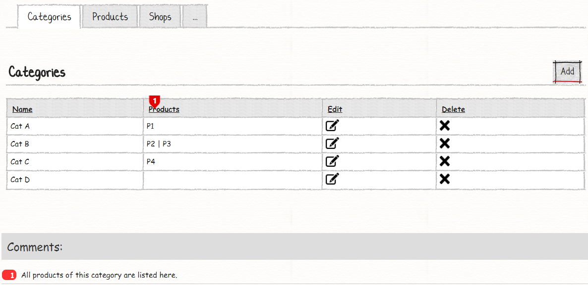
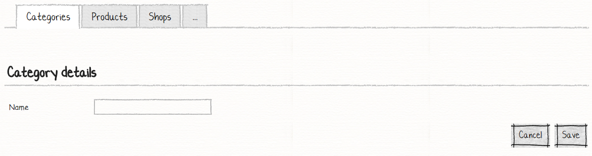
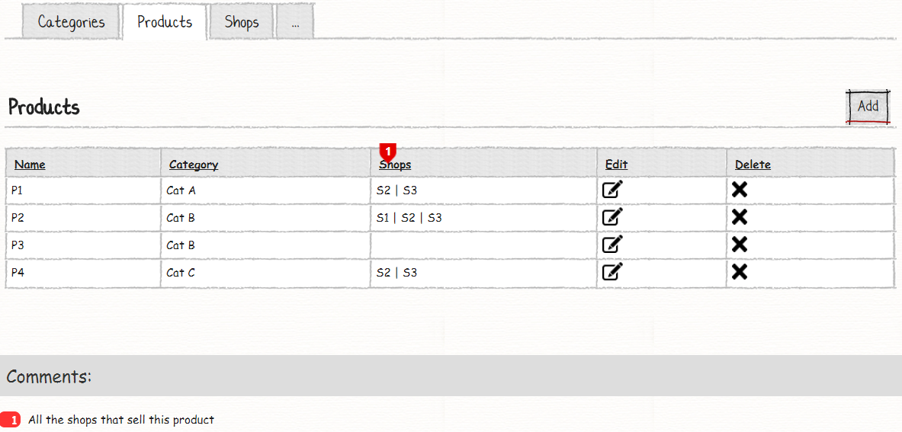
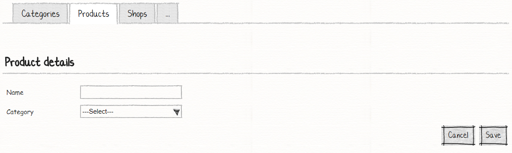
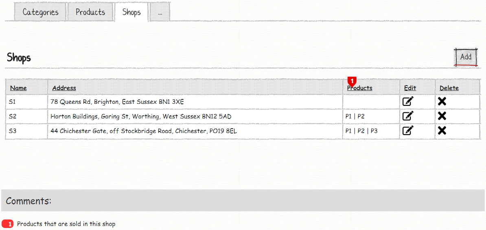
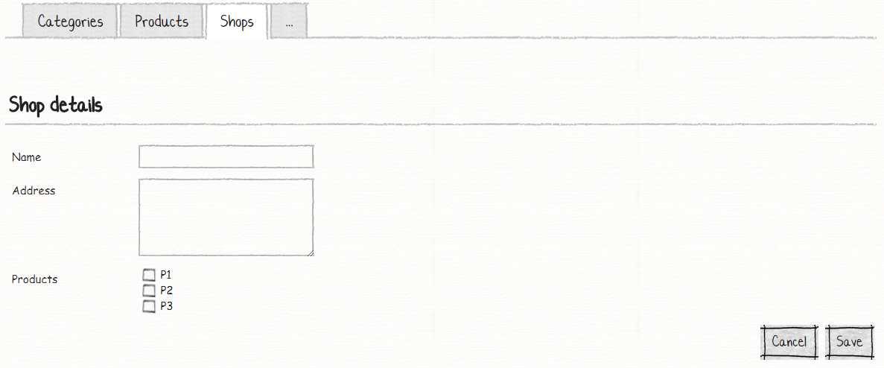

# Your Sixth M# Application
In this tutorial you will learn:

- One to Many (inverse) associations
- Many to Many associations 

## Requirements
In this tutorial we are going to develop a website that has three tabs:
- Categories
- Products
- Shops

In these pages, use can see related information and add/edit or delete them. Bellow is explanation of each tab.

### Categories:




On the category page, user can see a list of all categories and their related products that are separated by "|". User can do CRUD operation. You should notice that in this page we have **inverse assosiation** for product property, this association come from parent to child and it means we should list all related products for each category.

### Products:




On the product page, user can see a list of all products and their related shops that are separated by "|". User can do the CRUD operation. You should notice that in this page we have a **assosiation** to category and **inverse assosiation** to shop.

### Shops:




In shops page, user can see a list of all shops and their related products that are sold in the shop and separated by "|". User can do the CRUD operation. On this page we have **many to many** relation to products and shops, it means that each shop can sell many products and any products can be sold in any shops.

## Implementation
Let start our work by creating three entities, "Category", "product" and "Shop". There is one to many relation with *Category* and *Product* and many to many relation with *Product* and *Shop* entities. Now let's create the corresponding classes in the *#Model* project.

## Creating M# Entity Types
We start our work by creating related classes in a *#Model* project under *Domain* folder:

```C#
using MSharp;

namespace Domain
{
    public class Category : EntityType
    {
        public Category()
        {
            String("Name").Mandatory();

            InverseAssociate<Product>("Products", "Category");
        }
    }
}
```
Category class has a new M# method with the name of "InverseAssociate<>()". **InverseAssociate** method tells M# framework that we have a flow from parent to child. First parameter is the name of the property and the second one is the name of property in child entity.

[Comming soon...]