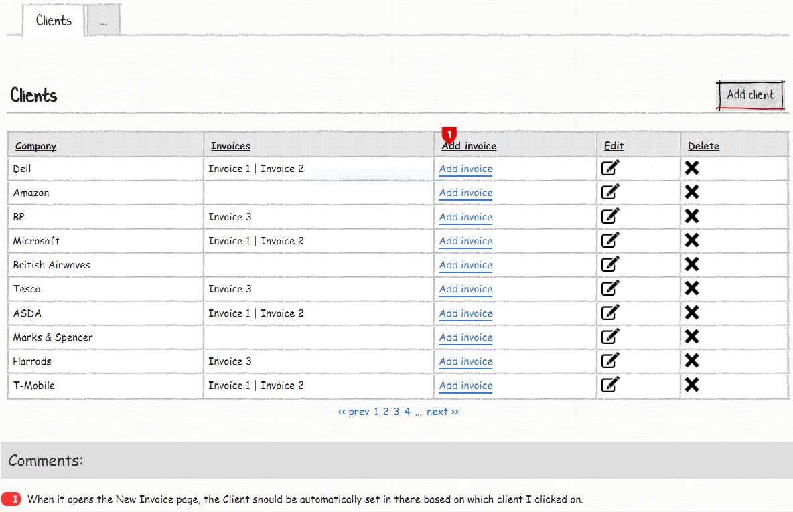
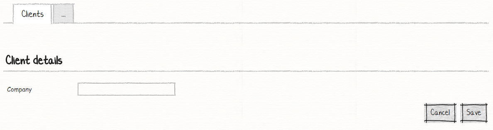
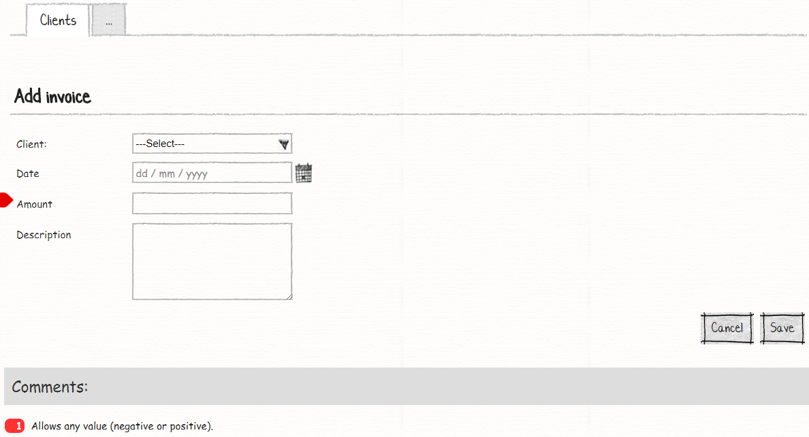

# M# Tutorial - Episode 7: Validation and pagination

In this tutorial you will learn:

- Range validation
- Paging
- Hyper link button style
- Property setter
- Expected lines

## Requirements

In this tutorial we are going to develop a website that lists our clients and each client can have many invoices. This page should have paging and when user click on "Add invoice" link button, add invoice page should be opened and related client should be selected by default, users can enter any negative or positive values and description property should be text area.

### Clients





On the client page, user can see a list of all clients and their related invoices that are separated by "|". User can do the CRUD operation. You should notice that in this page we have **inverse association** for invoice property. We also can add/edit/remove each client.

### Invoice



This page will be opened when a user click on "Add invoice" link button and related client would be selected by M#, user can enter and negative or positive value for amount property.

## Implementation: Entities

Let's get started with creating two entities, "Client" and "Invoice". There is one to many relation between "Client" and "Invoice" and an **inverse association** from client to invoice so we have parent child property too. Now let's create the corresponding classes in the *#Model* project.

Navigate to the **#Model** project and create a **Domain** folder, *right click > Add > M#* and then add these classes:

```csharp
using MSharp;

namespace Domain
{
    public class Client : EntityType
    {
        public Client()
        {
            String("Company").Mandatory();

            InverseAssociate<Invoice>("Invoices", "Client");
        }
    }
}
```

Client class has an inverse association with invoice entity, **InverseAssociate\<Invoice\>("Invoices", "Client")** generic method takes two parameters as you can see, first one is the property name and the second one is related property name in child class.

```csharp
using MSharp;

namespace Domain
{
    public class Invoice : EntityType
    {
        public Invoice()
        {
            Associate<Client>("Client").Mandatory();

            Date("Date");

            Money("Amount").Min(decimal.MinValue);

            String("Description").Max(2500).Lines(5);
        }
    }
}
```

In invoice class, the default "Amount" property value should be changed to any negative input. By default M# will set zero as a minimum value, we have used `.Min(decimal.MinValue)` to set its minimum value. We have also changed "Description" default M# value, by using `.Max(2500)` we tell M# that length of property is 2500 and by calling **.Lines(5)** M# mill generate text area with a 5 line in UI.

## Implementation: UI

According to the requirement, we have three pages to develop:

- Client List
  - Add / Edit Client
  - Add Invoice

### Creating Client Pages

Use M# context menu to add a *Client* root page intp *Pages* folder:

```csharp
using MSharp;

public class ClientPage : RootPage
{
    public ClientPage()
    {
        Add<Modules.ClientsList>();
    }
}
```

In this class we have added "ClientsList" module that is responsible for listing all clients.
Now create a *Client* folder under the *Pages* folder, then add this class:

```csharp
using MSharp;

namespace Client
{
    class EnterPage : SubPage<ClientPage>
    {
        public EnterPage()
        {
            Add<Modules.ClientForm>();
        }
    }
}
```

Let's move on with adding "ClientsList" and "ClientForm" modules.

### Creating required module of Client Pages

Navigate to **Modules** folder of **#UI** project and create folder named **Client**. Then add a *List module* named **ClientsList** using M# context menu:

```csharp
using MSharp;

namespace Modules
{
    public class ClientsList : ListModule<Domain.Client>
    {
        public ClientsList()
        {
            HeaderText("Clients")
                .UseDatabasePaging(false)
                .Sortable()
                .PageSize(5)
                .ShowFooterRow()
                .ShowHeaderRow()
                .PagerPosition(PagerAt.Bottom);

            Column(x => x.Company);

            Column(x => x.Invoices).IsSortable(false);

            ButtonColumn("Add Invoice").Style(ButtonStyle.Link)
                .OnClick(x => x.Go<Client.AddInvoicePage>()
                .SendReturnUrl()
                .Send("client", "item.ID"));

            ButtonColumn("Edit").Icon(FA.Edit)
                .HeaderText("Edit").GridColumnCssClass("actions")
                .OnClick(x => x.Go<Client.EnterPage>()
                .SendReturnUrl()
                .Send("item", "item.ID"));

            ButtonColumn("Delete").Icon(FA.Remove)
                .HeaderText("Delete").GridColumnCssClass("actions")
                .ConfirmQuestion("Are you sure you want to delete this Client?")
                .CssClass("btn-danger")
                .OnClick(x =>
                {
                    x.DeleteItem();
                    x.Reload();
                });

            Button("Add client").Icon(FA.Plus)
                .OnClick(x => x.Go<Client.EnterPage>()
                .SendReturnUrl());
        }
    }
}
```

This class contains some new methods:

- `UseDatabasePaging(false)`: This method will enable client side paging
- `PageSize(5)`: This method determines default paging size
- `ShowHeaderRow()`: This method generates the header for the grid
- `PagerPosition(PagerAt.Bottom)`: This method will put paging at bottom

You should notice that "Add invoice" button should be a hyper link button, so we have used `.Style(ButtonStyle.Link)` to achieve this. We also need to send client id as query string to invoice page, by calling `.Send("client", "item.ID")` method we send a query string with the name of **client** and with the value of client ID to invoice page.

Let's continue with adding *Form module* named **ClientForm** like below:

```csharp
using MSharp;

namespace Modules
{
    public class ClientForm : FormModule<Domain.Client>
    {
        public ClientForm()
        {
            HeaderText("Client details");

            Field(x => x.Company);

            Button("Cancel").OnClick(x => x.ReturnToPreviousPage());

            Button("Save").IsDefault().Icon(FA.Check)
            .OnClick(x =>
            {
                x.SaveInDatabase();
                x.GentleMessage("Saved successfully.");
                x.ReturnToPreviousPage();
            });
        }
    }
}
```

### Creating Invoice Page

Create "AddInvoice" page under the *clients* folder *Pages* like below:

```csharp
using MSharp;

namespace Client
{
    class AddInvoicePage : SubPage<ClientPage>
    {
        public AddInvoicePage()
        {
            Add<Modules.InvoiceForm>();
        }
    }
}
```

This page holds "InvoiceForm" module.

### Creating required module of Invoice Pages

Create a folder with the name of "Invoice" and add "InvoiceForm" module using the M# context menu like below:

```csharp
using MSharp;

namespace Modules
{
    public class InvoiceForm : FormModule<Domain.Invoice>
    {
        public InvoiceForm()
        {
            HeaderText("Invoice details");

            RequestParam("clientId");

            Field(x => x.Client);
            Field(x => x.Date);
            Field(x => x.Amount);
            Field(x => x.Description);

            Button("Cancel").OnClick(x => x.ReturnToPreviousPage());

            Button("Save").IsDefault().Icon(FA.Check)
            .OnClick(x =>
            {
                x.SaveInDatabase();
                x.GentleMessage("Saved successfully.");
                x.ReturnToPreviousPage();
            });

            AutoSet(x => x.Client);
        }
    }
}
```

This class has got a new method, `AutoSet(x => x.Client)` tell M# that its default value will come from query string.

### Adding Pages to the Menu

Our last step is to add a root page to the main menu:

```csharp
using MSharp;

namespace Modules
{
    public class MainMenu : MenuModule
    {
        public MainMenu()
        {
            AjaxRedirect().IsViewComponent().UlCssClass("nav navbar-nav dropped-submenu");

            Item("Login")
                .Icon(FA.UnlockAlt)
                .VisibleIf(AppRole.Anonymous)
                .OnClick(x => x.Go<LoginPage>());

            Item("Settings")
                .VisibleIf(AppRole.Admin)
                .Icon(FA.Cog)
                .OnClick(x => x.Go<Admin.SettingsPage>());

            Item("Clients")
                .Icon(FA.Navicon)
                .OnClick(x => x.Go<ClientPage>());
        }
    }
}
```

### Final Step

Build **#UI** project, set the **WebSite** project as your default *StartUp* project and configure your *connection string* in **appsetting.json** file and hit F5. Your project is ready to use.
