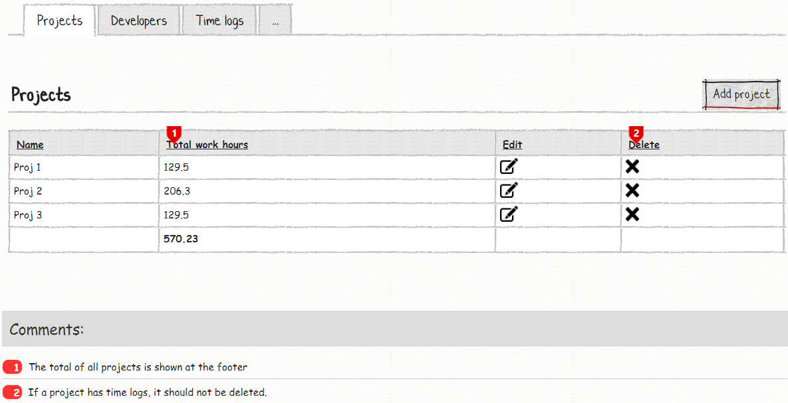
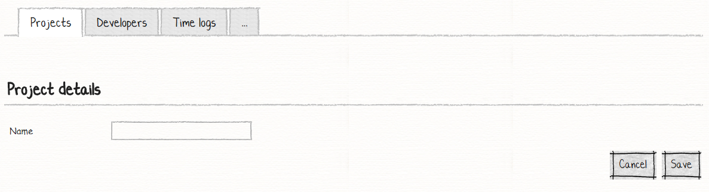
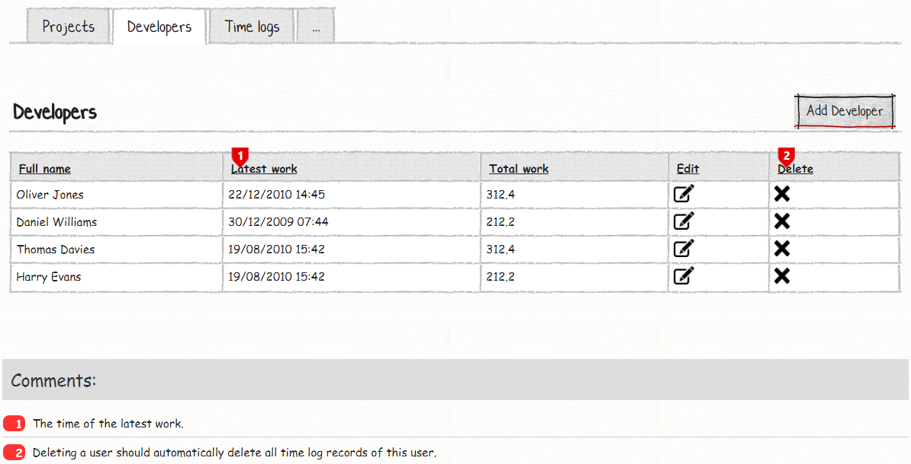
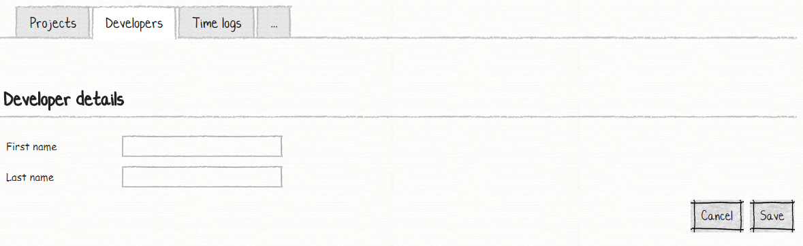
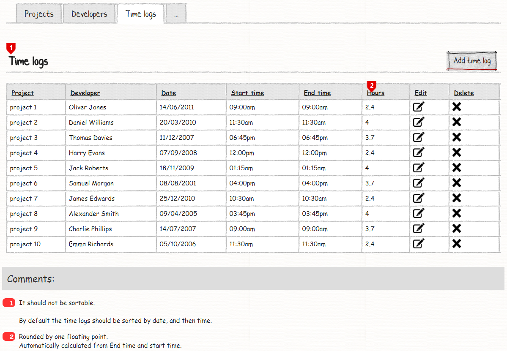
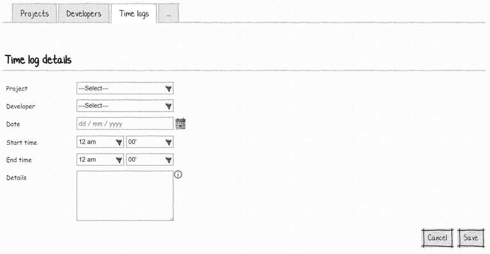

# Your Eighth M# Application
In this tutorial you will learn:

- Footer
- Cascade delete
- Calculated property

## Requirements
In this tutorial we are going to develop a website that lists projects, developers and related time logs. On project tab user can see all projects and their total work hours. On developer page user can see all developers with their related total work time and last working date and on the last tab, time logs shows projects and developers with their detail information.

### Projects:




On the project page, user can see a list of all projects and total work hours that have been spent on each project. User can do the CRUD operation. You should notice that on this page we have **inverse assosiation** and the sum of all working hours should be displayed in the footer row and if there is any related time logs, user should be unable to delete any project.

### Developers:




On the developer page, user can see all developers and their last activity date and their total working time. The user should be able to do CRUD operation and if the user deletes any one the developers, their related time logs should be deleted.

## Time Logs:



Time log page show all projects, task and their related starting and ending date time. User can see total times for each project by each developer.

## Creating Entities
We start our work by creating **Project**, **Developer** and **Time Log** classes in a *#Model* project under *Domain* folder:

```C#
using MSharp;

namespace Domain
{
    public class Project : EntityType
    {
        public Project()
        {
            String("Name");
        }
    }
}
```
Project class just have "Name" property right now, we will complete this class soon.
```C#
using MSharp;

namespace Domain
{
    public class Developer : EntityType
    {
        public Developer()
        {
            String("First name");

            String("Last name");

            String("Full name").Calculated().Getter("FirstName + ' ' + LastName");

            ToStringExpression("FullName");
        }
    }
}
```
Developer class has "First Name" and "Last Name" and "Full name" string property. "Full name" is a calculated property. Calculated properties are created for read-only purposes and returns data based on business requirements. M# defines these types of properties in “Entity Class” of the “Model Project” and marks them with “Calculated” attribute. No SQL table Column is created for such properties. A calculated property is usually used to display some information on UI or in decision making.

> **Note**:  A calculated property must not contain complex calculations because this is not the intended purpose of entity behaviours. It is always recommended to implement Methods / Functions for such complex calculations.

```C#
using MSharp;

namespace Domain
{
    public class TimeLog : EntityType
    {
        public TimeLog()
        {
            Associate<Project>("Project").Mandatory();

            Associate<Developer>("Developer").Mandatory().OnDelete(CascadeAction.CascadeDelete);

            Date("Date").Mandatory();

            Time("Start time").Mandatory();

            Time("End time").Mandatory();

            Decimal("Hours").Mandatory().Calculated().Getter("(decimal)EndTime.Subtract(StartTime).TotalHours.Round(2)");

            String("Details").Lines(5).HelpText("Help information so the user knows what to write here.");
        }
    }
}
```
Time log class has an association with "Project" and "Developer", because we need to delete all related time logs when a developer delete, we have changed the default cascade action by calling this method: **.OnDelete(CascadeAction.CascadeDelete)**. "Hours" property is a calculated property and as requirement told us, we have calculated total hours. "Details" property has a new method, **HelpText()** add an information icon on UI and when a user click on that icon a simple text will be displayed for the user.

Now open developer class again and change it like below:
```C#
using MSharp;

namespace Domain
{
    public class Developer : EntityType
    {
        public Developer()
        {
            String("First name");

            String("Last name");

            String("Full name").Calculated().Getter("FirstName + ' ' + LastName");

            String("Latest work").Mandatory().Calculated().Getter("this.TimeLogs.GetList().Result.Any() ? this.TimeLogs.GetList().OrderByDescending(x => x.Date).Result.First().Date.ToShortDateString() : string.Empty");

            ToStringExpression("FullName");

            InverseAssociate<TimeLog>("Time logs", "Developer");

            Decimal("Total work").Mandatory().Calculated().Getter("(decimal)this.TimeLogs.GetList().Sum(x => x.Hours).Result");
        }
    }
}
```
We have added "Latest work" property, this calculated property shows all developer's latest activities so we have used "TimeLogs" property which is an *Inverse Associate* property, by using this property we can get all related time logs. **ToStringExpression("FullName")** property set default *.ToString()* method of the class.

We continue our work by opening "Project" class and change it like below:
```C#
using MSharp;

namespace Domain
{
    public class Project : EntityType
    {
        public Project()
        {
            String("Name");

            InverseAssociate<TimeLog>("TimeLogs", "Project");

            Decimal("Total work hours")
                .Mandatory()
                .Calculated()
                .Getter("this.TimeLogs.GetList().Sum(x => x.Hours).Result");
        }
    }
}
```
Project class has an *InverseAssociate* with "TimeLog" class and a calculated property that calculate all related hours.
In solution explorer, right click the *#Model* project and select *Build* and then build the *Domain* project to make sure everything regarding it is fine.

## Developing UI
According to the requirement, we have these pages to develop:

- Projects List
  - Add / Edit Project
- Developers List
  - Add / Edit Developer
- Time logs List
  - Add / Edit Time Log

### Creating Project Pages
As you have learned from previous tutorials, use the M# context menu to add a root page to the "Page" folder:
```C#
using MSharp;

public class ProjectPage : RootPage
{
    public ProjectPage()
    {
        Add<Modules.ProjectsList>();
    }
}
```
Create a folder with the name of "Project" under "Page" folder and add this sub page:
```C#
using MSharp;

namespace Project
{
    class EnterPage : SubPage<ProjectPage>
    {
        public EnterPage()
        {
            Layout(Layouts.FrontEnd);

            Add<Modules.ProjectForm>();
        }
    }
}

```

#### Creating Project List Module
Add a folder with the name of *Projects* under the *Modules* folder of the *#UI* project and add *ProjectsList* by using the M# context menu like below:

```C#
using MSharp;

namespace Modules
{
    public class ProjectsList : ListModule<Domain.Project>
    {
        public ProjectsList()
        {
            HeaderText("Projects")
                .ShowHeaderRow()
                .ShowFooterRow();

            Column(x => x.Name);

            Column(x => x.TotalWorkHours).FooterFormula(AggregateFormula.Sum);

            ButtonColumn("Edit").Icon(FA.Edit)
                .OnClick(x => x.Go<Project.EnterPage>()
                .SendReturnUrl()
                .Send("item", "item.ID"));

            Button("Add project").Icon(FA.Plus)
                .OnClick(x => x.Go<Project.EnterPage>()
                .SendReturnUrl());
        }
    }
}
```
This class has a new M# method, **.FooterFormula(AggregateFormula.Sum)** method, add the sum of all columns at footer as a total sum.

#### Creating Project Form Module
Add form module with the name of *ProjectForm* by using the M# context menu like below:
```C#
using MSharp;

namespace Modules
{
    public class ProjectForm : FormModule<Domain.Project>
    {
        public ProjectForm()
        {
            HeaderText("Project details");

            Field(x => x.Name);

            Button("Cancel").OnClick(x => x.ReturnToPreviousPage());

            Button("Save").IsDefault().Icon(FA.Check)
            .OnClick(x =>
            {
                x.SaveInDatabase();
                x.GentleMessage("Saved successfully.");
                x.ReturnToPreviousPage();
            });
        }
    }
}
```

### Creating Developer Pages
Use M# context menu to add a root page to the "Page" folder:
```C#
using MSharp;

public class DeveloperPage : RootPage
{
    public DeveloperPage()
    {
        Add<Modules.DevelopersList>();
    }
}
```
Create a folder with the name of "Developer" under "Page" folder and add this sub page:
```C#
using MSharp;

namespace Developer
{
    class EnterPage : SubPage<DeveloperPage>
    {
        public EnterPage()
        {
            Add<Modules.DeveloperForm>();
        }
    }
}
```

#### Creating Developer List Module
Add a folder with the name of *Developers* under the *Modules* folder of the *#UI* project and add *DevelopersList* by using the M# context menu like below:

```C#
using MSharp;

namespace Modules
{
    public class DevelopersList : ListModule<Domain.Developer>
    {
        public DevelopersList()
        {
            HeaderText("Developers")
                .ShowHeaderRow()
                .ShowFooterRow();

            Column(x => x.FullName);

            Column(x => x.LatestWork);

            Column(x => x.TotalWork);

            ButtonColumn("Edit").Icon(FA.Edit)
                .OnClick(x => x.Go<Developer.EnterPage>()
                .SendReturnUrl()
                .Send("item", "item.ID"));

            Button("Add developer").Icon(FA.Plus)
                .OnClick(x => x.Go<Developer.EnterPage>()
                .SendReturnUrl());
        }
    }
}
```

#### Creating Developer Form Module
Add form module with the name of *DeveloperForm* by using the M# context menu like below:
```C#
using MSharp;

namespace Modules
{
    public class DeveloperForm : FormModule<Domain.Developer>
    {
        public DeveloperForm()
        {
            HeaderText("Developer details");

            Field(x => x.FirstName);

            Field(x => x.LastName);

            Button("Cancel").OnClick(x => x.ReturnToPreviousPage());

            Button("Save").IsDefault().Icon(FA.Check)
            .OnClick(x =>
            {
                x.SaveInDatabase();
                x.GentleMessage("Saved successfully.");
                x.ReturnToPreviousPage();
            });
        }
    }
}
```

### Creating Time Log Pages
Use M# context menu to add a root page to the "Page" folder:
```C#
using MSharp;

public class TimeLogPage : RootPage
{
    public TimeLogPage()
    {
        Add<Modules.TimeLogsList>();
    }
}
```
Create a folder with the name of "TimeLog" under "Page" folder and add this sub page:
```C#
using MSharp;

namespace TimeLog
{
    class EnterPage : SubPage<TimeLogPage>
    {
        public EnterPage()
        {
            Add<Modules.TimeLogForm>();
        }
    }
}
```

#### Creating Time Log List Module
Add a folder with the name of *TimeLogs* under the *Modules* folder of the *#UI* project and add *TimeLogsList* by using the M# context menu like below:

```C#
using MSharp;

namespace Modules
{
    public class TimeLogsList : ListModule<Domain.TimeLog>
    {
        public TimeLogsList()
        {
            HeaderText("Time logs")
                .ShowHeaderRow()
                .ShowFooterRow();

            Column(x => x.Project);

            Column(x => x.Developer);

            Column(x => x.Date);

            Column(x => x.StartTime);

            Column(x => x.EndTime);

            Column(x => x.Hours);

            ButtonColumn("Edit").Icon(FA.Edit)
                .OnClick(x => x.Go<TimeLog.EnterPage>()
                .SendReturnUrl()
                .Send("item", "item.ID"));

            Button("New Time log").Icon(FA.Plus)
                .OnClick(x => x.Go<TimeLog.EnterPage>()
                .SendReturnUrl());
        }
    }
}
```

#### Creating Time Log Form Module
Add form module with the name of *TimeLogForm* by using the M# context menu like below:
```C#
using MSharp;

namespace Modules
{
    public class TimeLogForm : FormModule<Domain.TimeLog>
    {
        public TimeLogForm()
        {
            HeaderText("Time log details");

            Field(x => x.Project).Control(ControlType.DropdownList);

            Field(x => x.Developer).Control(ControlType.DropdownList);

            Field(x => x.Date);

            Field(x => x.StartTime);

            Field(x => x.EndTime);

            Field(x => x.Details);

            Button("Cancel").OnClick(x => x.ReturnToPreviousPage());

            Button("Save").IsDefault().Icon(FA.Check)
            .OnClick(x =>
            {
                x.SaveInDatabase();
                x.GentleMessage("Saved successfully.");
                x.ReturnToPreviousPage();
            });
        }
    }
}
```

#### Adding Pages to Menu
Our last step is to add a root page to the main menu:
```C#
using MSharp;

namespace Modules
{
    public class MainMenu : MenuModule
    {
        public MainMenu()
        {
            AjaxRedirect().IsViewComponent().UlCssClass("nav navbar-nav dropped-submenu");

            Item("Login")
                .Icon(FA.UnlockAlt)
                .VisibleIf(AppRole.Anonymous)
                .OnClick(x => x.Go<LoginPage>());

            Item("Settings")
                .VisibleIf(AppRole.Admin)
                .Icon(FA.Cog)
                .OnClick(x => x.Go<Admin.SettingsPage>());

            Item("Projects")
                .Icon(FA.Cog)
                .OnClick(x => x.Go<ProjectPage>());

            Item("Developers")
                .Icon(FA.Cog)
                .OnClick(x => x.Go<DeveloperPage>());

            Item("Time logs")
                .Icon(FA.Cog)
                .OnClick(x => x.Go<TimeLogPage>());
        }
    }
}
```
### Final Step
Build **#UI** project, set the **WebSite** project as your default *StartUp* project and configure your *connection string* in **appsetting.json** file and hit F5. Your project is ready to use.