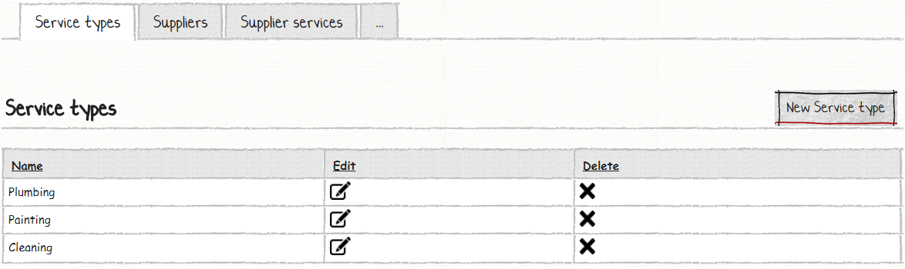
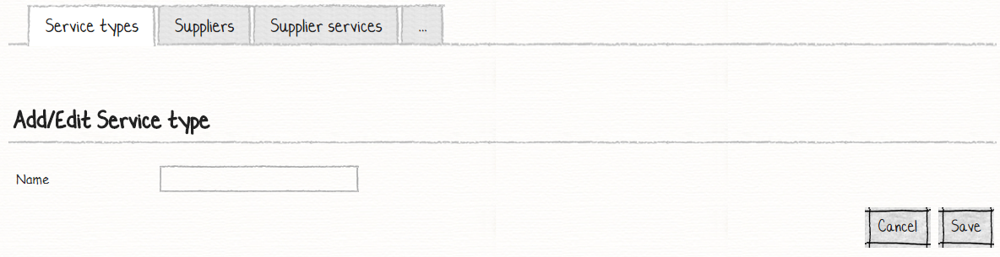
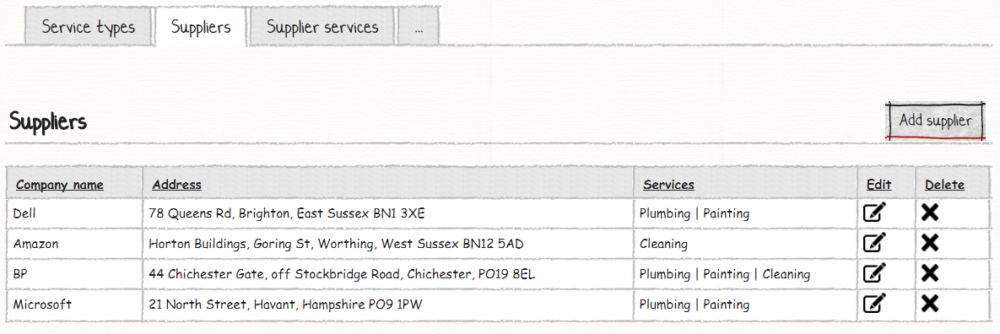
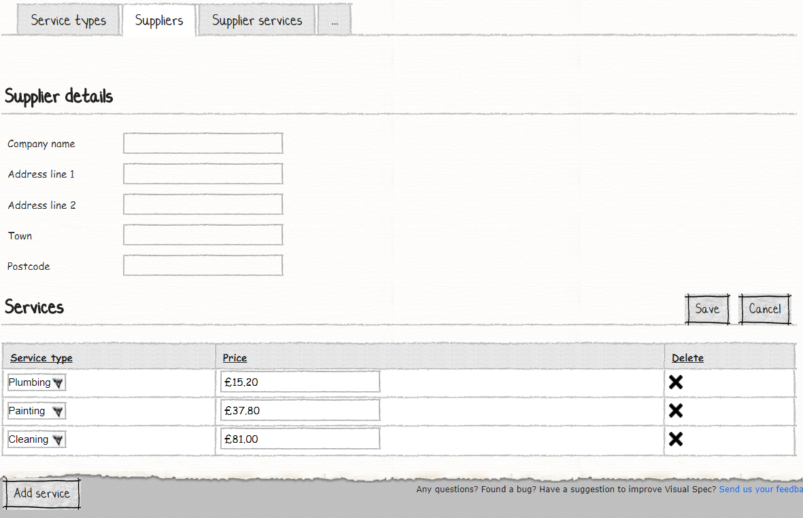
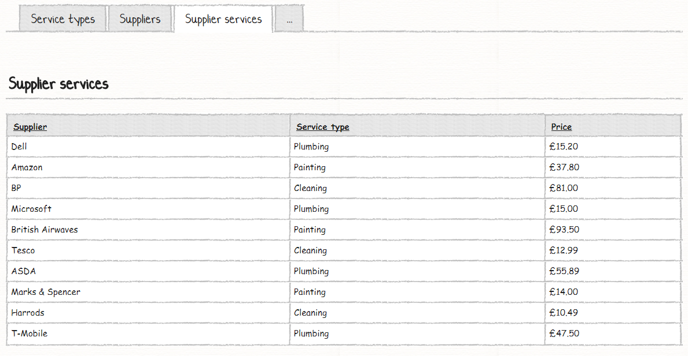

# Your Ninth M# Application
In this tutorial you will learn:

- Master-detail forms 

## Requirements
In this tutorial we are going to develop a website that lists Service types, suppliers and supplier services. On service types page user can see all service types and add or edit them. On suppliers page user can see all suppliers with their related services and on the supplier service page user can just see a list of all suppliers and service types with their price.

### Service Types:




The Service type page is simple, I just show a list of all service types and let users do CRUD operation.

### Suppliers:




On the supplier page, user can see a list of all supplier and their related services, in the list page all supplier address is connected with each other. In the add or edit pages, user can insert supplier information with their related service types as a master detail page.

## Supplier Services:


This page is just a list of all supplier and their related services.

[Continue here]
## Creating Entities
We start our work by creating **Service Type**, **Supplier** and **Supplier Service** classes in a *#Model* project under *Domain* folder:

```C#
using MSharp;

namespace Domain
{
    public class ServiceType : EntityType
    {
        public ServiceType()
        {
            String("Name");
        }
    }
}
```
*ServiceType* class just have "Name" property.
```C#
using MSharp;

namespace Domain
{
    public class Supplier : EntityType
    {
        public Supplier()
        {
            String("Company name");

            String("Address line 1");

            String("Address line 2");

            String("Town");

            String("Postcode");

            String("Address").Calculated().Getter("new[] { AddressLine1, AddressLine2, Town, Postcode }.ToString(\", \")");

            InverseAssociate<SupplierService>("Services", "Supplier");
        }
    }
}
```
*Supplier* class has a computed column with the name of "Address". We have used array to join all address properties into one column because these properties can be null and this way is best practice to join null-able string properties. This class has an inverse association with "SupplierService" property and other properties are just simple sting property.

```C#
using MSharp;

namespace Domain
{
    public class SupplierService : EntityType
    {
        public SupplierService()
        {
            Associate<Supplier>("Supplier");

            Associate<ServiceType>("Service type");

            Money("Price");
        }
    }
}
```
"SupplierService" class has two associations with "Supplier" and "ServiceType" class and a money property.
In solution explorer, right click the *#Model* project and select *Build* and then build the *Domain* project to make sure everything regarding it is fine.

## Developing UI
According to the requirement, we have these pages to develop:

- Service Types List
  - Add / Edit Service Type
- Suppliers List
  - Add / Edit Supplier
- Supplier Services List

### Creating Service Type Pages
Use the M# context menu to add a root page to the "Pages" folder of "#UI" project:
```C#
using MSharp;

public class ServiceTypePage : RootPage
{
    public ServiceTypePage()
    {
        Add<Modules.ServiceTypesList>();
    }
}
```
Create a folder with the name of "ServiceType" under "Pages" folder and add this sub page:
```C#
using MSharp;

namespace ServiceType
{
    class EnterPage : SubPage<ServiceTypePage>
    {
        public EnterPage()
        {
            Layout(Layouts.FrontEnd);

            Add<Modules.ServiceTypeForm>();
        }
    }
}
```

#### Creating Service Type List Module
Add a folder with the name of *ServiceType* under the *Modules* folder of the *#UI* project and add *ServiceTypesList* by using the M# context menu like below:

```C#
using MSharp;

namespace Modules
{
    public class ServiceTypesList : ListModule<Domain.ServiceType>
    {
        public ServiceTypesList()
        {
            HeaderText("Service types")
                .ShowHeaderRow()
                .ShowFooterRow();

            Column(x => x.Name);

            ButtonColumn("Edit").Icon(FA.Edit)
                .OnClick(x => x.Go<ServiceType.EnterPage>()
                .SendReturnUrl()
                .Send("item", "item.ID"));

            Button("New Service type").Icon(FA.Plus)
                .OnClick(x => x.Go<ServiceType.EnterPage>()
                .SendReturnUrl());
        }
    }
}
```
"ServiceTypesList" class just lists service types items in a grid and let users do CRUD operation.

#### Creating Service Type Form Module
Add a form module with the name of *ServiceTypeForm* by using the M# context menu like below:
```C#
using MSharp;

namespace Modules
{
    public class ServiceTypeForm : FormModule<Domain.ServiceType>
    {
        public ServiceTypeForm()
        {
            HeaderText("Add/Edit Service type");

            Field(x => x.Name);

            Button("Cancel").OnClick(x => x.ReturnToPreviousPage());

            Button("Save").IsDefault().Icon(FA.Check)
            .OnClick(x =>
            {
                x.SaveInDatabase();
                x.GentleMessage("Saved successfully.");
                x.ReturnToPreviousPage();
            });
        }
    }
}
```

### Creating Supplier Pages
Use M# context menu to add a root page to the "Pages" folder of "#UI" project:
```C#
using MSharp;

public class SupplierPage : RootPage
{
    public SupplierPage()
    {
        Add<Modules.SuppliersList>();
    }
}
```
Create a folder with the name of "Supplier" under "Pages" folder and add this sub page:
```C#
using MSharp;

namespace Supplier
{
    class EnterPage : SubPage<SupplierPage>
    {
        public EnterPage()
        {
            Layout(Layouts.FrontEnd);

            Add<Modules.SupplierForm>();
        }
    }
}
```

#### Creating Supplier List Module
Add a folder with the name of *Supplier* under the *Modules* folder of the *#UI* project and add *SuppliersList* by using the M# context menu like below:

```C#
using MSharp;

namespace Modules
{
    public class SuppliersList : ListModule<Domain.Supplier>
    {
        public SuppliersList()
        {
            HeaderText("Suppliers")
                .ShowHeaderRow()
                .ShowFooterRow();

            Column(x => x.CompanyName);

            Column(x => x.Address);

            Column(x => x.Services);

            ButtonColumn("Edit").Icon(FA.Edit)
                .OnClick(x => x.Go<Supplier.EnterPage>()
                .SendReturnUrl()
                .Send("item", "item.ID"));

            Button("New Supplier").Icon(FA.Plus)
                .OnClick(x => x.Go<Supplier.EnterPage>()
                .SendReturnUrl());
        }
    }
}
```
For "SuppliersList" class we have used "Address" property and "Services" as requested by requirements.

#### Creating Supplier Form Module
Add form module with the name of *SupplierForm* by using the M# context menu like below:
```C#
using MSharp;

namespace Modules
{
    public class SupplierForm : FormModule<Domain.Supplier>
    {
        public SupplierForm()
        {
            HeaderText("Supplier details");

            Field(x => x.CompanyName);

            Field(x => x.AddressLine1);

            Field(x => x.AddressLine2);

            Field(x => x.Town);

            Field(x => x.Postcode);

            //MasterDetail<SupplierServiceForm>(x => x.Services); //TODO: Complete this part

            Button("Cancel").OnClick(x => x.ReturnToPreviousPage());

            Button("Save").IsDefault().Icon(FA.Check)
            .OnClick(x =>
            {
                x.SaveInDatabase();
                x.GentleMessage("Saved successfully.");
                x.ReturnToPreviousPage();
            });
        }
    }
}
```

### Creating Supplier Service Pages
Use M# context menu to add a root page to the "Pages" folder:
```C#
using MSharp;

public class SupplierServicePage : RootPage
{
    public SupplierServicePage()
    {
        Add<Modules.SupplierServicesList>();
    }
}
```

#### Creating Supplier Service List Module
Add a folder with the name of *SupplierService* under the *Modules* folder of the *#UI* project and add *TimeLogsList* by using the M# context menu like below:

```C#
using MSharp;

namespace Modules
{
    public class SupplierServicesList : ListModule<Domain.SupplierService>
    {
        public SupplierServicesList()
        {
            HeaderText("Supplier services")
                .ShowHeaderRow()
                .ShowFooterRow();

            Column(x => x.Supplier);

            Column(x => x.ServiceType);

            Column(x => x.Price);
        }
    }
}
```

#### Adding Pages to Menu
Our last step is to add a root page to the main menu:
```C#
using MSharp;

namespace Modules
{
    public class MainMenu : MenuModule
    {
        public MainMenu()
        {
            AjaxRedirect().IsViewComponent().UlCssClass("nav navbar-nav dropped-submenu");

            Item("Login")
                .Icon(FA.UnlockAlt)
                .VisibleIf(AppRole.Anonymous)
                .OnClick(x => x.Go<LoginPage>());

            Item("Settings")
                .VisibleIf(AppRole.Admin)
                .Icon(FA.Cog)
                .OnClick(x => x.Go<Admin.SettingsPage>());

            Item("Service type")
               .Icon(FA.Cog)
               .OnClick(x => x.Go<ServiceTypePage>());

            Item("Supplier")
               .Icon(FA.Cog)
               .OnClick(x => x.Go<SupplierPage>());

            Item("Supplier services")
               .Icon(FA.Cog)
               .OnClick(x => x.Go<SupplierServicePage>());
        }
    }
}
```
### Final Step
Build **#UI** project, set the **WebSite** project as your default *StartUp* project and configure your *connection string* in **appsetting.json** file and hit F5. Your project is ready to use.