# Building a simple website

## Introduction

We are going to develop a simple website for an imaginary company named Smart Solutions. After countless hours of discussing client’s requirements and expectation of the design and features of the website the business development team came up with the following requirement list:

1. The client would like to have a slideshow on his website and be able to change the image of it. Also they like to be able to add a heading and a short description with a link to an article on their blog on medium.com
2. The client has just one service or product which he likes to be able to list its three most important features.
3. The client provided a short summary of his company's core values.
4. The client needs to show his former customers logo on the website and some of his customers’ testimonies.
5. The contact information is a must, duh! Also the client loves google maps!

The development team got excited by the new project’s requirement and fired up their visual studios, but before they create an empty solution and follow the Domain Driven Development guidelines spiced with Test Driven Development, they saw the projects due date: **The Day After TOMORROW**

Well it appears the client is attending an exhibition the day after tomorrow and needs the website ASAP. The team quickly brewed a fresh pot of coffee and prepared themselves for a long sleepless night. Suddenly the project manager comes in with a smile on his face and walks to the white board like the first cave man who discovered the fire and writes a magical letter and a symbol.

**M#**

So how M# Is going to save the day and help our imaginary client and development team? Well let's consider the steps the development team has to take without utilizing M#. Since the application doesn’t have a special behaviour other than storing and retrieving data in and out of the database and converting it to HTML output, Data Driven Design with some POCOs sounds like a good candidate. In a typical Data Driven Design you follow these steps

1. Create database tables.
2. Design associations between the tables.
3. Normalize the database.
4. Write stored procedures for typical CRUD operations.
5. Define database table’s corresponding classes, eg. POCOs.
6. Develop data retrieving\storing mechanisms, eg. repositories.
7. Develop authentication and authorization mechanisms.
8. Build the admin panel, so any non-technical staff of the Client with proper authentication can manage the data on the website.
9. Finally design and create the front of the website.

Add validation, unit and integration tests to the above list and you got yourself a proper data driven development cycle. You may ask, well yeah what's wrong with this development process? Glad you asked,

+ It’s error prone, your unit and integration tests usually won’t cover the entire business logic
+ You need highly experienced developers on your team to develop projects fast enough to be profitable for the company.
+ Each project varies from other projects, which makes support and further development harder for the team, especially for new members. 
+ Last but not least, It’s **time consuming and inefficient**.

Many companies tried to elevate the situation, good old folks on Microsoft came up with Entity Framework which frees time by almost taking care of steps 1 to 6. M# takes the extra mile and handles steps 1 to 8 and partially step 9. So let’s consider M#’s development cycle:

1. Define Entities (the POCO classes in our example) and their relation to each other.
2. Define how the entities should be presented and manipulated by binding entities to as many as needed predefined and highly configurable Modules.
3. Define websites different pages and what modules each contains.
4. Start frontend development eg. styling and scripting.

I hope you’re as excited as I am about this new technology, so let's first take a look at the finished website that we are going to build.

Below is the screenshot of the entire webpage, as you can see the entire front of the website consists of just one page. You can checkout the source code at :
[https://github.com/Geeksltd/MSharp.Docs-sample-gallery](https://github.com/Geeksltd/MSharp.Docs-sample-gallery)


Before jumping into code we need to prepare our development environment so let’s keep on by acquiring the tools we’re gonna need in order to utilize M# in our projects.

## The Tools of The Trade

In order to set up our development environment we need to install few common tools, as a .Net developer I’m sure you already have most of them installed on your machine but nevertheless here is the full list:

+ Visual Studio (latest version, at the time of writing this tutorial VS 2019 is the latest one)
+ Git
+ Node.js (don’t worry you’re not expected to know anything about node.js, we’re just using its package manager tools for front-end libraries)
+ Yarn (It’s another package manager for front-end libraries which gives us more options on where to install them)
+ Docker (we don’t need it for our sample project development)
+ An instance of the MS SQL Server (the developer edition or express edition)
+ SQL Server Management Studio (at the time of writing this tutorial it has been seperated from the MS SQL Server installer)

Also I’m highly recommend to install M#’s family extensions for Visual Studio they’ll optimize your code and improve your productivity. You can either download them from Nuget website by following [this link](https://marketplace.visualstudio.com/search?term=msharp&target=VS&category=All%20categories&vsVersion=&sortBy=Relevance) or you can use the built in extension manager of the visual studio by searching the **“MSharp”** phrase on its search box.


## A Brand New Project

Fire up your visual studio and navigate to File>New>Project. On the filter section make sure All languages, All platforms and All Projects types are selected and enter “M#” on the search box. You’ll be presented by the following result:

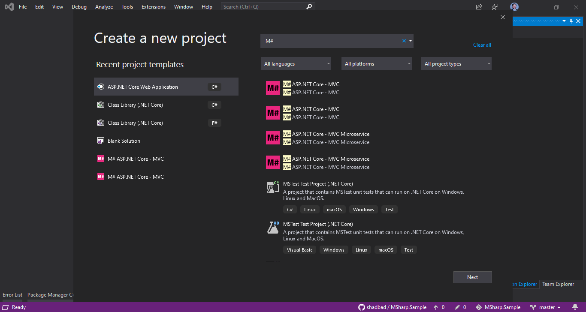

If you see a pair for MVC and a pair for Microservices, don’t panic both of MVC options generate the same project structure (I think it’s because visual studio categorize the M# projects on two different categories hopefully it’ll be addressed and resolved soon).

Select the M# ASP.Net Core - MVC option and click next. You’ll end up with the following dialogue:

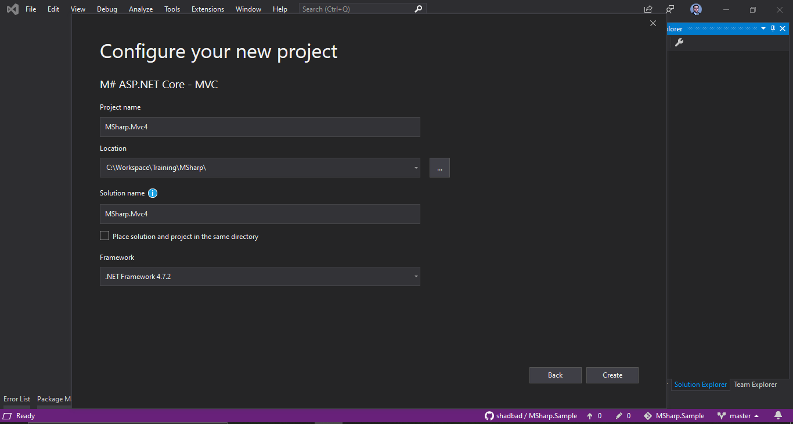

Don’t mind the Framework options which says .NetFramework 4. I’ll guarantee the end result will be a .Net Core project. After entering your desired project name and location hit the create button and we’ll see the M#’s project wizard dialogue like below

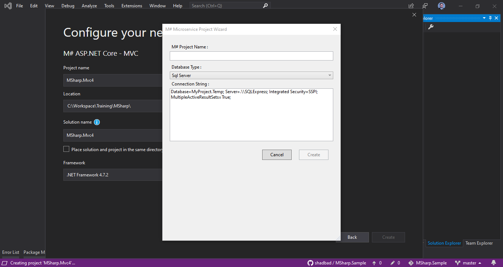

>Pay extra attention to the connection string field, I’m sure you have written many connection strings before but beware that for under development project **The Database Name MUST END WITH “ .Temp ”** I remember how much frustration I endure by this tiny little detail and removing the .Temp extension from the database name. So don’t make my mistake. This is the connection string which the ORM will use to create and track your project’s database and tables. You don’t need to create the database the M# will take care of it.

Click on the create button and visual studio starts to download the latest template from [this GitHub’s repository](https://github.com/Geeksltd/Olive.MvcTemplate).

You’ll end up with a solution containing 5 projects and they all have a disclimation icon next to their Dependencies node on solution explorer panel. By default VS 2019 starts to download Nuget and NPM packages. If this is the first time you have created a M# project on your machine and if like me you’re not blessed with the high speed internet connection it could take a while and unfortunatly visual studio doesn’t give a visual clue on how the package download is going on.

What I usually do after creating a new M# project, I launch the command prompt and navigate to the project’s folder, there is a **build.bat** file which upon execution will install all the dependencies and builds the solution.

So launch the command prompt by typing **cmd** on windows search and navigate to the project’s folder and execute the build.bat

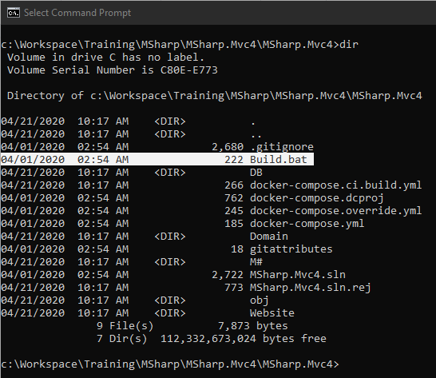

What will this batch file do? Well take a look at the output:

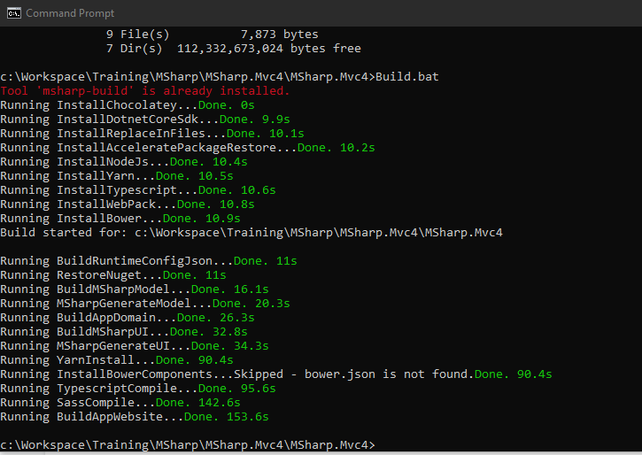

Now let’s get back to Visual Studio, as you can see most disclamation icons are now gone except for the website project! It appears visual studio is still struggling to install NPM packages but we know that the build.bat already took care of that. What causes the problem is that the package.json file is configured for Yarn and the visual studio internally uses NPM for front-end libraries which will be installed on a folder named Node_Modules but we want the packages to be installed on wwwroot/lib folder. Check the folder you’ll see that all packages are actually installed.

### MY EXPERIENCE: 

What I usually do to remove the annoying disclamation mark and speed up the build process is that I edit the package.json file and remove all the dependencies from it!

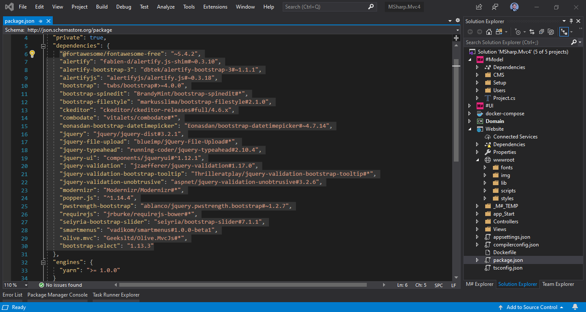

Don’t worry the packages are already installed, if you’re uncomfortable with this hack you can cut and paste the dependencies to a text file as a fallback solution. After deleting you’ll see that the exclamation mark has disappeared.

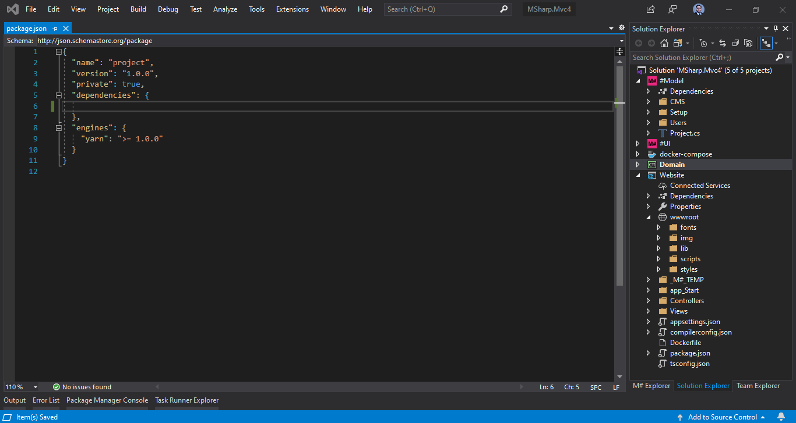

After this little hack open the appsetting.json file and modify the connection string, you might asked that we already stated the connection string on M#’s new project wizard why we should enter it on the appsetting.json too. Well the connection string you entered on the new project wizard is used by M#’s internal ORM but the connection string on the appsettings.json will be used by the website project.

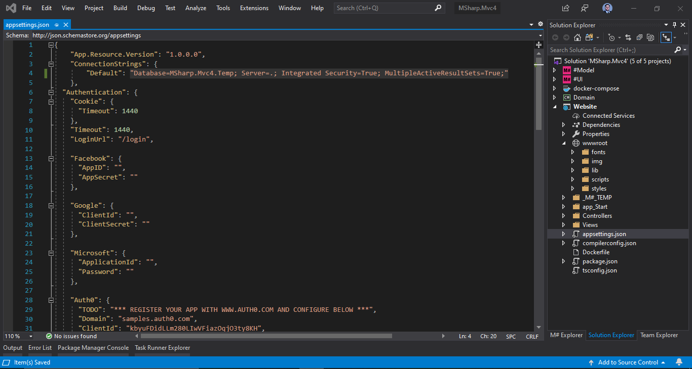

Only one thing left and that is right clicking the Website project and clicking Set as a startup project option. After that hit F5 or right click the website project and choose view>view in browser option and voila! Your brand new project is all set.

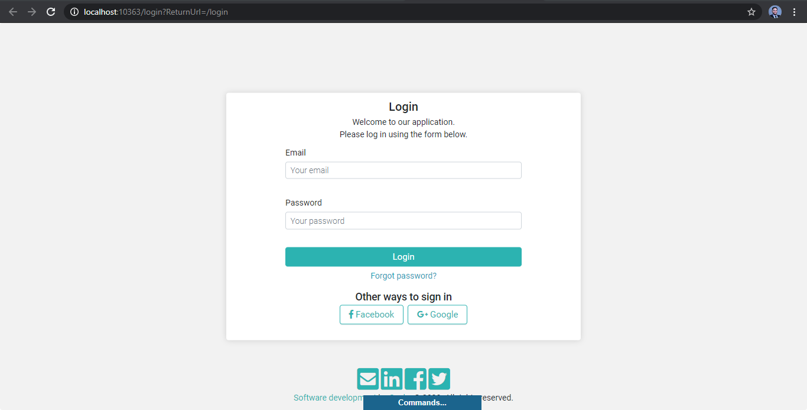

>Don’t know the username and password? No worries, we'll dig them up from the code in the next section.

## Exploring The Solution

Let’s get familiar with the structure of the M# solution. As you can see on the solution explorer panel we have 5 different projects. The first question that pops in mind is what is the relation between these projects. Let’s break down the solution:

### #Model And Domain

The #Model is a .net core library project which doesn’t depend on any other projects in the solution. You’ll define your entities here by using M#’s fluent API. After compiling this project it’ll modifies the **Domain** project and creates entities which will be consumed by the **Website** and **#UI** projects.

Let’s see what we got on the #Model project, couple of folders and a Project.cs file, let’s take a look at it first:

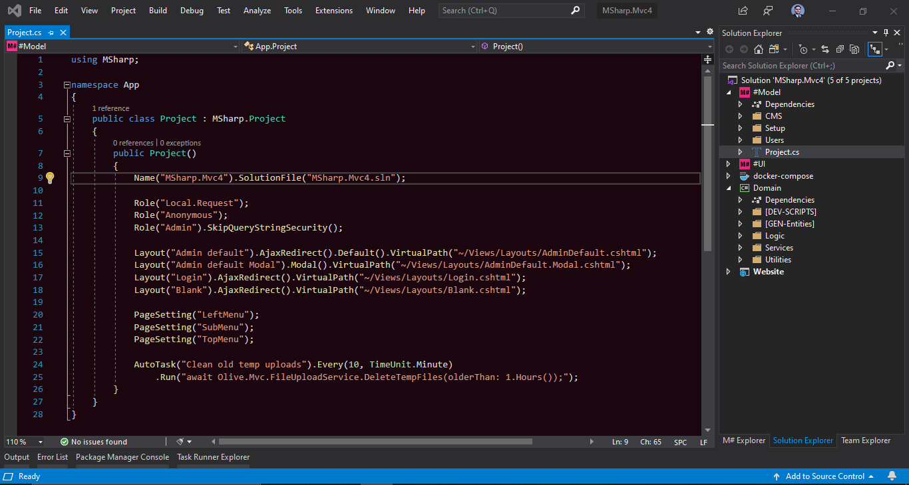

Well it’s a class with just a constructor method which is housing some code written in M#’s fluent API. at first line we got the Name and SolutionFile methods which M# compiler uses to modify the Domain and Website projects. Then we have Role methods which are used to define different roles for authentication and authorization processes. We don’t need to change any of these statements for our sample project. What is interesting is the Layout and PageSettings methods.

Basically the layout method introduces the layout files to the M# compiler which can be used on M#’s page classes. The PageSettings method defines placeholders on layout files which can be filled by M#’s modules. Go ahead and check the AdminDefault.cshtml file located on the website project > views > layouts you’ll see a div with the left-panel class which looks like it is loading an Asp.net Component View if some conditions are right. The function of PageSettings is kinda like razor sections.

In a nutshell, on #Domain’s  project.cs we define some global options and variables which we can then use on other solution’s project especially the #UI project.

Now let’s focus our attention to one of entities, I want you to open these 3 files:

1. #Model > Setup > Settings.cs
2. Domain > [GEN-Entities] > Settings.cs
3. Domain > Logic > Settings.cs

Every entity class that you’ll define on #Model project will generate one partial entity class in two files one on [GEN-Entities] folder and the other on Logic folder. If you think about classes in general each class has some fields or properties and some behaviour or logic expressed by its methods. What M# does, is splitting these two concepts in two different files.

You don’t manually change the files on [GEN-Entities], hence the name of the folder. But in some situations you’ll need to add some behaviour to your entities, the file on the logic folder is the one to go to.

>**Note that the files on the Domain project will be created after you build the #Model project.**

On the Domain project we have a folder named [DEV-SCRIPTS], and inside you’ll find the ReferenceData.cs file. This class is responsible for seeding the database, you can add any initial data here, kinda like the Seed method on the Configuration class of the Entity Framework.

Remember I promised you we’ll dig up the username and password of the admin panel? Well scroll down and take a look at the CreateAdmin method.

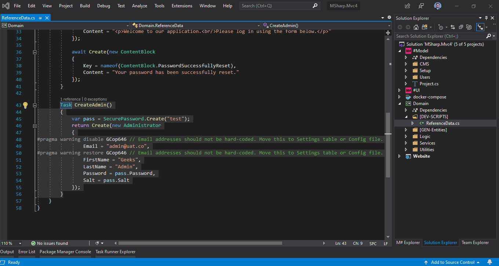

After entering the username and password on the login page you’ll gain access to the admin panel.

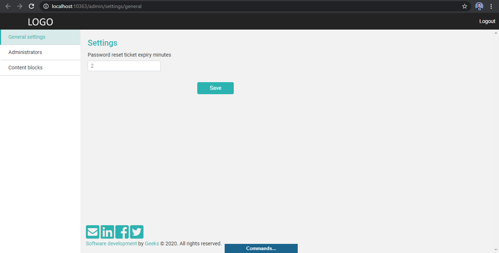

Note that when you create a method for seeding the database you’ll have to call your seed method on Create method, otherwise no database seeding!

### #UI and Website

This project is responsible for creating Controllers, Models, Views, View Components and routing on the Website project which we don’t manually change because after each build of the #UI project they all will be overwritten what you can change on the Website project are only the layout files, config files and files stored under wwwroot folder the rest is handled by #UI project.

Take a quick look at the files and folders under the #UI project. Project.cs and SchemaExtensions.cs are auto generated and if you modify these files they will be overwritten on the next build. Also we have two folders Pages and Modules.

#### Page

Let’s forget about M# for a second and think about good old static Html websites. They all have Html files with different names and are organized into different folders which dictates each Html file’s unique Url address. Every Html page has some meta data like title, meta description, icon and so on. All pages follow a specific layout and design, so we have headers, footers, nav bars and etc. Also we can identify UI elements like links to blog posts which they all look the same but with different content.

Similarly we have Page classes (don’t confuse them with the Razor Pages) which some of their common responsibilities are:

+ Defining the routing mechanism (folder structure on static html pages)
+ Defining what layout each page is going to use
+ What is the Title of the page
+ Redirecting visitors to other pages
+ Is the page accessible for specific group of users (user roles)
+ Does the page uses SSL or not
+ Should the server cache output of the page
+ What Js files should be sent to browser

The way we organize Page classes is similar to static html websites take a look at the following diagram:

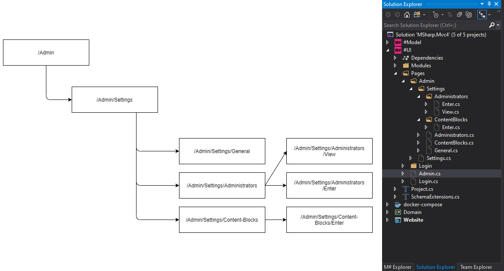

Perhaps the most important responsibility of Pages that is not listed above is **what each page contains!**

#### Modules

If you’re familiar with front-end libraries like React.js you’ll find lots of similarities between M#’s Modules and React.js’ Components. In M# you create different UI components by using Modules which behind the scene are generating Asp.net core view components (if you’re not familiar with view components think of them as partial views but with controllers).

It gets better, most of the M#’s modules are binded to an Entity and in sync with their data on the database. This is by far one of the coolest features of M# in my opinion on libraries like react you have to write the binding logic yourself but in M# you get the whole package, components + data + binding to the database.

M# got 5 different types of modules which are:

+ Form: for creating and updating entity instances
+ List: for looping over and listing entity instances on the database
+ View: for showing a single entity instance
+ Menu: for creating menus and submenus or dynamic menus
+ Generic: for creating modules that are not binded to an entity

Ok, enough theory! let's get our hands dirty by some code.

## Creating Homepage

First let’s create a Homepage for our imaginary client. Here is the rundown of what we’re going to do:

1. Create a layout for the front of the website on Website>Views>Layouts folder
    + Add a placeholder for Navigation and Footer to the layout
    + Create a folder in Website>wwwroot>styles to house our style files (I named the folder default)
    + Create a folder in Website>wwwroot>icons to house our fav icons and other icons that we are going to use in our design
    + Add fonts to Website>wwwroot>fonts folder (I used Popins font)
2. Introduce our new layout and placeholders to M# on #Model>Project.cs
3. Create a menu module
4. Create a class name Home under the Page folder in #UI project
5. Change the login routing on Login page and free up the “/” url to be used for our new homepage

### Creating Layout

Add an empty cshtml file to the Website>Views>Layouts folder, just right click on layout folder and choose Add > New item on the dialogue search for layout and choose razor layout and name the file Default.cshtml

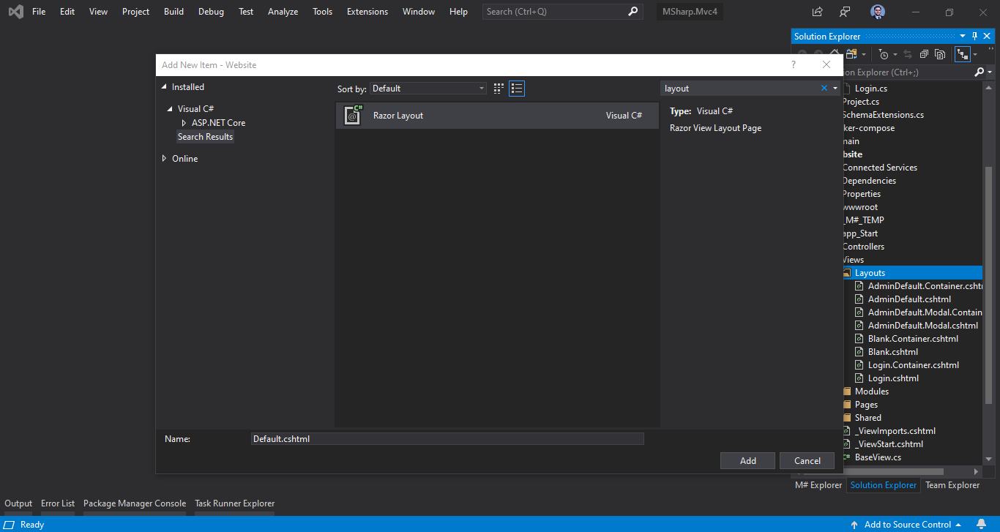

You’ll end up with the following file:

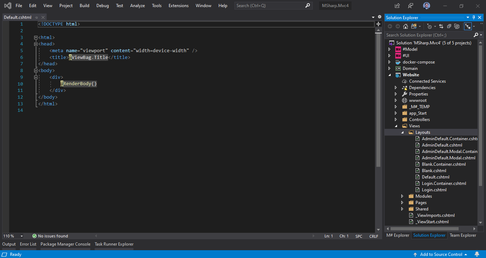

Technically you can start writing the body but if you like to have favIcons now it's a good time to visit [https://realfavicongenerator.net/](https://realfavicongenerator.net/) which generates favicons for different devices based on the image you upload and gives you the html tags for the head tag and a zip file containing your favicons collection.

You can also add open graph and mobile app’s meta tags to the layout. Don’t forget to link your css files to the layout.

Here is my layout page so far:

```cshtml
<!DOCTYPE html>

<html>
<head>
	<title>@ViewData["Title"]</title>
	<meta name="description" content="@ViewData["Description"]" />

	<meta charset="UTF-8" />
	<meta name="viewport" content="width=device-width, initial-scale=1" />
	<meta http-equiv="X-UA-Compatible" content="IE=edge,chrome=1" />
	<meta name="mobile-web-app-capable" content="yes" />
	<meta name="apple-mobile-web-app-capable" content="yes" />


	<!--
		Start Favicon:
			The following link and meta tags were generated by
			https://realfavicongenerator.net/
	-->

	<link rel="apple-touch-icon" sizes="180x180" href="~/icons/fav/apple-touch-icon.png" />
	<link rel="icon" type="image/png" sizes="32x32" href="~/icons/fav/favicon-32x32.png" />
	<link rel="icon" type="image/png" sizes="16x16" href="~/icons/fav/favicon-16x16.png" />
	<link rel="manifest" href="~/icons/fav/site.webmanifest" />
	<link rel="mask-icon" href="~/icons/fav/safari-pinned-tab.svg" color="#5bbad5" />
	<link rel="shortcut icon" href="~/icons/fav/favicon.ico" />
	<meta name="apple-mobile-web-app-title" content="School of Code" />
	<meta name="application-name" content="School of Code" />
	<meta name="msapplication-TileColor" content="#b7af9a" />
	<meta name="msapplication-config" content="~/icons/fav/browserconfig.xml" />
	<meta name="theme-color" content="#ffffff" />

	<!-- End Favicon -->


	<!-- Start Open Graph -->

	<meta property="og:title" content="@ViewData["Title"]" />
	<meta property="og:type" content="website" />
	<!-- TODO: Replace the url with the website's root Url-->
	<meta property="og:url" content="http://geeks.ltd.uk/" />
	<!-- 
		TODO: Create an image for the client's logo w:1200px h:1200px use fully qualified url address
		like https://geeks.ltd.uk/images/logo.png
	-->
	<meta property="og:image" content="" />
	<meta property="og:description" content="@ViewData["Description"]" />

	<!-- End Open Graph-->

	<link href="~/styles/default/default.css" rel="stylesheet" />
</head>
<body>
	@RenderBody()
</body>
</html>
```

Now we need to create 2 placeholders for the Menu module and the Footer module, if you remember I stated that all modules in M# are actually ViewComponents so what we need to do is just call the Invoke method of the Component helper class and provide the method with the name of the module. M# will put the name of the module in the ViewBag collection we just need to check if the name is available for each page or not (meaning the module has been added to the page or not). So let’s create code block at the top of the layout page and extract the names of the modules from ViewBag.

```cshtml
@{
	var navigation = ViewData["MainNav"].ToStringOrEmpty();
	var footer = ViewData["MainFooter"].ToStringOrEmpty();
}
<!DOCTYPE html>

<html>
<head>...</head>
<body>
	@RenderBody()
</body>
</html>
```

Now we need to invoke the ViewComponent only if the name of the placeholder is not empty:

```cshtml
@{
	var navigation = ViewData["MainNav"].ToStringOrEmpty();
	var footer = ViewData["MainFooter"].ToStringOrEmpty();
}
<!DOCTYPE html>

<html>
<head>...</head>
<body>
	<header>
		<div class="wrapper">
			<a class="icon-logo" href="/">
				<span>SMART</span>
			</a>

			@if (navigation.HasValue())
			{
				<nav>
					@await Component.InvokeAsync(navigation)
				</nav>
			}

			<span class="menu"><i></i><i></i><i></i></span>
		</div>
	</header>

	<main>
		<div class="wrapper">
			@RenderBody()
		</div>
	</main>

	<footer>
		<div class="wrapper">
			@if (footer.HasValue())
			{
				@await Component.InvokeAsync(footer)
			}
		</div>
	</footer>
</body>
</html>
```

### Modifying the Project.cs file

Now let’s jump to #Model > Project.cs file and introduce our newly created layout with its placeholder to M#. Edit your project.cs file like below:

```csharp
using MSharp;

namespace App
{
    public class Project : MSharp.Project
    {
        public Project()
        {
            Name("MSharp.Sample").SolutionFile("MSharp.Sample.sln");            

            Role("Local.Request");
            Role("Anonymous");
            Role("Admin").SkipQueryStringSecurity();

            Layout("Admin default").AjaxRedirect().Default().VirtualPath("~/Views/Layouts/AdminDefault.cshtml");
            Layout("Admin default Modal").Modal().VirtualPath("~/Views/Layouts/AdminDefault.Modal.cshtml");
            Layout("Login").AjaxRedirect().VirtualPath("~/Views/Layouts/Login.cshtml");
            Layout("Blank").AjaxRedirect().VirtualPath("~/Views/Layouts/Blank.cshtml");
            
            PageSetting("LeftMenu");
            PageSetting("SubMenu");
            PageSetting("TopMenu");

            // The new layout
            Layout("Default")
                .AjaxRedirect()
                .VirtualPath("~/Views/Layouts/Default.cshtml");

            // The new placeholders
            PageSetting("MainNav");
            PageSetting("MainFooter");

            AutoTask("Clean old temp uploads")
                .Every(10, TimeUnit.Minute)
                .Run("await Olive.Mvc.FileUploadService.DeleteTempFiles(olderThan: 1.Hours());");
        }
    }
}
```

#### The Build Process

Now we need to build the solution, If you have installed the M# extensions by right clicking the solution on solution explorer you have a new option called Build All with the M# icon next to it which you can use to build the solution however by the time of writing this tutorial some of the extensions are not behaving as they should (I just sugar coated the word buggy :D) which hopefully will be addressed soon. So this is how I build the solution 

1. Build the #Model project 
2. Build the Domain project
3. Build the #UI project
4. Finally build the Website project

Remember this sequence. Also if you get any errors from extensions complaining that they couldn’t find a specific file and so, just to the build process and try again, remember that the #UI project depends on the domain.dll file. And Domain project depend on the #Model project.

### Creating MainNav Module

Since our project contains only one page the links are actually just hashtag links which we will use on our javascripts file to scroll the page to corresponding sections. When it comes to creating M# files you have 3 options:

1. Use MSharp.AddNew extension
2. Use M# Explorer extension
3. Create files manually

I used MSharp.AddNew extension but ran into some problems for creating certain files then I used M# Explorer which I ran into other problems for some other files! (Again not blaming anyone, I just ran into problems :D). 

Bottomline if you tried AddNew extension and faced with an error first repeat the build process I mentioned above if the error still exists use M# explorer and if still you’re running into an error message try adding the file manually.

Where were we? Right adding a menu module. Head over to the #UI>Modules>-Menus folder, right click on the folder choose Add>M#>Add Menu and name the file MainNav. Which will generate the following class:

```csharp
using MSharp;

namespace Modules
{
	class MainNav : MenuModule
	{
		public MainNav()
		{
			// TODO: Configure me ...!
            AjaxRedirect().IsViewComponent().UlCssClass("nav navbar-nav dropped-submenu");
            Item("Item text 1...").OnClick(x => x.Go<...Page>());
            // Or the shortcut version:
            Item<...SomePage>();
		}
	}
}

```
Now we have to inform M# that this class is a ViewComponent by using M# fluent API and calling the IsViewComponent() method. By default M# wrapps the generated Html for each module in a form, since we just need a UL element with a couple of LIs and anchor elements we’re going to set this feature off by calling WrappInForm(false) method. What left to do is to actually introducing links to M# which is done by Item method. 

Typically Item method requires the link text and since we’re building a single page application our links’ href attribute contains only hashes so instead of instructing M# to direct visitors to a specific M# Page upon clicking the links we ask M# just to navigate to a URL which is only a hash like below:

```csharp
using MSharp;

namespace Modules
{
	class MainNav : MenuModule
	{
		public MainNav()
		{
			WrapInForm(false);
			IsViewComponent();
			
			Item("Home").LinkCssClass("mark").OnClick(x =>
			{
				x.Go("#SlideLst");
			});

			Item("Features").OnClick(x =>
			{
				x.Go("#FeatureLst");
			});

			Item("About").OnClick(x =>
			{
				x.Go("#About");
			});

			Item("Clients").OnClick(x =>
			{
				x.Go("#ClientLst");
			});


			Item("Contact").OnClick(x =>
			{
				x.Go("#Contact");
			});

		}
	}
}

```

### Creating Homepage class
Bring up your M# Explorer panel on Visual Studio, you should see a panel like this:

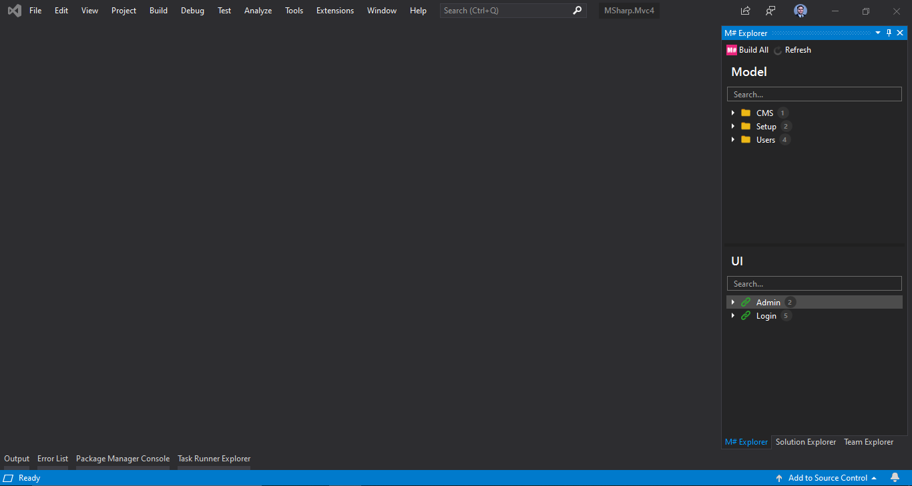

Couple of things you should know about M# Explorer first it relies on compiled projects so don’t get surprised if your newly created models or UI modules are not listed here. Second in order to list your newly created stuff after building the solution you must hit the refresh button located on top of the panel.

Technically you should be able to add the Homepage class by using MSharp Add New extension but I ran into error messages for adding root pages like our homepage but for subpages it works like a charm. 

Right click on UI section (on any of the listed pages) and select Add Page, you’ll greeted by the Create New Page dialogue:

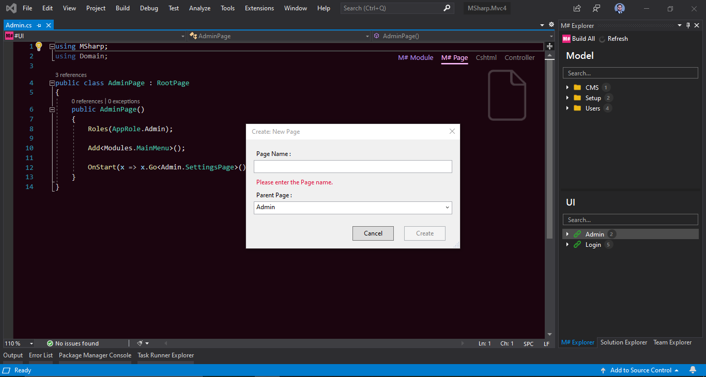

Clear the parent page field and enter Home in the Page Name textbox. Don’t enter HomePage just enter Home. M# will add the Page suffix for Page classes so if you enter HomePage here you’ll end up with HomePagePage class.

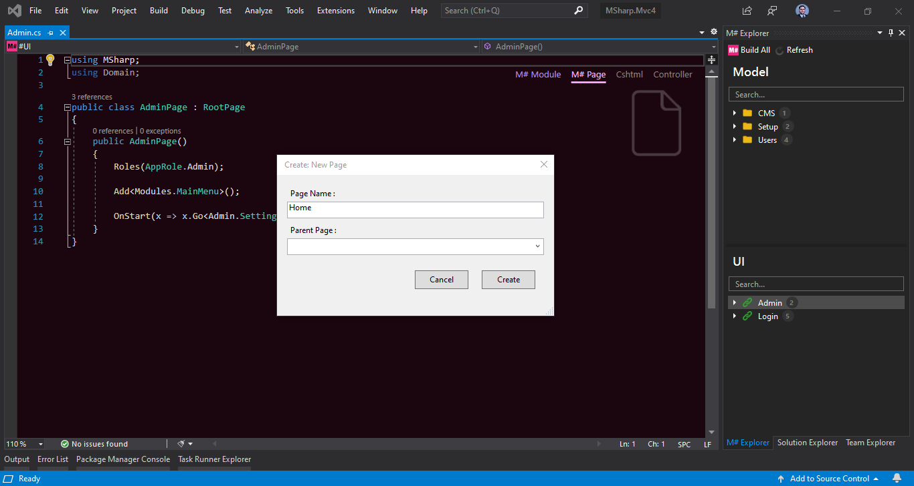

Now we got an empty brand new HomePage class stored under Home.cs file. It’s time to configure our home page, we should:

1. Set the route for the page to be “/” not “/home”
2. State what layout this page and all its subpages will use
3. Fill the layout placeholders for this page
4. Set page title

By default the pages routes mirror the filename. In our case since the homepage is a root page it’s accessed by /home and if for example later we add a sub page to our homepage named contact it will be accessible with /home/contact url. But we don’t want the /home, instead we want this page to be accessed by “/”. So we use Route method of the M# fluent API and put “/” as its input. The rest of the above steps are self explaining, just take a look at the following code:

```csharp
using MSharp;

class HomePage : RootPage
{
    public HomePage()
    {
        Route("/");
        Layout(Layouts.Default);
        BrowserTitle("MSharp Sample Application");
        Set(PageSettings.MainNav, "MainNav");
    }
}
```

### Changing Login Page Routing

Openup #UI > Pages > Login you should have a login class like bellow

```csharp
using MSharp;

public class LoginPage : RootPage
{
    public LoginPage()
    {
        Route(@"Login
            [#EMPTY#]");

        Layout(Layouts.Login);

        Add<Modules.LoginForm>();
        Add<Modules.SocialMediaLogin>();

        MarkupTemplate("<div class=\"login-content\"><div class=\"card login\"><div class=\"card-body\">[#1#][#2#]</div></div></div>");

        OnStart(x =>
        {
            x.If("Request.IsAjaxPost()").CSharp("return Redirect(Url.CurrentUri().OriginalString);");
            x.If("User.Identity.IsAuthenticated").Go<Login.DispatchPage>().RunServerSide();
            x.If("Url.ReturnUrl().IsEmpty()").Go("/login").RunServerSide()
                .Send("ReturnUrl", ValueContext.Static, "/login");
        });
    }
}
```

We’re going to remove the Route method from it. After removing the Route method the login page is only accessible by /login url. And the routing conflict between LoginPage and HomePage will be resolved.

```csharp
using MSharp;
using Domain;

public class LoginPage : RootPage
{
    public LoginPage()
    {
        Layout(Layouts.Login);

        Add<Modules.LoginForm>();
        Add<Modules.SocialMediaLogin>();

        MarkupTemplate("<div class=\"login-content\"><div class=\"card login\"><div class=\"card-body\">[#1#][#2#]</div></div></div>");

        OnStart(x =>
        {
            x.If("Request.IsAjaxPost()").CSharp("return Redirect(Url.CurrentUri().OriginalString);");
            x.If("User.Identity.IsAuthenticated").Go<Login.DispatchPage>().RunServerSide();
            x.If("Url.ReturnUrl().IsEmpty()").Go("/login").RunServerSide()
                .Send("ReturnUrl", ValueContext.Static, "/login");
        });
    }
}

```

Now if you build the solution and try to navigate to the home page on your browser you’ll get a complaint message from your browser stating that the homepage could not be found! **That's because we haven’t added anything to our homepage yet and M# compiler won't generate the controllers and views for empty pages**.

Let’s create our first entity for the slideshow module.

## Creating Slide Module

As I mentioned in the introduction, our imaginary client likes to have a slideshow on his website and since he has windows paint on his machine he also likes to be able to add and remove slides whenever he likes. Therefore we have to provide slide CRUD operations on the admin panel.

Here is the rundown of what we’re going to do:

1. Create an Entity for our slides which should have the following properties:	
    + Title
    + Description
    + Image
    + Link text
    + Link Url
    + Display order
2. Create a list module for admin panel, which generates a html table
3. Create a form module for admin panel
4. Add a subpage to the AdminPage named Slides
5. Add created list module on step 2 to the SlidesPage
6. Add a subpage to the SlidesPage named AddOrUpdate
7. Add created form module on step 3 to the AddOrUpdate page
8. Add a SlidesPage link to the Admin menu
9. Create a list module with custom markup for homepage
10. Add created list module on step 9 to the homepage

### Creating Slide Entity

Head over to the #Model project and create a new folder called Domain. Right click on Domain folder and select Add > M# > Add Entity on the popped up dialogue enter Slide for Type Name field and leave the Base Type empty. Use the M# fluent API to add properties in the constructor method like below:

```csharp
using MSharp;

namespace Domain
{
    class Slide : EntityType
    {
        public Slide()
        {
            String("Title").Mandatory();
            String("Description").Mandatory();
            String("Link Url").Mandatory();
            String("Link Text").Mandatory();
            Int("Display Order").Mandatory();
            OpenImage("Image");
        }
    }
}
```

The M#’s fluent API is straightforward, whenever you are stuck and couldn’t remember the method names just pick the definition of the EntityType base class (The class our newly created entity is inherited from) and see the code definition young skywalker :D.

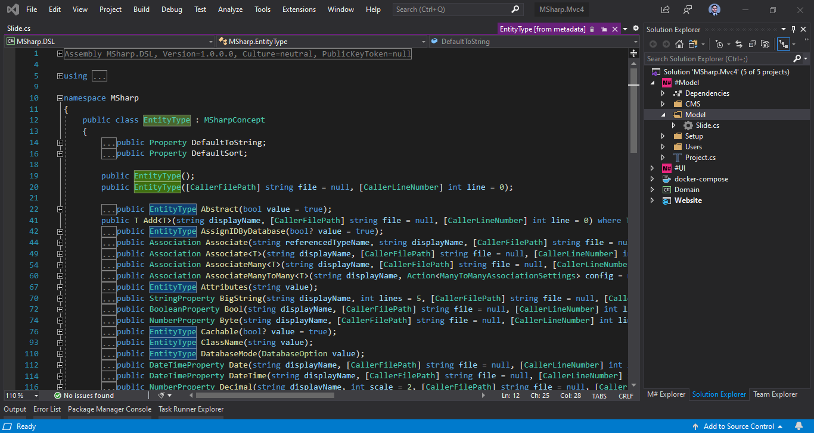

Build the #Model then the Domain projects and head over to the #UI project.

### Creating List Module for Admin Panel

Right click on the #UI project and select Add > M# > Add List on the popup dialogue select the Slide entity for on type select list and enter SlideTbl for type name.

> At the time of writing this tutorial, after adding the SlideTbl module I got the “The operation could not be completed” error message. If you get the same error, don’t panic. It's a known bug and will be fixed soon. If you look at the solution explorer you’ll notice that despite the error message, a new folder named “Slide” under the Modules folder has been created and our SlideTbl is also present there. We also have a SlideTbl.cs file in the root of the #UI project which you can safely remove.

Now open up the SlideTbl.cs file, for now we only need to comment out the Button methods because we haven’t yet created the pages which will house our modules and we also need to build the solution.

```csharp
using Admin;
using MSharp;

namespace Modules
{
    class SlideTbl : ListModule<Domain.Slide>
    {
        public SlideTbl()
        {
            // TODO: Configure me ...!
            HeaderText("Slides");
            
            Search(GeneralSearch.AllFields).Label("Find:");
            // ...
            
            Column(x => x.Title);
            Column(x => x.Description);
            Column(x => x.LinkUrl);
            Column(x => x.LinkText);
            Column(x => x.DisplayOrder);
            Column(x => x.Image);

            // ButtonColumn("Edit")
            //     .HeaderText("Actions")
            //     .GridColumnCssClass("actions")
            //     .Icon(FA.Edit)
            //     .OnClick(x => x.Go<...Page>().Send("item", "item.ID"));

            // Button("New Slide")
            //     .Icon(FA.Plus)
            //     .OnClick(x => x.Go <...Page>());
        }
    }
}

```

Now let’s create the SlidePage which will house the SlideTbl module.

### Creating Slides Page on Admin Panel

On M# Explorer panel right click on the admin page and create a subpage named Slides. Open the Slides.cs up and by using the Add method, place the SlideTbl module on SlidesPage like below after that build the solution.

```csharp
using MSharp;

namespace Admin
{
    class SlidesPage : SubPage<AdminPage>
    {
        public SlidesPage()
        {
            Add<Modules.SlideTbl>();
        }
    }
}
```

### Creating Form Module for Admin Panel

Just like creating a list module for slides, now repeat the process but this time instead of adding a List Module add a Form module and name it SlideFrm. You’ll end up with the following SlideFrm class which we need to replace ~~x.ReturnToPreviousPage();~~ with **x.Go<Admin.SlidesPage>();**

```csharp
using MSharp;

namespace Modules
{
    class SlideFrm : FormModule<Domain.Slide>
    {
        public SlideFrm()
        {
            // TODO: Configure me ...!
            HeaderText("Slide details");
            
            Field(x => x.Title);
            Field(x => x.Description);
            Field(x => x.LinkUrl);
            Field(x => x.LinkText);
            Field(x => x.DisplayOrder);
            Field(x => x.Image);
            
            Button("Cancel").OnClick(x => x.ReturnToPreviousPage());
            
            Button("Save").IsDefault().Icon(FA.Check)
            .OnClick(x =>
            {
                x.SaveInDatabase();
                x.GentleMessage("Saved successfully.");
                x.Go<Admin.SlidesPage>();
            });
        }
    }
}
```

### Creating Slides AddOrUpdate Page on Admin Panel

Just like when we created the SlidesPage, add a new subpage to SlidesPage and name it AddOrUpdate. After adding this Page open it up and append the SlideFrm module to it by using the Add method. Your AddOrUpdatePage.cs should look like the following:

```csharp
using MSharp;

namespace Admin.Slides
{
    class AddOrUpdatePage : SubPage<Admin.SlidesPage>
    {
        public AddOrUpdatePage()
        {
            Add<Modules.SlideFrm>();
        }
    }
}
```

### Adding Slides Link to The Admin Menu

For this simple project we are not going to use multilevel menu for admin panel therefore we are going to rename the admin settings menu located under #UI>Modules>-Menus to AdminMenu and also remove the Set method from Settings page.

First remove or comment out the Set method from settings page:

```csharp
using MSharp;
using Domain;

namespace Admin
{
    public class SettingsPage : SubPage<AdminPage>
    {
        public SettingsPage()
        {
            //Set(PageSettings.LeftMenu, "AdminSettingsMenu");

            OnStart(x => x.Go<Settings.GeneralPage>().RunServerSide());
        }
    }
}
```
Then rename the AdminSettingsMenu to AdminMenu and add the SlidesPage link to it like below:

```csharp
using MSharp;
using Domain;

namespace Modules
{
    public class AdminMenu : MenuModule
    {
        public AdminMenu()
        {
            SubItemBehaviour(MenuSubItemBehaviour.ExpandCollapse);
            WrapInForm(false);
            AjaxRedirect();
            IsViewComponent();
            RootCssClass("sidebar-menu");
            UlCssClass("nav flex-column");
            Using("Olive.Security");


            Item("General settings")
                .OnClick(x => x.Go<Admin.Settings.GeneralPage>());

            Item("Administrators")
                .OnClick(x => x.Go<Admin.Settings.AdministratorsPage>());

            Item("Content blocks")
                .OnClick(x => x.Go<Admin.Settings.ContentBlocksPage>());

            Item("Slides")
                .OnClick(x => x.Go<Admin.SlidesPage>());
        }
    }
}
```

Modify the Admin page by Setting the AdminMenu:

```csharp
using MSharp;
using Domain;

public class AdminPage : RootPage
{
    public AdminPage()
    {
        Roles(AppRole.Admin);

        Set(PageSettings.AdminLeftMenu, "AdminMenu");

        OnStart(x => x.Go<Admin.SlidesPage>().RunServerSide());
    }
}
```

### Updating formerly commented buttons on SlideTbl module

As you may recall we commented the button methods on SlideTbl before in order to build the solution, it’s now time to uncomment and set their click behaviour and also add a remove button too. Update your SlideTbl module like below:

```csharp
using Admin;
using MSharp;

namespace Modules
{
    class SlideTbl : ListModule<Domain.Slide>
    {
        public SlideTbl()
        {
            HeaderText("Slides");
            
            Search(GeneralSearch.AllFields).Label("Find:");
            
            Column(x => x.Title);
            Column(x => x.Description);
            Column(x => x.LinkUrl);
            Column(x => x.LinkText);
            Column(x => x.DisplayOrder);
            Column(x => x.Image);

            ButtonColumn("Edit")
                .HeaderText("Actions")
                .GridColumnCssClass("actions")
                .Icon(FA.Edit)
                .OnClick(x => x.Go<Admin.Slides.AddOrUpdatePage>().Send("item", "item.ID"));

            ButtonColumn("Delete")
                .HeaderText("Actions")
                .GridColumnCssClass("actions")
                .Icon(FA.Remove)
                .OnClick(x => {
                   x.DeleteItem();
                   x.RefreshPage();
                });

            Button("New Slide")
                .Icon(FA.Plus)
                .OnClick(x => x.Go <Admin.Slides.AddOrUpdatePage>());
        }
    }
}
```

Build the solution and run the website project, head over to /admin/slides and add some dummy slides to the database.

