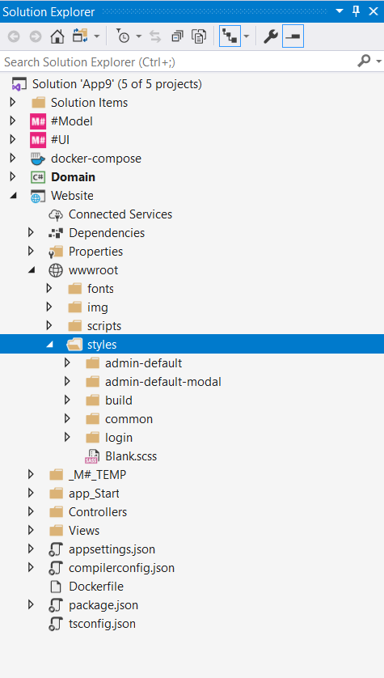

# Modal VS Standard

In this lesson we will learn about two types of pages provided in M#. We will also look at the CSS and mark-up of each page.

## Structure
M# creates three types of master page when you create a new project. All master pages are loaded with a default layout and set of CSS files.

- AdminDefault (Standard Pages)
- AdminDefault.Modal (Modal / popup pages)

M# encapsulates all the Stylesheets and Master Pages in one folder called **styles** that is located under **wwwroot** folder of **Website** project:



M# generates default template styles, which can be modified later according to the website design.

### Common.scss
This stylesheet contains the global design related styles, which can be used generically throughout the website.

### Blank.scss
This template is used for **Blank** master page

## AdminDefault Master Page
Although there is no hard and fast rule for using master pages, pages inheriting this type of master page are usually used to display primary data in the website. M# creates three default modules for this type of page as shown in the code below:

```HTML
@{Layout = Request.IsAjaxCall() ? null : "~/Views/Layouts/AdminDefault.Container.cshtml";}
@{ var leftMenu = ViewData["LeftMenu"].ToStringOrEmpty(); }

<main>
    <header> @await Component.InvokeAsync(typeof(Header)) </header>

    <div class="container-fluid">
        <div class="page">
            @if (leftMenu.HasValue())
            {
                <div class="side-bar"> @await Component.InvokeAsync(ViewData["LeftMenu"].ToString()) </div>
            }

            <div class="content @("full".OnlyWhen(leftMenu.IsEmpty()))">@RenderBody()</div>
        </div>
    </div>

    <footer>@await Component.InvokeAsync(typeof(Footer))</footer>

    @if (!Request.IsAjaxRequest())
    {
        <script src="/lib/requirejs/require.js" data-main="/scripts/references"></script>
    }

    @Html.RegisterDynamicScriptFiles()
    @RenderSection("scripts", required: false)
    @Html.WebTestWidget()
    @Html.RegisterStartupActions()
    @Html.RunJavascript("page.ensureNonModal();")
</main>
```

### Header Module
This module contains header related info e.g. Logo, Top Menu, Greetings etc. This module can be modified and managed in M#

### Left Menu Module
This module is used to display the side menu on the standard page. `content` tag class in above code gets the `Class` based on a page setting which is also determined to show or hide the sidebar module. Page settings are discussed in another lesson. This module is also customizable.

### Footer Module
This module holds all the footer related info in the default template and is also customizable in M#.

## Modal Master Page
Pages inheriting this master page are displayed on top of standard pages in a modal or popup form.

```HTML
@{Layout = Request.IsAjaxRequest() ? null : "~/Views/Layouts/AdminDefault.Modal.Container.cshtml";}
<main>
    <div class="container-fluid">
        <div class="page">
            <div class="content"> @RenderBody() </div>
        </div>
    </div>
    
    @if (!Request.IsAjaxRequest())
    {
        <script src="/lib/requirejs/require.js" data-main="/scripts/references"></script>
    }

    @RenderSection("scripts", required: false)

    @Html.RegisterStartupActions()
</main>
```