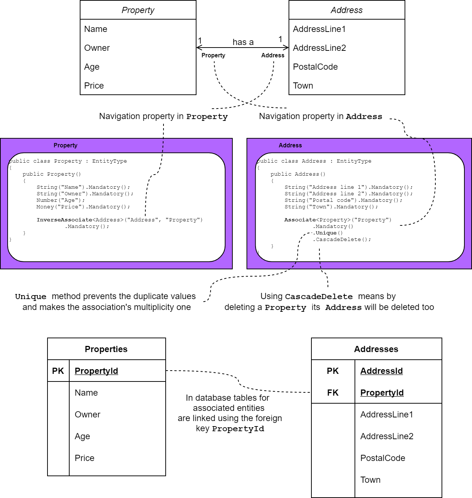

# One-to-one relationship

## Problem
You want to model a one-to-one association relationship between two entities in M#.

## Overview
When you create applications, most of the time some of your entities are related to each other.
One of the most common relationships which you need to model is where an instance of an entity is related to an instance of another entity in a way that an instance of the entity can only be in relation to one and only one instance of the other entity and vice versa. This is called a one-to-one association relationship. 

You can find such relationships quite regularly in the real world. As an example, a property to address relationship is one-to-one since each property can only have one address and each address only belongs to one property. We can merge two entities into a single entity but using two entities is more manageable and maintainable and concerns are separated.

## Implementation
The `Unique` method is used in M# on association defined by generic `Associate<T>` and `InverseAssociate<T>` methods to make it one-to-one association.

#### Example
Let's say we have an application for managing real states and have `Property` and `Address` entities.
Each property has only one address and each address, obviously belongs to one property.
The diagram below shows the UML diagram for these entities along with their M# code and generated tables for easy comparison.



In this diagram the relation is defined bidirectional. You may define it unidirectional and skip using `InverseAssociate<T>` on the other entity.
#### Generated Code

The generated code for the `Property` entity shows the relation as well.

```csharp
public partial class Property : GuidEntity
{
    //...
        
    /// <summary>Gets the Address of this Property.</summary>
    [Calculated]
    [XmlIgnore, Newtonsoft.Json.JsonIgnore]
    public Task<Address> Address
    {
        get => Domain.Address.FindByProperty(this);
    }
}
```
Without the `Unique` method on the association, the generated code for this relation would have the type of `IDatabaseQuery<Address>` as used in the many-to-one relation.

The generated code for the `Address` entity shows the relation property and a static method for finding `Address` by `Property` and validation rule for uniquenes.
```csharp
public partial class Address : GuidEntity
{
    CachedReference<Property> cachedProperty = new CachedReference<Property>();

    /// <summary>Gets or sets the ID of the associated Property.</summary>
    public Guid? PropertyId { get; set; }
        
    /// <summary>Gets or sets the value of Property on this Address instance.</summary>
    public Property Property
    {
        get => cachedProperty.GetOrDefault(ContactId);
        set => PropertyId = value?.ID;
    }

    public static Task<Address> FindByProperty(Domain.Property property)
    {
        return Database.FirstOrDefault<Address>(a => a.PropertyId == property);
    }

    protected override async Task ValidateProperties()
    {
        var result = new List<string>();
          
        if (PropertyId == null)
            result.Add("Please provide a value for property.");

        if (await Database.Any<Address>(a => a.PropertyId == PropertyId && a != this))
            result.Add("Property must be unique. There is an existing Address record with the provided Property.");
            
        //...
            
        if (result.Any())
            throw new ValidationException(result.ToLinesString());
    }
}
```
Also, the value for the `Property` is cached for performance reasons so that read only once until the cache gets invalidated to not hitting the database constantly.

