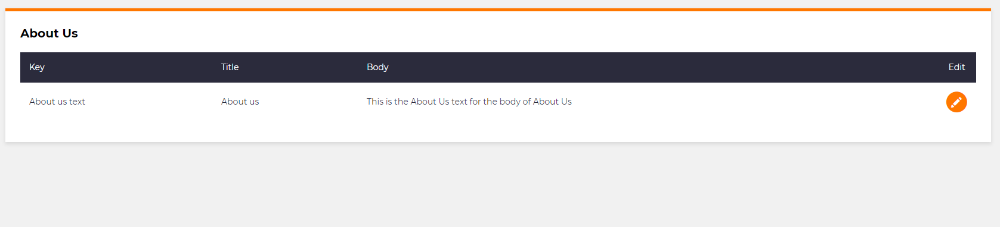

# Button per row

## Problem

Sometimes when we are creating a list module, we want to be able to add a button to each row of the list to allow the user to perform an action on each individual list item.

## Implementation

When creating a list we can use the `ButtonColumn()` method to create a column in the list that will be populated with a button.

Similar the `Button()` method, we can give this button a name, styling, location, actions to perform when the button is clicked and many other properties for this button.

### Example

In this example we have a list module that requires a column to allow the user to edit each item in the list.

```csharp
using MSharp;

namespace Modules
{
    public class AdminCMSAboutUsList
    {
        public AdminCMSAboutUsList()
        {
            HeaderText("About Us");
            EmptyMarkup("There are no items to display");

            ///================ Columns: ===============
            Column(x => x.Key);
            Column(x => x.Title);
            Column(x => x.Body);

            ButtonColumn("Edit").HeaderText("Edit").GridColumnCssClass("actions")
                .Icon("mz mz-edit")
                .NoText()
                .OnClick(x => x.Go<Admin.CMS.Home.AboutUs.EnterPage>().Send("item", "item.ID"));
        }
    }
}
```

This creates the following list in the UI.



Each row in the list will have an edit button so that the user can change the details for each "About us" item.
