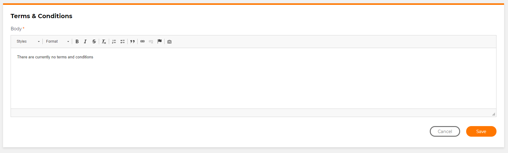

# Custom location for a button

## Problem

You want to be able to put the button you have created in the right location on the page to conform with design or to make the purpose of the button more intuitive for the user.

## Implementation

We can use the `.CssClass()` method to allow us to give each button a class that we can use to manipulate the location of the button in css styling.

### Example

```csharp
namespace Modules
{
    public class AdminCMSTermsAndConditionsForm : FormModule<Domain.CMSTermsAndConditions>
    {
        public AdminCMSTermsAndConditionsForm()
        {
            SupportsAdd(false);
            SupportsEdit(true);
            HeaderText("Terms & Conditions");

            Field(x => x.Body).AsHtmlEditor();

            Button("Cancel")
                .CssClass("pull-left")
                .OnClick(x => x.ReturnToPreviousPage());

            Button("Save").IsDefault()
                .OnClick(x =>
                {
                    x.SaveInDatabase();
                    x.GentleMessage("Saved successfully.");
                    x.Go<Admin.CMS.TermsAndConditionsPage>();
                });
        }
    }
}
```

In this example, the `.CssClass()` for the "Cancel" button is defined as `pull-left`. In the UI this class will mean the "Cancel" button will be to the left of the "Save" button.

