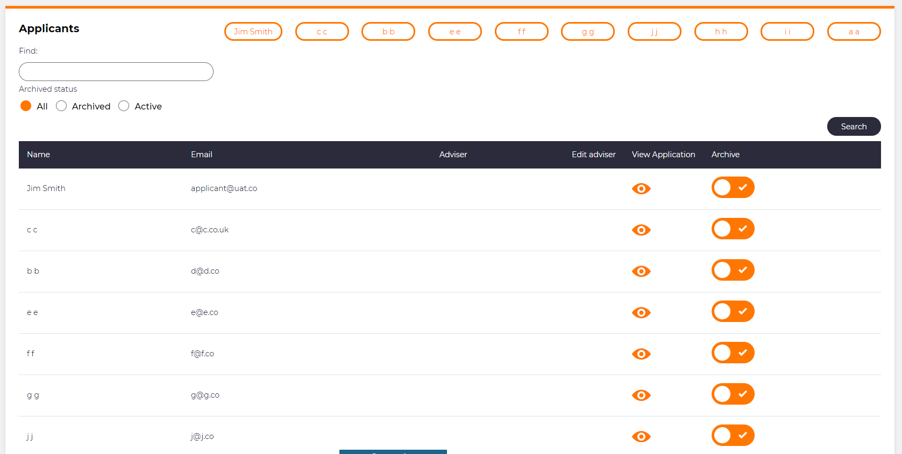

# Multiple buttons from data source

## Problem

In your application you may have a situation where you wish to create a button for each item within a data source.  For instance you may have a list of categories and you wish to have a button that will send you to that particular category Or the name of a customer where clicking on their name takes you to their profile.

## Implementation

In M# we have the `RepeatDataSource()` method that allows us to refer to the data source.  The data to populate the button will be repeated for each row of the table that is being called by this method.

### Example

Below is a button which is on a list module of applicants.

```csharp
Button("@option.Item.Name").RepeatDataSource("info.Items");
```

We can set the button name to be the `Name` property of each table row and we display a button for each `Item` or 'row' of data.

We would expect to see something like this within the UI.  As you can see, we have a button for each row of the list above the list.


