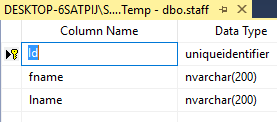

# Custom table/column name

## Problem

Sometimes you don't want the default database table/column names which M# chooses for entities and want to change them.
It might be because of your own project conventions, organization-wide policies or existing project considerations or just pure taste/design decision.

Also if you want to use the entity with an existing database and don't want to generate  a new table for it, you should set the table and column names of the entity which will be discussed in another chapter.
M# allows you to customize database and table names it uses on a per entity basis.

## Implementation

To set the name of the table which the entity will use you should call the `TableName()` method in the public constructor of your entity definition.
To set a property's column name, you should call `ColumnName()` method of the fluent API in the method chain of the property definition.

#### Example

Let's say we want to define an employee class with the table name as staff and fname and lname as column names of the name properties of the entity.
We define the entity like this

```csharp
using MSharp;

namespace Model.Domain
{
    public class Employee : EntityType
    {
        public Employee()
        {
            TableName("staff");
            String("first Name").Mandatory().ColumnName("fname");
            String("Last Name").Mandatory().ColumnName("lname");
        }
    }
}
```

For each property we call `ColumnName()` and set the desired column name.
we call `TableName()` as described and set the database table name for the entity as well.

#### Database Schema

The generated table is called staff and the column names are what we chose as well.



## Remarks

- The database namespace which M# uses as prefix for tables is `dbo`, that is not changed when setting custom table names
- If you want to generate a data access layer class for an entity which connects to an existing table, usually you need to define all column names and the table name unless your existing database uses M# conventions.