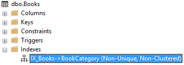

# Index

## Problem

Databases can use indices  to speed up query execution.
However indices are not free neither in storage nor in performance so it is not feasible to create them for all columns of all tables.
Instead you usually create indices for columns which are used a lot in queries that your app makes to speed them up.
Foreign keys are usually a good candidate for indexing.
M# has a feature which lets us define what entity properties we want a database index on.

## Implementation

To tell M# to create an index for a property, we should call `DatabaseIndex()` method on the property.
This method will tell M# to create a database index for the property so any queries which involve checking the value of this property will be significantly faster.

#### Example

We have an application which stores books and their categories.
Each book has a relation with the category which is assigned to it and stores the category's ID in its record.
To query which books are in a certain category, we need to check category ID of all books and return those which are in our desired category, to speed this operation up, we can create an index on the category ID of the books table.

We define the book entity like this

```csharp
using MSharp;

namespace Model
{
    public class Book : EntityType
    {
        public Book()
        {
            String("Name").Mandatory();
            String("Author").Mandatory();
            Associate<Category>("book Category").Mandatory().DatabaseIndex();
        }
    }
}
```

The `DatabaseIndex()` method call causes an index to be created on the BookCategory column of the books table.
This does not affect the generated C# code.

#### Database schema

After building and running the project, this index is created for the books table.



## Remarks

If your application is under high load, creating good indices is a very important decision which requires monitoring usage and database metrics. 
Don't consider the  decisions regarding it lightly and consult a DBA if needed.
What we could do was making the task of creating an index for a column as easy as possible.