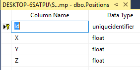

# Type conversion

## problem

Sometimes the type of the data in the database is not suitable for the type that we want for the entity.
In these cases we usually write data access layer code which converts between the types.
M# allows us to achieve the same with the generated code without writing much code.

Also sometimes you might want to store the data in the database in a format other than the default designated format.
that is easily achievable as well.

## Implementation

### Type conversion

If you call the method `NeedsDatabaseTypeConversion()` on a property, the data access layer code for the class will try to use the `Convert` class's methods like `ToInt32()`, `ToSingle()` and … to convert the read field to the correct data type.
The usual code just casts the result.

#### Example

Let's say we have a position entity which is stored in the database as a numeric and we want to store it in C# as a `Single`.
We define our entity like this

```csharp
using MSharp;
namespace Domain
{
    public class Position : EntityType
    {
        public Position()
        {
            Double("X").Mandatory().CSharpTypeName("Single").NeedsDatabaseTypeConversion();
            Double("Y").Mandatory().CSharpTypeName("Single").NeedsDatabaseTypeConversion();
            Double("Z").Mandatory().CSharpTypeName("Single").NeedsDatabaseTypeConversion();
        }
    }
}

```

The `CSharpTypeName()` method causes to generate float/single fields for the C# class and not `double`  which is the actual type for a `Double()` property.
The database type for a `Double()` will be `numeric(27,2)` which means a number with 27 digits which at least two of them are after the decimal point.
This value cannot be directly converted to a `Single` value so we call the `NeedsDatabaseTypeConversion()` which means the code which reads the data in the `DAL` (data access layer) code uses the `Convert.ToSingle()` method to convert the data to float.

This still doesn't guarantee that the float will not be overflowed and that's up to the application.
Also we did not use `float` as the C# type name in the `CSharpTypeName()` call because then the generated code for `Convert` would be `ToFloat()` which doesn't exist. 
`Single` is the actual .NET type name which its C# alias is `float`.

### Setting data type in the database

Sometimes you might want to also set the type that the database uses as well.

The method `DatabaseType()` can be used for this purpose.

#### Example

If we want to store the data of the position class in the database as a `float` as well, then we can do that.

```csharp
using MSharp;
namespace Domain
{
    public class Position : EntityType
    {
        public Position()
        {
            Double("X").Mandatory().CSharpTypeName("Single").DatabaseType("float");
            Double("Y").Mandatory().CSharpTypeName("Single").DatabaseType("float");
            Double("Z").Mandatory().CSharpTypeName("Single").DatabaseType("float");
        }
    }
}
```

As you can see we are just setting the database type name of the property as `float` using the `DatabaseType()` method.

#### Generated schema

The schema will use the `float` type for this entity.

