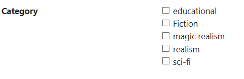

# Adding Checkbox List

## Problem

Sometimes you have fields with limited possible set of values but the user should be able to choose multiple of them.
In these cases you will need a list of checkboxes which the user can tick.

## Implementation

To make a field a list of checkboxes, you should call the `Control()` method on it and pass one of the following:

- `VerticalCheckBoxes`
- `HorizontalCheckBoxes`

The field itself should be a many to many relationship so it can store multiple values and you should return the `%PropertyName%Links` instead of the `%PropertyName%` itself.
So if your many to many relation is named `Category`, you should return `CategoryLinks` in the lambda expression of the `Field()` method.
An example will make it much more clear.

#### Example

We have a `Category` entity and a `Product` entity.
Each product can be a part of multiple categories.
We define them like this

```csharp
using MSharp;

namespace Domain
{
    public class Category : EntityType
    {
        public Category()
        {
            String("Name").Mandatory();
        }
    }
}
```

```csharp
using MSharp;


namespace Domain
{
    public class Product : EntityType
    {
        public Product()
        {
            String("Product Name").Mandatory();
            AssociateManyToMany<Category>("Category");
        }
    }
}
```

`Category` is nothing special but the `Product` entity has a `AssociateManyToMany<T>()` relation which is a many to many relationship named `Category`.
M# will also generate a `CategoryLinks` property which should be used when creating the form field.

Now let's take a look at our form

```csharp
using MSharp;

namespace Modules
{
    public class ProductForm : FormModule<Domain.Product>
    {
        public ProductForm()
        {
            Field(x => x.ProductName).Control(ControlType.Textbox);
            Field(x => x.CategoryLinks).Control(ControlType.VerticalCheckBoxes);

            Button("Save").IsDefault().Icon(FA.Check).OnClick(x =>
            {
                x.SaveInDatabase();
                x.GentleMessage("Saved");
                x.ReturnToPreviousPage();
            });
        }
    }
}
```



As you can see we use `CategoryLinks` instead of `Category` when creating the field so M# can store multiple categories in it.
Also we set the control to vertical list of checkboxes.

## Remarks

- The data for these many to many relations is stored in a separate table
- There are multiple types of these checkbox lists which you can use based on what you exactly want your controls to look like
- If you are really curious, there are products which can be in multiple of these categories. Alexa is one of them :)