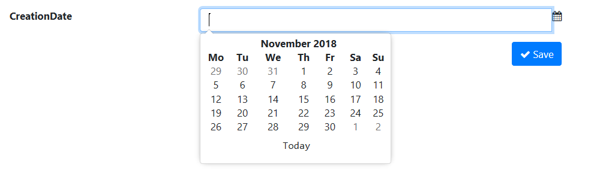

# Adding Date picker

## Problem

When you want a user to choose a date, you need an easy way for the user to choose it.
Getting it as text is complicated for multiple reasons.
One reason is the fact that the user might not be sure of the format accepted.
Another is that it is not intuitive at all to type and a user expects you to show a calendar.

## Implementation

To show a date picker control, you call the `Control()` method on the field and choose the `ControlType.DatePicker` value as the argument.

#### Example

Let's say our `Product` entity has a `CreationDate` property and we want to get the value for it in a form using a date picker.
The form should be defined like this

```csharp
using MSharp;

namespace Modules
{
    public class ProductForm : FormModule<Domain.Product>
    {
        public ProductForm()
        {
            Field(x => x.ProductName).Control(ControlType.Textbox);
            Field(x => x.CreationDate).Control(ControlType.DatePicker);

            Button("Save").IsDefault().Icon(FA.Check).OnClick(x =>
            {
                x.SaveInDatabase();
                x.GentleMessage("Saved");
                x.ReturnToPreviousPage();
            });
        }
    }
}
```



As you can see, simply calling `.Control(ControlType.DatePicker)` on the field is enough to make it a date picker control.