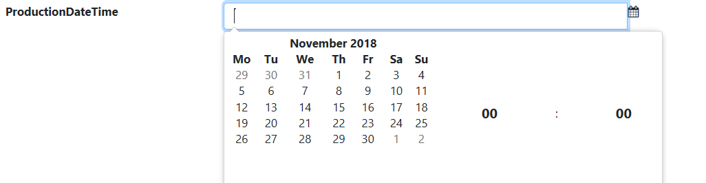

# Adding DateTime picker

## Problem

Sometimes you might want to show a date/time picker control to a user regardless of the type of the form field.
You should not have to change your entity property for doing so and we show you how to explicitly define this control type.

## Implementation

The `Control()` method should be called on the field which you want to show as a date/time picker with the argument value of `ControlType.DateTimePicker`.

#### Example 

We have a `ProductionDateTime` property which in this application is used as a string.
The property is defined in the entity as a string but we want to show it as a DateTime 
when entering it so the user can easily choose a date and time for the production of the product.

The form will be defined like this

```csharp
using MSharp;

namespace Modules
{
    public class ProductForm : FormModule<Domain.Product>
    {
        public ProductForm()
        {
            Field(x => x.ProductName).Control(ControlType.Textbox);
            Field(x => x.ProductionDateTime).Control(ControlType.DateAndTimePicker);

            Button("Save").IsDefault().Icon(FA.Check).OnClick(x =>
            {
                x.SaveInDatabase();
                x.GentleMessage("Saved");
                x.ReturnToPreviousPage();
            });
        }
    }
}
```



As you can see, the field is shown as a date/time picker instead of a normal text box for our string property.