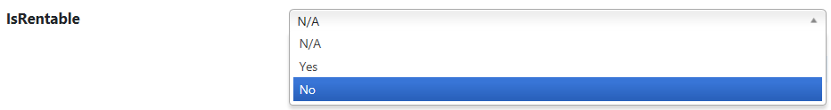

# Adding dropdown list

## Problem

Sometimes a form field has a few defined answers and you have different options like a dropdown or radio button list to let the user choose an answer.
In this page we describe how you can make these fields a dropdown.

## Implementation

You should call the `Control()` method with the `ControlType` of DropDownList to make the control for a field a dropdown.

#### Example

Let's define a `IsRentable` property for our product entity which is not mandatory so can be null as well.
So the user can say if the product is rentable or not and also be able to choose not applicable in the case of products which renting is meaningless for them because they are essentially consumables which can be used once.

We want to give 3 options in a dropdown to the user instead of having a checkbox which doesn't make it possible to give not applicable as an answer.
We define the form like this

```csharp
using MSharp;

namespace Modules
{
    public class ProductForm : FormModule<Domain.Product>
    {
        public ProductForm()
        {
            Field(x => x.ProductName).Control(ControlType.Textbox);
            Field(x => x.IsRentable).Control(ControlType.DropdownList);

            Button("Save").IsDefault().Icon(FA.Check).OnClick(x =>
            {
                x.SaveInDatabase();
                x.GentleMessage("Saved");
                x.ReturnToPreviousPage();
            });
        }
    }
}
```



As you can see **YES**, **NO** and **N/A** are the possible answers here.

## Remarks

The text for the answers can be changed when defining the entity using `TrueText()`, `FalseText()` and `NullText()` methods.

For associations, by default, M# will add a pseudo first option in the list, reading "-Select-". In cases where the field is `mandatory` and you always have a `default value`, then that first option will become meaningless. In such case, you can remove it by setting `Field(x => x.Something).WatermarkText("[#EMPTY#]")` or simply `.NoWatermarkText()`.
