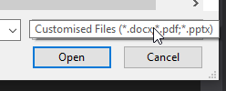
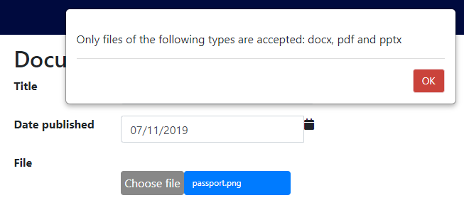

# Adding a file upload field

## Problem

To upload files on a form module, we need to implement a field with a file-upload control.

## Implementation

You will need to add a `BinaryProperty` type to your entity and then add a `Field()` 
in your module pointing to the resultant property in your `Domain` (which will be of type
`Olive.Entities.Blob`).

#### Example 

Let's consider a simple document upload form. The entity would be something like

```csharp
using MSharp;

namespace Domain
{
    public class Document : EntityType
    {
        public Document()
        {
            String("Title").Mandatory();
            SecureFile("File").ValidExtensions(".docx, .pdf, .pptx").Mandatory();
            DateTime("Date published").Mandatory();
        }
    }
}
```

We restrict the valid file types using the `ValidExtensions()` method.
An alternative implementation (if security is not a concern) would be to use the `OpenFile()` method to generate
the `Blob` property.

We then could implement the module something like

```csharp
using MSharp;
using Domain;

namespace Modules
{
    public class DocumentForm : BaseFormModule<Document>
    {
        public DocumentForm()
        {
            HeaderText("Document Details");

            Field(x => x.Title).Mandatory();
            Field(x => x.DatePublished).Mandatory();
            Field(x => x.File);

            // some more form module components
        }
    }
}
```

The `ValidExtensions()` customisation is seen both in the file-type selector in the file dialog box;



and in an alert pop-up if you try to save the form with the wrong file type uploaded.


