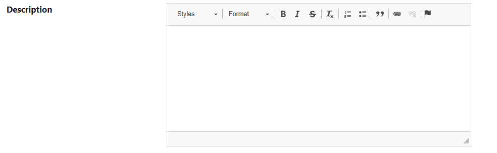

# Adding HTML Editor

## Problem

Sometimes you need to provide the capability to create formattedtext to your users.
The way to format text on the web is using HTML tags but since the users might not know HTML and it is not convenient to write HTML for them even if they know it, you usually use HTML Editors which provide rich text capabilities similar in spirit to what Microsoft Word and wordpad have.
M# allows you to place rich text editors in your forms easily.

## Implementation

To make a field a rich text editor one, call `Control()` on it and pass `ControlType.HtmlEditor`.

#### Example

Let's define a description field for our product's form and make it a HTML editor.

```csharp
using MSharp;

namespace Modules
{
    public class ProductForm : FormModule<Domain.Product>
    {
        public ProductForm()
        {
            Field(x => x.ProductName).Control(ControlType.Textbox);
            Field(x => x.Description).Control(ControlType.HtmlEditor);
            Button("Save").IsDefault().Icon(FA.Check).OnClick(x =>
            {
                x.SaveInDatabase();
                x.GentleMessage("Saved");
                x.ReturnToPreviousPage();
            });
        }
    }
}
```



As you can see, instead of having a simple textbox, here we got a control which allows us to format text and outputs HTML code for the formatted text as well.