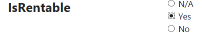

# Adding Radio Button list

## Problem

Some fields only provide a finite set of answers and the number of answers is not many.
In these cases you might want to use a list of radio buttons to let the user choose an answer.
We'll describe how to create radio button lists here.

## Implementation

You should use the `Control()` method and pass `ControlType.VerticalRadioButtons` or `ControlType.HorizontalRadioButtons` on a field which you want to show it as a list of radio buttons that one of them can be selected.

#### Example

Let's say we have a form for products which their entity has a `IsRentable` property which can be `null`, `true` or `false`.

We will first show it in a vertical list of radio buttons and then in a horizontal one.

```csharp
using MSharp;

namespace Modules
{
    public class ProductForm : FormModule<Domain.Product>
    {
        public ProductForm()
        {
            Field(x => x.ProductName).Control(ControlType.Textbox);
            Field(x => x.IsRentable).Control(ControlType.VerticalRadioButtons);

            Button("Save").IsDefault().Icon(FA.Check).OnClick(x =>
            {
                x.SaveInDatabase();
                x.GentleMessage("Saved");
                x.ReturnToPreviousPage();
            });
        }
    }
}
```



And now let's take a look at the horizontal version

```csharp
using MSharp;

namespace Modules
{
    public class ProductForm : FormModule<Domain.Product>
    {
        public ProductForm()
        {
            Field(x => x.ProductName).Control(ControlType.Textbox);
            Field(x => x.IsRentable).Control(ControlType.HorizontalRadioButtons);

            Button("Save").IsDefault().Icon(FA.Check).OnClick(x =>
            {
                x.SaveInDatabase();
                x.GentleMessage("Saved");
                x.ReturnToPreviousPage();
            });
        }
    }
}
```


As you can see the difference between these is only the enum type which could be `HorizontalRadioButtons` or `VerticalRadioButtons`.

## Remarks

- For fields with many values, dropdown or AutoComplete are much better options.
- The text for true, false and null values of the nullable bool can be changed when defining the properties in the entity using `TrueText()`, `FalseText()` and `NullText()` methods.