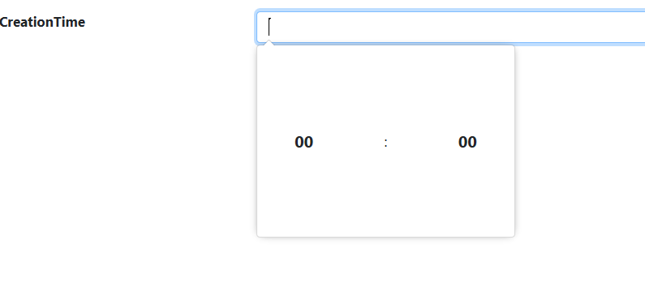

# Adding a time picker

## Problem

Sometimes you want to get a time value from the user but don't want to store it as a time object in your entity.
In these cases you should explicitly choose to have a time picker in your form for the property.

## Implementation

You should call the `Control()` method on your field and pass the `ControlType.TimePicker` value to it.

#### Example

Our `Product` entity contains a `CreationTime` property which for all intents and purposes should be a string.
However when entering it, the user should see a time picker control for easy data entry.
We defined the property as a `String()` one in our entity definition and defined the form like this

```csharp
using MSharp;

namespace Modules
{
    public class ProductForm : FormModule<Domain.Product>
    {
        public ProductForm()
        {
            Field(x => x.ProductName).Control(ControlType.Textbox);
            Field(x => x.CreationTime).Control(ControlType.TimePicker);

            Button("Save").IsDefault().Icon(FA.Check).OnClick(x =>
            {
                x.SaveInDatabase();
                x.GentleMessage("Saved");
                x.ReturnToPreviousPage();
            });
        }
    }
}
```



As you can see, when defining the `CreationTime` field, we call the `Control()` method and set the type of it to time picker and as a result, the control in the form is a time picker.