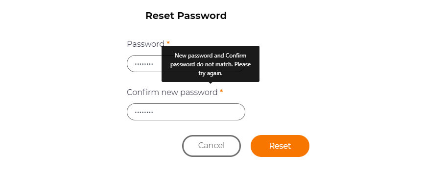

# Custom form elements

## Problems

Sometimes when creating a form module, you will want to add a field that is a property of a different entity to the data source of the form module itself or even create a property that is only used in this one instance.

## Implementation

We can use the `CustomField()` method to tailor an element to what we need for the application to work as expected.

If we are creating a new property then we can set the `PropertyName` and `PropertyType` of the field.

### Examples

Here we have an example of a field that is creating a property that adds a boolean field to this module.

```csharp
 CustomField()
    .Label("Please confirm that your circumstances have not changed")
    .PropertyName("HasConfirmedNoChange").PropertyType("bool")
    .Control(ControlType.CheckBox);
```

In this example we see a whole module with a custom field element for confirming the user password.

```csharp
using MSharp;
using Domain;

namespace Modules
{
    public class ResetUserPassword : FormModule<Domain.User>
    {
        public ResetUserPassword()
        {
            SupportsAdd(false)
                .SupportsEdit()
                .HeaderText("Reset Password")
                .DataSource("info.Ticket.User")
                .SecurityChecks("Request.Has(\"Ticket\")");

            ///================ View model properties: ================

            ViewModelProperty<PasswordResetTicket>("Ticket").FromRequestParam("ticket");


            ///================ Fields: ================

            Field(x => x.Password)
                .Mandatory()
                .AfterControl("<div class='password-strength'></div>");
            CustomField()
                .Label("Confirm new password")
                .Mandatory()
                .PropertyName("ConfirmPassword")
                //.PropertyType("string") // Default type is string
                .ExtraControlAttributes("type=\"password\"")
                .ViewModelAttributes("[System.ComponentModel.DataAnnotations.Compare(\"Password\",ErrorMessage=\"New password and Confirm password do not match. Please try again.\")]")
                .Control(ControlType.Textbox);


            ///================ Buttons: ================

            Button("Cancel")
                .OnClick(x => x.Go<LoginPage>());

            Button("Reset")
                .IsDefault()
                .OnClick(x =>
                {
                    // Reset password logic here
                    x.Go<Login.ResetPassword.ConfirmPage>()
                        .Send("item", "info.Ticket.UserId");
                });
        }
    }
}
```



`ConfirmPassword` custom field is not a member of `Domain.User` class, but it is used to confirm the entered password in `Password` field.