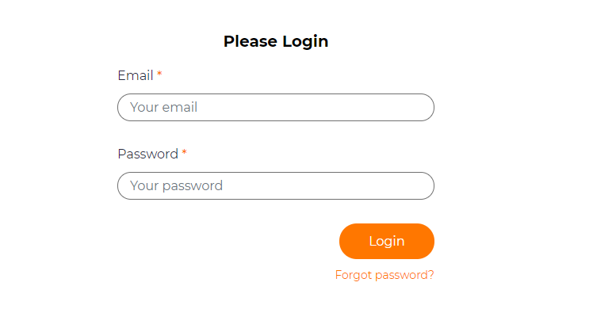

# Watermark text

## Problem

Sometimes a user can be confused by what is expected of them when completing a field.  They may not understand what is expected of them in terms of syntax which may cause frustration when using an application.

## Implementation

The `WatermarkText()` method is a useful tool to make it clear to the user what is expected of them when filling in data.  This method will populate the field with a light grey example of the type of data expected for that field.  Simply pass a `string` into this method to show what the user should be doing.

### Example

```csharp
using MSharp;
using Domain;

namespace Modules
{
    public class LoginForm : FormModule<Domain.User>
    {
        public LoginForm()
        { 
            HeaderText("Please Login");

            Field(x => x.Email).WatermarkText("Your email");
            Field(x => x.Password).Mandatory().WatermarkText("Your password");

            Button("Login").ValidateAntiForgeryToken(false)
                .OnClick(x =>
                {
                    x.Go<Login.DispatchPage>();
                });

            Link("Forgot password?").OnClick(x => x.Go<Login.ForgotPasswordPage>());
        }
    }
}
```

In this simple login example, you can see that the `WatermarkText()` method has been used to show the user how to fill this in.

This will show like this in the UI.

