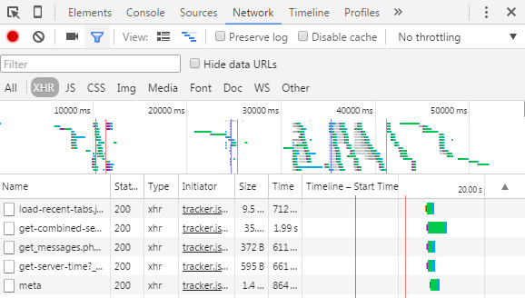

# Calling API from javascript

## Problem

You want to know how to call a web API from the javascript code with an AJAX request.

## Overview
The ability to asynchronously fetch data and repaint portions of the page is the heart of single-page architecture. Part of this mechanism is through the layout and navigation mechanism and another part is related to AJAX techniques. In the latter, we only send the data required for knowing the elements data commonly in JSON format, and not the entire view and HTML.

## Creating API
The class for this API that merely sends data should be separate from the generated controllers for modules and should be created in **Website\Controllers\Api** folder by convention. The controller class name should be the logical name of this particular API followed by "Api" and named after the purpose that it serves. It is advised to create one API controller class per consumer.

Here is the structure of an API class for sending JSON data:

```csharp
public class MyApi : BaseController
{
    [HttpGet("...")]
    public async Task<IActionResult> MyFunction(string param)
    {
        // Custom validation and checks
                       
        ViewModelType result = ....;
        return Json(result);
    }
        
    public class ViewModelType
    {
        public string Property1 {get; set;}
        public int Property2 {get; set;}
        // ...
    }
}
```
When you create APIs that need to send or receive structured data, the best approach is to define simple _DTO_ (Data Transfer Object) classes dedicated to each API client, which is sometimes referred to as _ViewModel classes_. Rather than sending the domain objects to the client directly, it should create the ViewModel objects to return (usually after JSON serialization) that can be the result of joining data from multiple entities or tables in the database. This approach provides great flexibility and also decouples client services from your domain model design.

## Calling API
With this API class in place, we may have a javascript code that is calling this API and is updating part of the view. This code file should be first registered with the M# module class.

Calling API within this code can be done using jQuery AJAX. 
The [`$.ajax([options])`](https://api.jquery.com/jquery.ajax/) function can be used to send AJAX requests to the server. 

```javascript
$.ajax({
   method: "GET",
   url: "MyApi/MyFunction/param1",
   data: { Prop1 = "...", Prop2="..."},
   error: function (response) { page.handleAjaxResponseError(response); },
   success: function (result) { /* Handle with custom code or use standard M# MVC result*/ },
}) ;
```
[`$.get()`](https://api.jquery.com/jquery.get/) and [`$.post()`](https://api.jquery.com/jquery.post/) are also useful simplifications of the `$.ajax()` function.

## Chrome Inspection
Sometimes it is needed to inspect individual AJAX requests to help diagnose a problem. For doing this, inside the Chrome browser go to the **Developer Tools > Network** tab and then click **XHR** below. Here, XHR stands for XMLHttpRequest which is an underlying mechanism in browsers for AJAX that is also used in jQuery AJAX.

You can now see the AJAX requests as shown in the following picture:



Click on an individual request to see the request details. You can find a similar tool in other browsers.

