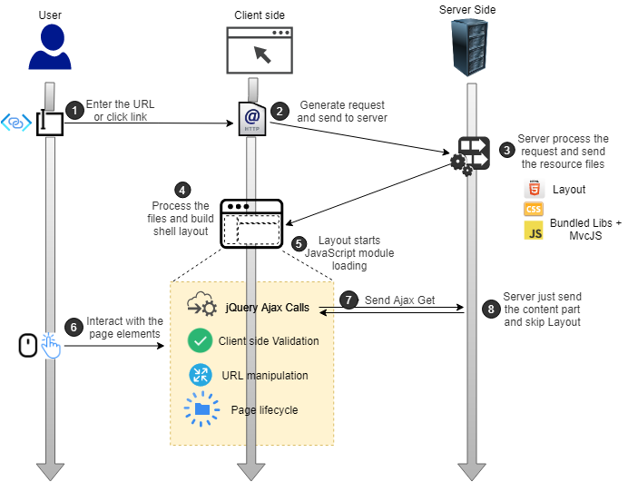

# Javascript lifecycle

## Problem

You want to know the javascript lifecycle and various stages in the processing of the M# application. This knowledge is needed if you intend to change part of this lifecycle or add additional Javascript libraries to the project.

## Overview

Olive and MvcJs are two libraries referenced in the M#-base applications that are created to provide a SPA experience that is based on Razor templates and MVC. The key to understanding the javascript lifecycle lies in this underlying SPA framework. 

The diagram below shows various stages in the lifecycle.

### Layout
 The single page in SPA refers to the layout or shell file that is initially loaded and is defined in M# in the file **Project.cs** inside the M# Model project. Ideally, this would be the only time that full browser load happens but in practice, you may consider post requests for some pages for another refresh. The content part of this shell or layout is updated with later requests without having to refresh the shell.

### Module loading
The layout page runs a script to load other Javascript files and modules. Then the **appPage.ts** will run as an entry point for layout behaviour and configuring all other javascript settings.

### MvcJs Library
 The code in the MvcJs library represents the application's presentation logic. It is a lightweight framework for SPA and contains helper utilities for general client-side coding related to URL manipulation, form data, validation, modal (pop-up), etc.

### Navigation
The code in the MvcJs library checks the layout page content. This library searches through the DOM for custom attributes like `data-redirect="ajax"` and replaces their default action with ajax call (i.e. navigation hijacking) using the jQuery Ajax mechanism. When the user clicks on any navigation links, MvcJs send a jQuery Ajax get call to the server and replaces the content's view with another view, giving the user an illusion that the page itself is changing as the URL changes. MvcJs library does this by handling the response and dynamically attaching the new view extracted from the response to the shell's DOM and then handles the lifecycle of the new content. In this way, part of the tasks for combining views is moved from the server to the client to give the user feeling of working on a native desktop app.

