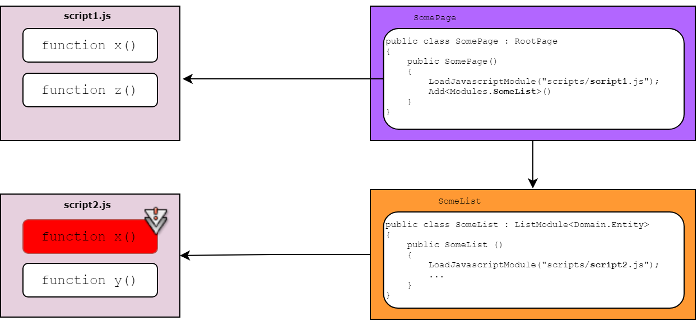

# JavaScript scope level

## Problem

You want to know the JavaScript scope level and its implication on running JavaScript code on your M# pages.

### JavaScript Scope
Scope refers to language rules regarding when a variable can be referenced or assigned. The scope is also used to
determine the accessibility of variables and functions to other callers. In JavaScript, we have 3 scopes: the global scope, the function scope and the block scope.

### Why should we care?
With the use of script files and third-party libraries in M# based solutions, we often encounter the problem of polluted global namespaces, causing name collision between components in the global namespace. Therefore, we need a way to organize blocks of code so that variables, objects, and classes are uniquely identified. It is also another reason why we categorize views in the form of modules in M#.

For example, let's consider an example that what will happen when the scope is not considered. If we add a JavaScript file for loading into a page and all functions and variables inside the file are global scopes, it may override the same variable or function in the JavaScript library that is used on another JavaScript file that is added in a higher level. This is depicted in the following diagram. 



In this diagram, the function `x` added in script2 has a name conflict with the function in script1 added at the root level. By adding script2, this function is replaced with the function in script1, so the functionality of script1 would not be as expected.

This small detail can become crucial as our M# project grows in size and complexity. Luckily by using TypeScript's Modules this problem can be solved easily.

### Modules in TypeScript
Starting with ECMAScript 2015, JavaScript has a concept of modules and TypeScript has shared this concept.

Modules are executed within their own scope, not in the global scope; this means that variables, functions, classes, etc. declared in a module are not visible outside the module unless they are explicitly exported using one of the export forms. Conversely, to consume a variable, function, class, interface, etc. exported from a different module, it has to be imported using one of the import forms.

Modules are declarative; the relationships between modules are specified in terms of imports and exports at the file level. Modules import one another using a module loader. At runtime, the module loader (using RequireJS) is responsible for locating and executing all dependencies of a module before executing it. 

In TypeScript, any file containing a top-level import or export is considered a module. Conversely, a file without any top-level import or export declarations is treated as a script whose contents are available in the global scope (and therefore to modules as well).

So by using the TypeScript code like the following code and using the generated JavaScript file in the M# module we can resolve the scope problem.

```typescript
import AppPage from "../AppPage"
import Url from "olive/components/url"

export default class ClassName {
    public static run() {
        //...
    }
    //...
}
```
 