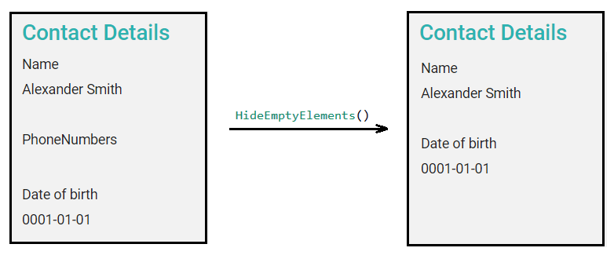

# Hiding empty elements

## Problem

Some elements in the view or list modules may be null or empty. This happens when they aren't mandatory or with any restriction rule and the user has not filled out these elements when created the entity. These elements are shown as labels followed by empty content. The client wants to skip these elements from showing up in the view.

## Implementation

M# has a `HideEmptyElements()` method that can be used in the list or view modules for not displaying empty elements.

### Example
You have a view module for contact that has 3 fields. Contact can have zero or more phone numbers:
```csharp
public ContactView()
{
    Field(x => x.FullName).LabelText("Name");

    Field(x => x.PhoneNumbers);

    Field(x => x.DateOfBirth);

    HideEmptyElements();
}
```

Using `HideEmptyElements()` method affects the view as depicted below:



### Tips
- Using `HideEmptyElements()` method on `ListModule` has no effect on empty column values, just elements outside the list will be affected.

- This methods can also be used as `HideEmptyElements(true)` that has the same effect as the above example. Using `false` input argument is the default behaviour and does not affect the view.

- This method can be chained to the `HeaderText`:
```csharp
     HeaderText("Contact Details").HideEmptyElements();
```