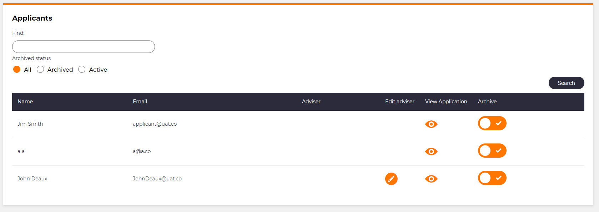

# Adding link/button column

## Problem

There will be times when creating the application that you will want to have buttons or links within a column when creating a list.  This is very common when needing a link to a piece of documentation or you need a button to change the state of an item within a list.

## Implementation

There are two methods that we use for Links and Buttons. These are `LinkColumn()` and `ButtonColumn()` respectively.  Which one you decide to use will depend upon the nature of want you want the column to do.

## Example

```csharp
LinkColumn("View Application")
                .Icon("mz mz-view").NoText()
                .HeaderText("View Application")
                .GridColumnCssClass("actions")
                .OnClick(x => x.Go<Adviser.ViewApplication.ViewApplicationPage>()
                .Send("application", "item.ID"));
```

```csharp
ButtonColumn("Edit").HeaderText("Edit").GridColumnCssClass("actions")
                .Icon("mz mz-edit").NoText()
                .OnClick(x => x.Go<Admin.Settings.CommittedExpenditure.EnterPage>().Send("item", "item.ID"));
```

Both methods work fairly similarly, the main difference being the look of these columns in the UI with the `LinkColumn()` column showing a clickable Link and the `ButtonColumn()` column showing a clickable button. Below you can see an example of both types of column.


