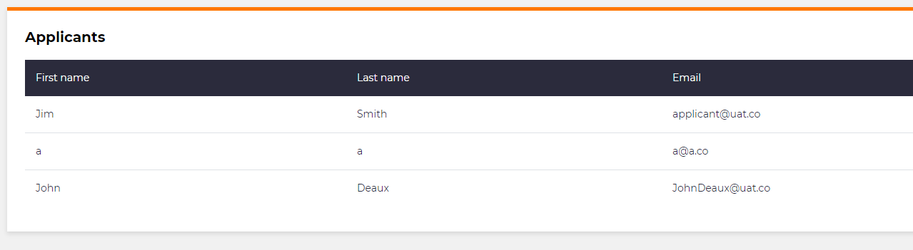

# Adding a data column

## Problem

When you are creating a list in M# you need to able to create a column that relates to a property of an entity.  We can do this easily using the `Column()` method.

## Implementation

We can do this easily using the `Column()` method.  We pass the property through this method and this will create a column with the data source of that property.

## Example

Here we have an entity in the model called `Applicant` with 3 properties `FirstName`, `LastName` and `Email`

```csharp
namespace Domain
{
    public class Applicant : EntityType
    {
        public MortgageApplication()
        {
            String("First name");
            String("Last name");
            String("Email").Accepts(TextPattern.EmailAddress);
        }
    }
}
```

We can create a list module of Applicants in the UI project and have each column show the property data for each applicant.

```csharp
using MSharp;

namespace Modules : ListModule<Domain.Applicant>
{
    public class ApplicantsList
    {
        public AdminApplicantsList()
        {
            HeaderText("Applicants").PageSize("10");
            EmptyMarkup("There are no applicants to display");

            ///================ Columns: ================

            Column(x => x.FirstName);
            Column(x => x.LastName);
            Column(x => x.Email);
        }
    }
}
```

This module will then show on the page like this.

